---
# User change
title: "Advanced debug with ETM trace"

weight: 5 # 1 is first, 2 is second, etc.

# Do not modify these elements
layout: "learningpathall"
---

## ETM Trace

Many Armv7-M/Armv8-M devices include an **Embedded Trace Macrocell (ETM)** which provides instruction trace. When streaming instruction trace directly to your PC, the µVision debugger enables [review of historical sequences](#instruction-trace), [execution profiling](#execution-profiling), [performance optimization](#performance-analysis), and code [coverage analysis](#code-coverage).

#### Types of Problems that can only be found with ETM Trace

There are certain types of problems that can only be found with a quality trace, such as:

1. Pointer problems.
2. Illegal instructions and data aborts (such as misaligned writes): How I did I get to this fault vector?
3. Code overwrites – writes to Flash, unexpected writes to peripheral registers: How did I get here?
4. A corrupted stack.
5. Out of bounds data. Uninitialized variables and arrays.
6. Stack overflows: What causes the stack to grow bigger than it should?
7. Probably the most important use: an application has gone off into the weeds and you need to know what instruction caused this.
8. Communication protocol and timing issues.
1. System timing problems.
1. Profile Analysis and Code Coverage is provided. Available only with ETM trace.

#### FVPs: Configure the Target Driver Setup to use ETM Trace

The Corstone-300 FVP can be used to collect instruction trace data with a two-step approach. First, you run the simulation and collect the data. Then, you restart the simulation and load the coverage file that was created in the first step to use the data in µVision. Follow these steps to set this up in µVision:

1. Open a Windows Explorer and copy the file `MTItoCoverage.dll` from `C:\Keil_v5\ARM\VHT` to `C:\Keil_v5\ARM\FVP\Corstone-300\models\Win64_VC2017`. This file is required to extract the coverage data from a previous run.
1. In µVision, Go to  **Project - Options for Target... (Alt+F7)** and switch to the **Debug** tab.
2. On the right-hand side, select **Models ARMv8-M Debugger** and click on **Settings**. The **Models ARMv8-M Target Driver Setup** window opens.
3. Select a coverage file (simply enter a name for the file and it will be generated automatically).
1. Enable **Load Coverage on Connect** and **Store Coverage on Disconnect**:
   
1. Click **OK** twice.

When you now start a debug session, the coverage information is recorded. When you leave the debug session, the data is written to the coverage file specified. Next time you start a debug session, the file is opened and the information is used. This method does not provide [Instruction Trace](#instruction-trace) data, so you can move directly to the [Code Coverage](#code-coverage) section.

#### Hardware: Configure the Target Driver Setup to use ETM Trace

For the following, you need to connect a [ULINKpro](https://developer.arm.com/Tools%20and%20Software/ULINKpro) debug and trace adapter to your target board using the [20-pin Cortex+ETM connector](https://developer.arm.com/documentation/kan339/latest).

1. Go to  **Project - Options for Target... (Alt+F7)** and switch to the **Debug** tab.
1. Remove any **Initialization File** that might be present.
2. On the right-hand side, select **ULINK Pro Cortex Debugger** and click on **Settings**. The **Target Driver Setup** window opens.
3. Select the **Trace** tab:  
   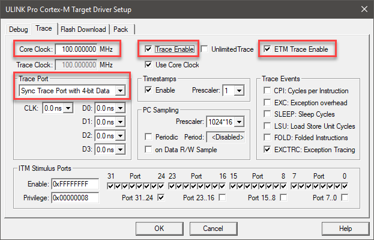
4. In **Core Clock:** enter the correct core clock of your target device. This value will be used for calculating timing values.
5. If your device runs a different trace clock, you might need to unselect **Use Core Clock** and enter the correct trace clock speed. 
4. Select **Trace Enable** for SWV data trace.
4. Select **ETM Trace Enable** for ETM.
5. Set **Trace Port** to **Sync Trace Port with 4-bit Data**.
6. The last 1 million trace frames will be saved with the older ones being overwritten. If you need to save them all, select also **Unlimited Trace**. Your hard drive space will determine how many are saved. ULINKpro is a streaming trace.
10. ETM and SWV are now configured and ready to use. Click **OK** twice to return to the main μVision menu.

### Instruction Trace

Instruction trace enables the review of historical data of the application execution.

#### Open the Trace Data Window and Confirm Trace is Working

1. **Start a Debug Session (Ctrl+F5)** to enter the µVision debugger.
1.  Go to **View - Trace** and select **Trace Data**.
2. The Trace Data window will look similar to the one below if it is working correctly:  
   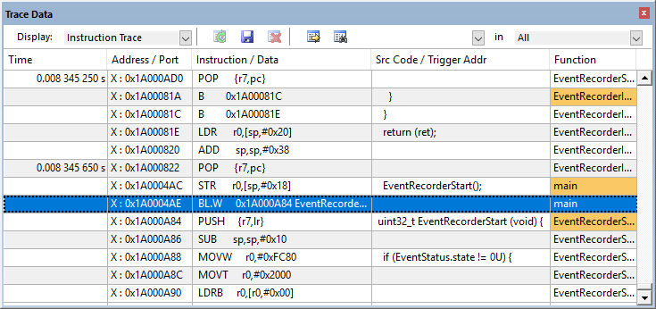
3. If you do not see trace frames in this window, go to **View - Trace** and select **Enable Trace Recording**.

{}
- You must stop the program to view the trace frames in the **Trace Data** window.
- All frames are executed instructions with source if available.
- The **Function** column displays the name of its function with the first instance highlighted in orange.
{}

#### View ETM Frames starting at Reset

1. Scroll to the top of the **Trace Data** window to the first frame. This is the first instruction executed after the initial RESET sequence. In this case, it is a `LDR` instruction in the RESET_Handler function as shown below:  
   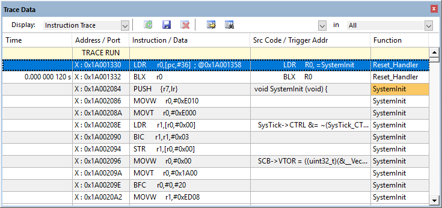
2. If you use the **Memory** window to look at location `0x04`, you will find the address of the first instruction there and this will match with that displayed in the first frame. In my case it is `0x1A00_1330 + 1 = 0x1A00_1331` (+1 says it is a [Thumb&reg; instruction](https://developer.arm.com/documentation/ddi0210/c/Introduction/Architecture/The-Thumb-instruction-set)). The first occurrence in a function is highlighted in orange to make the start of functions easier to find.
3. Any source code associated with an instruction is displayed in the **Src Code / Trigger Addr** column.
4. If you double-click on any line, this will be highlighted in both the **Disassembly** and the relevant source window.

{}
If you unselect **Run to main()** in the **Debug** tab of the  **Options for Target...** window, no instructions will be executed when you enter debug mode. The program counter will be `0x1A00_1330`. You can run or single-step from that point and this will be recorded in the **Trace Data** window.
{}

#### How to Find Interesting Trace Frames

Capturing all the instructions executed is possible in simulation and with ULINKpro but this might not be practical. It is not easy sorting through millions of trace frames or records looking for the ones you want. Use **Trace Filters**, **Find**, or save everything to a file and search with a different application program such as a spreadsheet.

*Trace Filters*

In the **Trace Data** window, you can select various types of frames to be displayed. The **Display:** box shows the various options available:  


{}
These filters are post collection.
{}

#### Find a Trace Record

In the **Find a Trace Record** box, enter `bx` as shown here:  
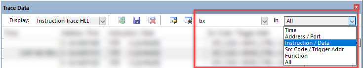

You can select properties/columns where you want to search in the “in” box.

Select the **Find a Trace Record** icon  and the following screen opens:  
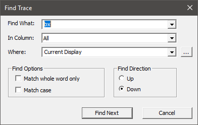

Click on **Find Next** and each time it will step through the trace records highlighting each occurrence of the instruction `bx`. Or you can press "Enter" to go to the next occurrence of the search term.

### Trace Triggering with Tracepoints

The data stream capture can be controlled and filtered by using tracepoints. μVision has three types of trace trigger commands:

1. [TraceRun](https://developer.arm.com/documentation/101407/latest/Debug-Commands/TraceRun--ETM-): Starts ETM trace collection when encountered.
2. [TraceSuspend](https://developer.arm.com/documentation/101407/latest/Debug-Commands/TraceSuspend--ETM-): Stops ETM trace collection when encountered. ETM tracing must have been started with **TraceRun**.
3. [TraceHalt](https://developer.arm.com/documentation/101407/latest/Debug-Commands/TraceHalt): Stops all trace data, including ETM. Trace collection can be resumed only with a STOP/RUN sequence in the µVision debugger.

They are selected from the context menu by right-clicking on a valid assembly instruction in the **Disassembly** window or a **C source line**:


#### How it works

When a **TraceRun** is encountered on an instruction while the program is running, ULINKpro will start collecting trace records. When a **TraceSuspend** is encountered, trace records collection will stop there. *Everything* in between these two will be collected. This includes all instructions through any branches, exceptions and interrupts. Sometimes there is some skid past the trigger point which is normal.

#### Setting Trace Triggers

Setup the current application:

1. Stop the program, but stay in debug mode.
2. In `Blinky.c`, set a breakpoint near line 46: `EventStartA(11);`.
3.  **Run (F5)** the application. Once it hits the breakpoint, it stops.
4. Remove the breakpoint.
5.  **Step (F11)** once to enter the function `EventRecord2`.

Setup the Trace Triggers:

1. In the file `EventRecorder.c`, right click on the grey (or green) block opposite near line 1120.
7. Select **Insert Tracepoint at or near line 1120** and select **TraceRun (ETM)**. A cyan T will appear next to that line.
8. Right-click on the gray (or green) block opposite line 1136 `return ret;`.
9. Select **Insert Tracepoint at line 1136** and select **TraceSuspend (ETM)**. A cyan T will appear:  
   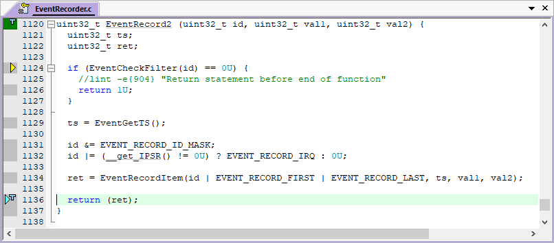
10. Clear the **Trace Data** window for convenience. This is an optional step.
11.  **Run (F5)** the application and after a few seconds click  **Stop**.
12. Filter exceptions out by selecting **ETM – Code Exec** in the **Display:** in the **Trace Data** window:  
    
13. Examine the **Trace Data** window:  
    
14. In the [**Command**](https://developer.arm.com/documentation/101407/latest/Debugging/Debug-Windows-and-Dialogs/Command-Window) window, enter `TL` and press "Enter" to display the two tracepoints:
    
15. Enter `TK*` in the **Command** window and press "Enter" to delete all tracepoints.

#### Trace Skid

The trace triggers use the same CoreSight hardware as the [Watchpoints](/learning-paths/embedded-and-microcontrollers/uv_debug/2_basics/#watchpoints). This means that it is possible a program counter skid might happen. The program might not start or stop on the exact location you set the trigger to. You might have to adjust the trigger point location to minimize this effect. This is because of the nature of the comparators in the CoreSight module and it is normal behavior.

### Code Coverage

**Code Coverage** tells what assembly instructions were executed. It is important to ensure all assembly code produced by the compiler is executed and tested. You do not want a bug or an unplanned circumstance to cause a sequence of untested instructions to be executed. The result could be catastrophic. Functional safety applications require **Code Coverage** for certification.

The µVision debugger provides **Code Coverage** with the FVP or via ETM using ULINKpro.

1.  **Start a Debug Session (Ctrl+F5)** to enter the µVision debugger.
1. In Blinky.c, set a breakpoint at `if (g_ledSet) {` (near line 56).
2.  **Run (F5)** the application. Once it hits the breakpoint, it stops. Remove the breakpoint.
3. Examine the **Disassembly** and **Blinky.c** windows. Scroll and notice the different color blocks in the left margin:  
   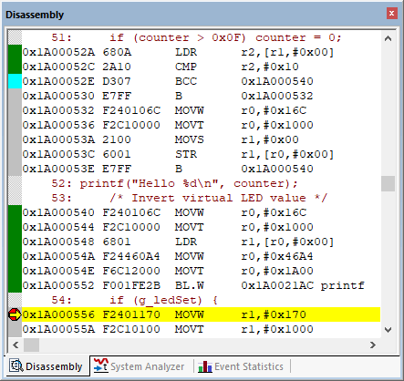  
   This is **Code Coverage** provided by ETM trace. This indicates if an instruction has been executed or not.

Color blocks indicate which assembly instructions have been executed:

 There is no assembly instruction here.  
 This assembly instruction was not executed.  
 This assembly instruction was executed.  
 A Branch is never taken.  
 A Branch is always taken.  
 A Breakpoint is set here.  
 This points to the next instruction to be executed.

{}
Code Coverage is visible in both the **Disassembly** and **source code** windows. Click on a line in one window and this place will be matched in the other window.
{}

#### Code Coverage Window

A separate [**Code Coverage**](https://developer.arm.com/documentation/101407/latest/Debugging/Debug-Windows-and-Dialogs/Code-Coverage) window is available that shows statistics.

 Go to **View - Analysis Windows** and select **Code Coverage**:  
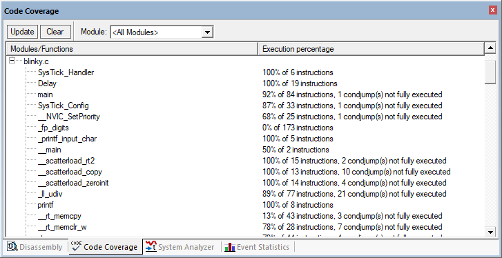

#### Code Coverage Data in the Command Window

In the [**Command**](https://developer.arm.com/documentation/101407/latest/Debugging/Debug-Windows-and-Dialogs/Command-Window) window, you can show Code Coverage in many ways, for example, enter `coverage \Blinky.c\main details`:  


{}
You can copy and paste the result from the **Command** window by right-clicking into it. Save the data in a convenient format.
{}

#### Save Code Coverage Data

Code Coverage information is temporarily saved during a run and is displayed in various windows as shown. It is possible to save this information in an ASCII file for use in other programs. You can save Code Coverage data in two formats:

1. In a [.gcov](https://en.wikipedia.org/wiki/Gcov) file. In the **Command** window execute:
   ```
   COVERAGE GCOV module
   ```
   or
   ```
   COVERAGE GCOV *
   ```
2. In an ASCII file using the `log` command.  
   Send Code Coverage data to a file (the specified directory must exist):
   ```
   log > c:\cc\test.txt
   ```
   Provides the data for `log` (you can also specify a module or function):
   ```
   coverage asm
   ```
   Turn the log function off:
   ```
   log off
   ```

### Performance Analysis

It is useful to optimize your code for speed. [**Performance Analyzer**](https://developer.arm.com/documentation/101407/latest/Debugging/Debug-Windows-and-Dialogs/Performance-Analyzer) tells you how much time was spent in each function as well as the total number of total calls. A graphical display is generated for a quick reference. If you are optimizing for speed, work first on those functions taking the longest time to execute.

The µVision debugger provides **Performance Analysis** with the FVP (number of calls only) or via ETM using ULINKpro.

1.  **Start a Debug Session (Ctrl+F5)** to enter the µVision debugger.
2. 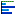 Go to **View - Analysis Windows** and select **Performance Analysis**:  
   
4. *Do not* click on  **Run (F5)** yet!
4. Expand some of the module names as shown above.
5. Shown is the number of calls and percentage of total time in this short run from reset to the start of `main()`.
6. Now,  **Run (F5)** the application. The **Performance Analyzer** window updates in real-time:  
   

{}
- Double-click on any **Function** or **Module** name and this will be highlighted in the **Disassembly** or **source code** windows.
- Select **Show: Functions** from the pull down box and notice the difference.
- You can reset the **Performance Analyzer** window by clicking on . Watch as new data is displayed in the window.
{}

### Execution Profiling

[**Execution Profiling**](https://developer.arm.com/documentation/101407/latest/Debugging/Debug-Windows-and-Dialogs/Execution-Profiler) is used to display how much time a C source line took to execute and how many times it was called. This information is provided by the ETM trace in real time while the program keeps running.

The µVision debugger provides **Execution Profiling** with the FVP (number of calls only) or via ETM using ULINKpro.

1.  **Start a Debug Session (Ctrl+F5)** to enter the µVision debugger.
2. Go to **Debug - Execution Profiling** and select **Show Time**.
3.  **Run (F5)** the application.
4. In the left margin of the **Disassembly** and **source code** windows various time values will be displayed.
8. Hover the cursor over a time and more information appears as in the yellow box here:  
   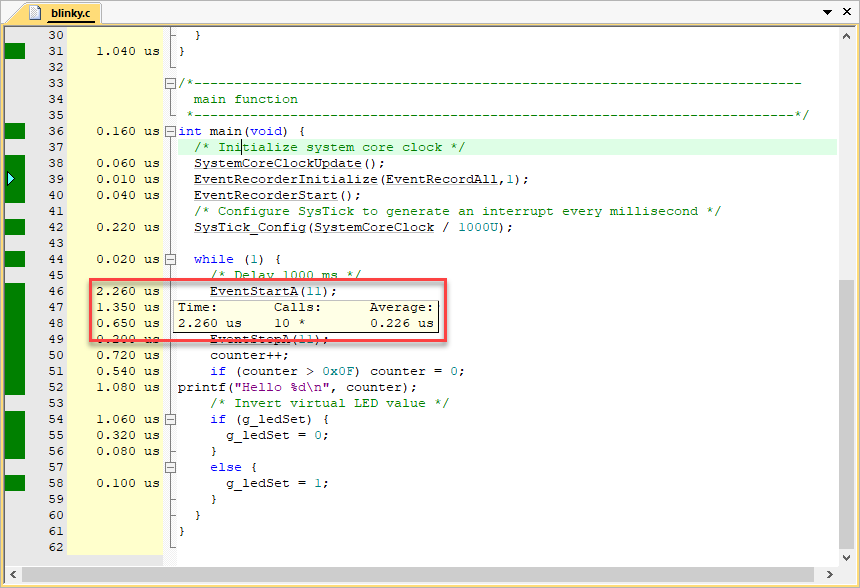
9. You can also select **Debug - Execution Profiling - Show Calls** to display this information rather than the execution times in the left margin.

#### Outlining

At some places, there is an  **Outlining** sign that can be used to collapse a code section and to compress the associated source files together.

1. In `Blinky.c`, click in the **Outlining** square near the `while (1) {` loop near line 46:  
   
2. The C source in the while loop is now collapsed into one line and times are added together to 8.380 us in this case.
5. Click on  to expand it.

{}
[Outlining](https://developer.arm.com/documentation/101407/latest/User-Interface/Edit-Menu-and-Commands/Outlining-Menu) can be useful to hide sections of code to simplify the window you are reading.
{}

### In-the-Weeds Example

This part of the tutorial requires real hardware with ETM trace capabilities as the **Traca Data** window is not available for FVP models.

Some of the hardest problems to solve are those when a crash has occurred and you have no clue what caused this – you only know that it happened and the stack is corrupted or provides no useful clues.

Modern programs tend to be asynchronous with interrupts and RTOS thread switching plus unexpected and spurious events. Having a recording of the program flow is useful especially when a problem occurs and the consequences are not immediately visible. Another problem is detecting race conditions and determining how to fix them. ETM trace handles these problems and others easily and it is easy to use.

In this example, a hard fault occurs and the CPU ends up at `0x1A00_133A` as shown in the **Disassembly** window (note that your address might not be the same as shown here):  
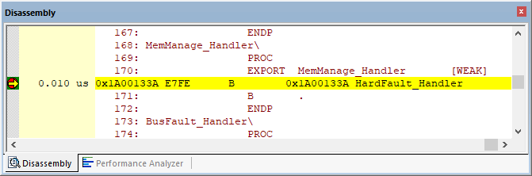

This is the `HardFault_Handler`. This is a branch to itself and will run this instruction forever. The trace buffer will save millions of the same branch instructions, which is not very useful.

The hard fault handler exception vector is found in the startup file of your device. Set a breakpoint by clicking on the `HardFault_Handler` and run the program. At the next hard fault event, the CPU jumps to the `HardFault_Handler` and halts processing. The difference this time is the breakpoint will stop the CPU and also the trace collection. The trace buffer will be visible and is useful to investigate and determine the cause of the crash.

#### Simulate a Hard Fault

1. Using the previous example,  **start a Debug Session (Ctrl+F5)** to enter the µVision debugger.
2. Locate the `HardFault_Handler` in the startup_*device*.s/c file.
3. Set a breakpoint at this point. A red circle will appear.
4. In the **Command** window execute:
   ```
   g, EventRecord2
   ```
   This puts the PC at the start of this function. `EventRecord2` returns with a `POP` instruction which you will use to create a hard fault with `LR = 0`. The assembly and sources in the **Disassembly** window do not always match up and this is caused by anomalies in ELF/DWARF specification. In general, scroll downwards in this window to provide the best match.
6. Clear the **Trace Data** window by clicking on the  clear trace icon. This helps to see what is happening.
7. In the **Register** window, double-click on the `R14 (LR)` register and set it to `'0'`. This will cause a hard fault when the processor places `LR = 0` into the PC and tries to execute the non-existent instruction at memory location `0x0`.
8.  **Run (F5)** the application and almost immediately it will stop on the hard fault exception branch instruction.
9. In the **Trace Data** window, you will find the `EventRecord2` function with the `POP` instruction at the end. When the function tried to return, the bogus value of LR caused a hard fault.
1. The `B` instruction at the hard fault vector was not executed because CoreSight hardware breakpoints do not execute the instruction they are set to when they stop the program. They are no-skid breakpoints.
1.  **Step (F11)** once. You will now see the hard fault branch as shown in the bottom screen:  


This example clearly shows how quickly ETM trace can help debug program flow bugs.

{}
Instead of setting a breakpoint on the hard fault vector, you could also right-click on it and select **Insert Tracepoint** and select **TraceHalt**. When hard fault is reached, trace collection will halt but the program will keep executing for testing and hard fault handlers.
{}
