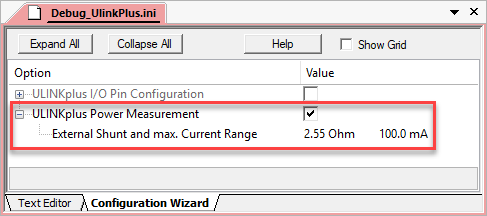

---
# User change
title: "Measure Power with ULINKplus"

weight: 6 # 1 is first, 2 is second, etc.

# Do not modify these elements
layout: "learningpathall"
---

## Measure Power with ULINKplus

An Arm Keil [ULINKplus debug adapter](https://developer.arm.com/Tools%20and%20Software/ULINKplus) offers serial-wire debug capabilities, measures the CPU core clock directly, and adds power measurement. Together with Event Statistics, this can be used to create power profiles for code sections.

{}
For details on how to connect the ULINKplus to your board, refer to the [documentation](https://developer.arm.com/documentation/101636/latest/Power-Measurement?lang=en).
{}

#### Configure ULINKplus with an Initialization File

You can configure the ULINKplus adapter with a set of debug commands that you can capture in a debug script. These scripts are executed when debug mode is entered. A [debug script template](https://developer.arm.com/documentation/101636/latest/Test-Automation/Debug-Script-Template) is available in your tool installation: `C:\Keil_v5\ARM\ULINK\Templates\Debug_UlinkPlus.ini` as a reference.

1. Copy this file into your project directory (where the `*.uvprojx` file is located).
1. Go to  **Project - Options for Target... (Alt+F7)** and switch to the **Debug** tab.
6. Click on **...** in the **Initialization File:** box, and add the file:  
   
6. Click **Edit...** to open the file.
9. Click **OK** to close the target options window and return to the main μVision window.
1. Click on the **Configuration Wizard** tab at the bottom of `Debug_UlinkPlus.ini` window.
1. Enable **ULINK Power Measurement** and select the value of your shunt resistor (in this case 2.55 Ohm/100 mA):  
   
3. Go to  **File - Save All**.

ULINKplus is now configured and ready to use.

#### Measure Power in System Analyzer

1.  **Start a Debug Session (Ctrl+F5)** to enter the µVision debugger.
1.  **Run (F5)** the application.  
1. If the window is not already open, go to **View - Analysis Windows** and select  **System Analyzer**.
6. Click the  lock symbol to stop the data collection.
9. Zoom in or out with or your mouse wheel. First, click in the waveform to set an anchor point.
5. You will have a window similar to the one below:
   

The **Current** and **Voltage** waveforms are shown in the **Consumption** section.

{}
- If **Current** has negative values, reverse the shunt wires.
- The **Voltage** and **Current** Y axis numbers are adaptive and will change dynamically to suit the values displayed.
{}

#### Power Consumption in the Event Statistics Window

1. Go to **View - Analysis Windows** and select  **Event Statistics** to open the window:  
   

The various statistics are displayed and updated in real-time. Timings, voltage, current and charges consumed are recorded according to Groups and Slots. These are created by the `EventStartX()` and `EventStopX()` function calls in the application code.

### Energy Measurement without Debug

The CoreSight debug components consume some amount of power. This will be reflected in the **System Analyzer** window. To be able to measure the real-life power without a debug connection, a specific debug mode is available. In this more, you will not be able to relate the waveforms with your code. The effects will be most pronounced during processor Sleep and WAIT states when the current drops to very low values.

1. **Stop a Debug Session (Ctrl+F5)** to leave the µVision debugger.
1. Go to  **Debug - Energy Measurement without Debug**.
2. The debug session starts and you can  **Run (F5)** the application as usual.
4. System Analyzer will display the waveform as shown below:  
   

{}
Any features needing CoreSight will not be available.
{}
