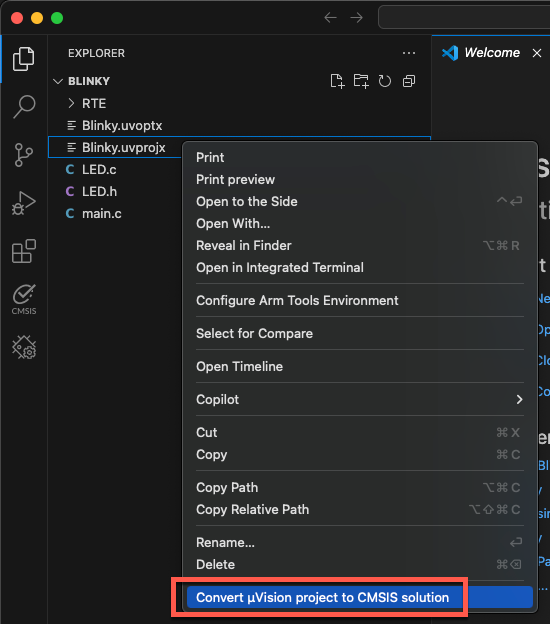
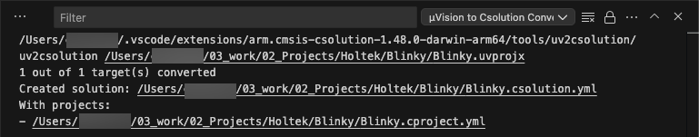
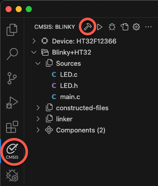

## Project conversion in Keil Studio

1. In VS Code, go to **File - Open Folder** and select the folder containing the uvprojx file (here `Blinky.uvprojx`).

1. Once the folder is open in VS Code, right-click the uvprojx file and select **Convert µVision project to csolution**:

   

1. The following files (and more) are generated:
   - `Blinky.csolution.yaml`
   - `Blinky.cproject.yaml`
   - `vcpkg-configuration.json`

1. The **Output** window shows a successful conversion:

   

1. The vcpkg configuration file is automatically activated. You notice a couple of "Arm Tools" available in the
   **Status Bar** at the bottom:

   

2. Click on the **CMSIS** icon in the **Activity Bar** to open the **CMSIS View**. At the top, click on the hammer icon to
   build the project:

   

3. The `cbuild` task starts. A successful project build will end with:

   ```output
   Program size: Code=... RO-data=... RW-data=... ZI-data=...
   info cbuild: build finished successfully!
   Build complete
   ```
