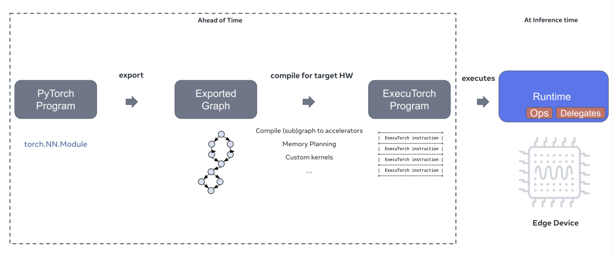

---
# User change
title: "Understand the ExecuTorch workflow"

weight: 3

# Do not modify these elements
layout: "learningpathall"
---
##  Overview

Before setting up your environment, it helps to understand how ExecuTorch processes a model and runs it on Arm-based hardware. ExecuTorch uses ahead-of-time (AOT) compilation to transform PyTorch models into optimized operator graphs that run efficiently on resource-constrained systems. The workflow supports hybrid execution across CPU and NPU cores, allowing you to profile, debug, and deploy TinyML workloads with low runtime overhead and high portability across Arm microcontrollers.

## ExecuTorch in three steps

ExecuTorch works in three main steps:

**Step 1: Export the model**

   - Convert a trained PyTorch model into an operator graph
   - Identify operators that can be offloaded to the Ethos-U NPU (for example, ReLU, conv, and quantize)

**Step 2: Compile with the AOT compiler**

   - Translate the operator graph into an optimized, quantized format
   - Use `--delegate` to move eligible operations to the Ethos-U accelerator
   - Save the compiled output as a `.pte` file

**Step 3: Deploy and run**

   - Execute the compiled model on an FVP or physical target
   - The Ethos-U NPU runs delegated operators - all others run on the Cortex-M CPU

For more detail, see the [ExecuTorch documentation](https://docs.pytorch.org/executorch/stable/intro-how-it-works.html).

## A visual overview

The diagram below summarizes the ExecuTorch workflow from model export to deployment. It shows how a trained PyTorch model is transformed into an optimized, quantized format and deployed to a target system such as an Arm Fixed Virtual Platform (FVP).

- On the left, the model is exported into a graph of operators, with eligible layers flagged for NPU acceleration.
- In the center, the AOT compiler optimizes and delegates operations, producing a `.pte` file ready for deployment.
- On the right, the model is executed on embedded Arm hardware, where delegated operators run on the Ethos-U NPU, and the rest are handled by the Cortex-M CPU.

This three-step workflow ensures your TinyML models are performance-tuned and hardware-aware before deployment—even without access to physical silicon.

## What's next?

Now that you understand how ExecuTorch works, you're ready to set up your environment and install the tools.
