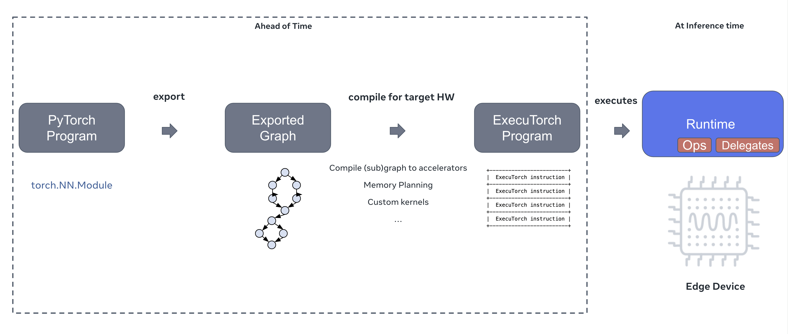

---
# User change
title: "How ExecuTorch Works"

weight: 5 # 1 is first, 2 is second, etc.

# Do not modify these elements
layout: "learningpathall"
---

To get a better understanding of [How ExecuTorch Works](https://docs.pytorch.org/executorch/stable/intro-how-it-works.html) refer to the official PyTorch Documentation. A summary is provided here for your reference:

1. **Export the model:**
   * Generate a Graph
   * A graph is series of operators (ReLU, quantize, etc.) eligible for delegation to an accelerator
   * Your goal is to identify operators for acceleration on the Ethos-U NPU
2. **Compile to ExecuTorch:**
   * This is the ahead-of-time compiler
   * This is why ExecuTorch inference is faster than PyTorch inference
   * Delegate operators to an accelerator, like the Ethos-U NPU
3. **Run on targeted device:**
   * Deploy the ML model to the Fixed Virtual Platform (FVP) or physical device
   * Execute operators on the CPU and delegated operators on the Ethos-U NPU

**Diagram of How ExecuTorch Works**


## Deploy a TinyML Model

With your development environment set up, you can deploy a simple PyTorch model.

This example deploys the [MobileNet V2](https://pytorch.org/hub/pytorch_vision_mobilenet_v2/) computer vision model. The model is a convolutional neural network (CNN) that extracts visual features from an image. It is used for image classification and object detection.

The actual Python code for the MobileNet V2 model is in your local `executorch` repo: [executorch/examples/models/mobilenet_v2/model.py](https://github.com/pytorch/executorch/blob/main/examples/models/mobilenet_v2/model.py). You can deploy it using [run.sh](https://github.com/pytorch/executorch/blob/main/examples/arm/run.sh), just like you did in the previous step, with some extra parameters:

{}

**Start Docker:** on macOS, FVPs run inside a Docker container.

{}

```bash
./examples/arm/run.sh \
--aot_arm_compiler_flags="--delegate --quantize --intermediates mv2_u85/ --debug --evaluate" \
--output=mv2_u85 \
--target=ethos-u85-128 \
--model_name=mv2
```

**Explanation of run.sh Parameters**
|run.sh Parameter|Meaning / Context|
|--------------|-----------------|
|--aot_arm_compiler_flags|Passes a string of compiler options to the ExecuTorch Ahead-of-Time (AOT) compiler|
|--delegate|Enables backend delegation|
|--quantize|Converts the floating-point model to int8 quantized format using post-training quantization<br>**Essential for running on NPUs**|
|--intermediates mv2_u85/|Directory where intermediate files (e.g., TOSA, YAMLs, debug graphs) will be saved<br>Useful output files for **manual debugging**|
|--debug|Verbose debugging logging|
|--evaluate|Validates model output, provides timing estimates|
