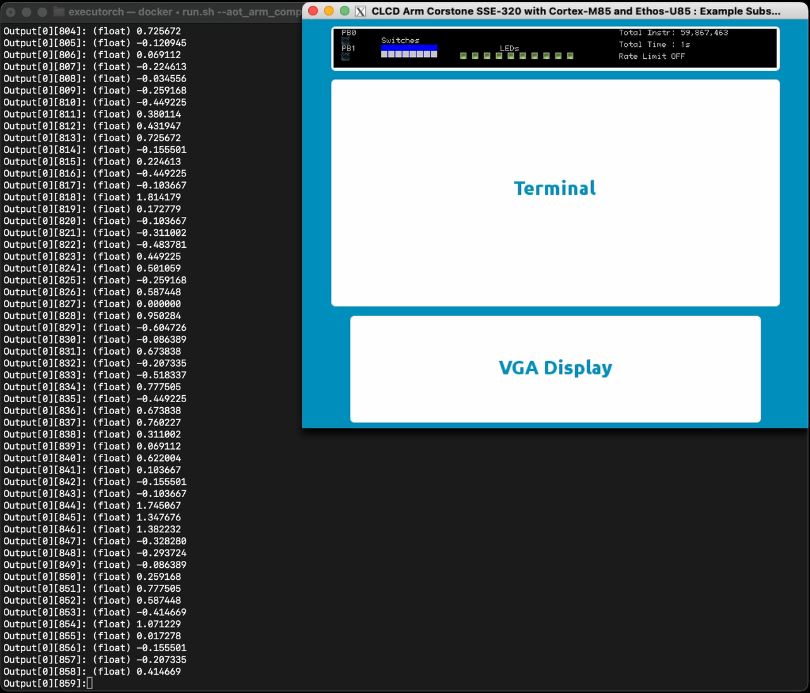

---
# User change
title: "Enable GUI and deploy a model on Corstone-320 FVP"

weight: 7 # 1 is first, 2 is second, etc.

# Do not modify these elements
layout: "learningpathall"
---

## Visualize model execution using the FVP GUI

You’ve successfully deployed a model on the Corstone-320 FVP from the command line. In this step, you’ll enable the platform’s built-in graphical output and re-run the model to observe instruction-level execution metrics in a windowed display.

## Find your IP address

Note down your computer's IP address:
```bash
ip addr show 
```
You'll use the IP address of your active network interface (inet) later to pass as an argument to the FVP.

{}

For macOS, note down your `en0` IP address (or whichever network adapter is active):

```bash
ipconfig getifaddr en0 # Returns your Mac's WiFi IP address
```

{}

## Configure the FVP for GUI output

Edit the following parameters in your locally checked out [executorch/backends/arm/scripts/run_fvp.sh](https://github.com/pytorch/executorch/blob/d5fe5faadb8a46375d925b18827493cd65ec84ce/backends/arm/scripts/run_fvp.sh#L97-L102) file, to enable the Mobilenet V2 output on the FVP's GUI:

```bash
-C mps4_board.subsystem.ethosu.num_macs=${num_macs} \
-C mps4_board.visualisation.disable-visualisation=1 \
-C vis_hdlcd.disable_visualisation=1                \
-C mps4_board.telnetterminal0.start_telnet=0        \
-C mps4_board.uart0.out_file='-'                    \
-C mps4_board.uart0.shutdown_on_eot=1               \
```

- Change `mps4_board.visualisation.disable-visualisation` to equal `0`
- Change `vis_hdlcd.disable_visualisation` to equal `0`
- Enter a `--display-ip` parameter and set it to your computer's IP address

```bash
-C mps4_board.subsystem.ethosu.num_macs=${num_macs} \
-C mps4_board.visualisation.disable-visualisation=0 \
-C vis_hdlcd.disable_visualisation=0                \
-C mps4_board.telnetterminal0.start_telnet=0        \
-C mps4_board.uart0.out_file='-'                    \
-C mps4_board.uart0.shutdown_on_eot=1               \
--display-ip <YOUR_IP_ADDRESS>                   \
```

## Deploy the model

Now run the Mobilenet V2 computer vision model, using [executorch/examples/arm/run.sh](https://github.com/pytorch/executorch/blob/main/examples/arm/run.sh):
```bash
./examples/arm/run.sh \
--aot_arm_compiler_flags="--delegate --quantize --intermediates mv2_u85/ --debug --evaluate" \
--output=mv2_u85 \
--target=ethos-u85-128 \
--model_name=mv2
```

Observe that the FVP loads the model file, compiles the PyTorch model to ExecuTorch `.pte` format and then shows an instruction count in the top right of the GUI:



{}

For macOS users, follow these instructions:

- Start Docker. FVPs run inside a Docker container. 
- Make sure to use an [official version of Docker](https://www.docker.com/products/docker-desktop/) and not a free version like the [Colima](https://github.com/abiosoft/colima?tab=readme-ov-file) Docker container runtime
 - `run.sh` assumes Docker Desktop style networking (`host.docker.internal`) which breaks with Colima
  - Colima then breaks the FVP GUI

- **Start XQuartz:** on macOS, the FVP GUI runs using XQuartz.

  Start the xquartz.app and then configure XQuartz so that the FVP will accept connections from your Mac and localhost:
  ```bash
  xhost + <YOUR_IP_ADDRESS>
  xhost + 127.0.0.1 # The Docker container seems to proxy through localhost
  ```
{}
