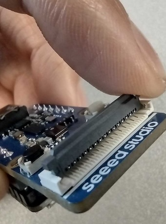
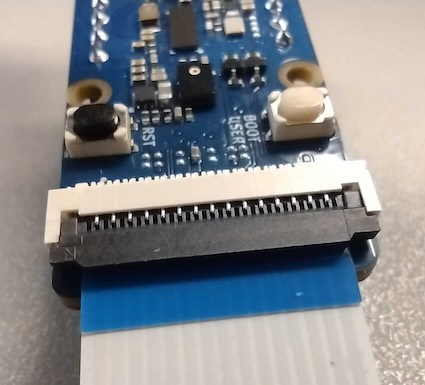
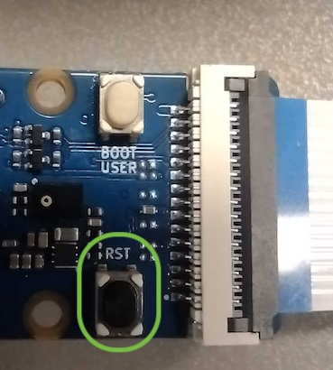

Now that you have generated an image file on the local host machine, you are ready to flash the microcontroller with the firmware.

## Install xmodem

You can easily install a basic file transfer protocol called `Xmodem` using the Himax repository containing the examples. 

Run the following command to install the dependency:

```bash
cd $HOME/Seeed_Grove_Vision_AI_Module_V2
pip install -r xmodem/requirements.txt
```

## Connect the module

It's time to get the board set up. 

Insert the Flexible Printed Circuit (FPC) into the Grove Vision AI V2 module. 

Lift the dark grey latch on the connector as shown in the image below.



* With the metal pins facing down, slide the FPC connector in.
* Close the dark grey latch to fasten the connector.



Now you can connect the Groove Vision AI V2 Module to your computer using the USB-C cable.

{}
The development board might have two USB-C connectors. If you are running into issues connecting the board in the next step, make sure you are using the correct USB-C connector.
{}

## Find the COM port

To flash the image, you need to provide the communication port (COM) which the board is connected to. 

On your machine, you can find commands that you can use to list all COMs available to use. Once your board is connected through USB, it will appear on this list of available COMs. 

The COM identifier is prefixed with **tty**, so you can use this to help you identify which COM it is. You can also run the command before and after plugging in the board if you are unsure, and look for the change in the list.



  
sudo grep -i 'tty' /var/log/dmesg
  
  
ls /dev/tty.*
  



{}
If the port appears to be unavailable, try changing the permissions temporarily using the `chmod` command. Be sure to reset the permissions again afterwards, as otherwise this can pose a computer security vulnerability.

```bash
chmod 0777 <COM port>
```
{}

You will require the full path to the port in the next step, so be sure to save it. 

## Flash the firmware onto the module

Run the python script below to flash the firmware:

```bash
python xmodem\xmodem_send.py --port=<COM port> \
--baudrate=921600 --protocol=xmodem \
--file=we2_image_gen_local\output_case1_sec_wlcsp\output.img
```

{}
When you run other example models demonstrated in the later section [Run additional models in the web toolkit](/learning-paths/embedded-and-microcontrollers/yolo-on-himax/web-toolkit/), you need to adapt this command with `--model` argument.
{}

After the firmware image flashing is completed, the message `Do you want to end file transmission and reboot system? (y)` is displayed. Press the reset button shown in the image below.



## Run the model

After the reset button is pressed, the board starts inference with the object detection automatically. Observe the output in the terminal to verify that the image is built correctly. If a person is in front of the camera, you should see the `person_score` value exceed `100`.

```output
b'SENSORDPLIB_STATUS_XDMA_FRAME_READY 240'
b'write frame result 0, data size=15284,addr=0x340e04e0'
b'invoke pass'
b'person_score:113'
b'EVT event = 10'
b'SENSORDPLIB_STATUS_XDMA_FRAME_READY 241'
b'write frame result 0, data size=15296,addr=0x340e04e0'
b'invoke pass'
b'person_score:112'
b'EVT event = 10'
```

This means the image works correctly on the device, and the end-to-end flow is complete.
