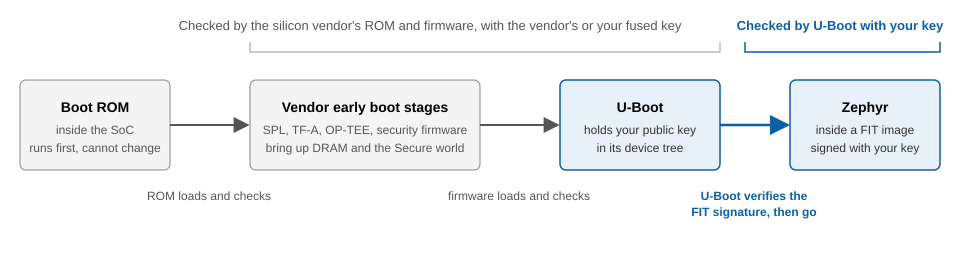
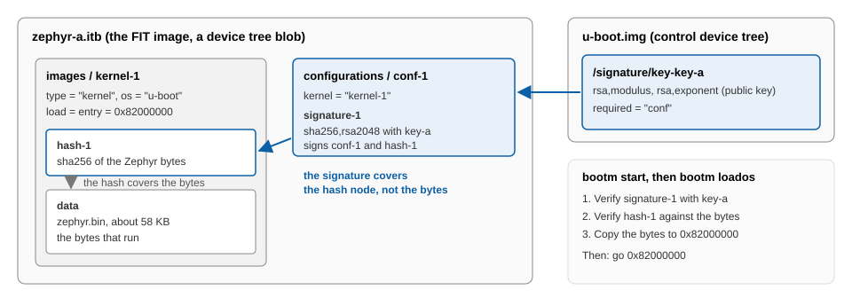

## Zephyr is the last stage, not the first

On a microcontroller (MCU), Zephyr runs first, so secure boot means adding a bootloader such as MCUboot. A Cortex-A processor starts in a read-only memory (ROM) inside the system on chip (SoC), and several firmware stages run before your code. Zephyr is the last stage, so the stage before it, usually U-Boot, can check it before starting it.

You'll package Zephyr in a Flattened Image Tree (FIT) with a signature that U-Boot verifies before starting the image.

You'll build and boot a verified Zephyr image either in QEMU without hardware, or on a TI AM62L evaluation module (EVM). You can use the same signing and verification workflow for both targets. The Learning Path includes separate instructions where setup differs.

## The boot chain on a Cortex-A board

On an Armv8-A board using U-Boot, boot proceeds from the SoC's boot ROM through early firmware to U-Boot. U-Boot then loads and starts the payload: Zephyr in your setup.

The early firmware is usually the Secondary Program Loader (SPL), a small U-Boot that loads the full one. In addition, Trusted Firmware-A (TF-A) and Open Portable Trusted Execution Environment (OP-TEE) run in the Secure world. Many SoCs add the vendor's own security firmware, which checks the later stages. 

You'll build the SPL with U-Boot. The rest comes prebuilt in the vendor's SDK.



## Choose your target

Choose between QEMU and AM62L EVM. QEMU is the default target for which you need nothing but your host. The AM62L EVM shows the same work on real silicon. 

| Requirement or feature | QEMU | AM62L EVM |
|---|---|---|
| Hardware | None | The board, a micro-SD card and reader, a micro-USB cable, and a USB-C PD supply |
| Download | U-Boot source, 32 MB | TI Processor SDK, 4.5 GB, unpacks to 11 GB |
| Stages before U-Boot | None: QEMU starts `u-boot.bin` directly | Boot ROM, `tiboot3.bin`, `tispl.bin` |
| Zephyr board | `qemu_cortex_a53` | `am62l_evm/am62l3/a53` |
| Boot media | File Allocation Table (FAT) partition in a 64 MiB disk image, `virtio 0:1` | FAT partition on a micro-SD card, `mmc 1:1` |
| Console | The terminal that you start QEMU in | USB serial at 115200 baud |

### The boot chain in QEMU

QEMU's `virt` machine has no boot ROM and no vendor firmware. It loads the file that you pass to `-bios` and starts the Cortex-A53 on it, so the chain is two links long:

```output
QEMU -bios u-boot.bin  ->  U-Boot  ->  Zephyr inside a FIT image
```

QEMU runs U-Boot's FIT verifier, but nothing authenticates U-Boot itself.

### The boot chain on the AM62L EVM

On the AM62L, the early stages are two files. `tiboot3.bin` holds TF-A's first stage and TI Foundational Security (TIFS), TI's security firmware. `tispl.bin` holds the rest of TF-A, OP-TEE, and the SPL. You'll build them together with `u-boot.img` when you build U-Boot. The EVM ships in TI's High Security, Field Securable (HS-FS) development state.


## What a FIT image is

A FIT is U-Boot's container format for boot images. It's a device tree blob (DTB) whose nodes hold images instead of hardware descriptions.

The signed FIT that you'll build contains:

- The image itself, which is Zephyr's `zephyr.bin`
- A hash of that image, so that U-Boot can tell if a byte changed
- A configuration that names the image to use (`kernel = "kernel-1"`) and carries a signature

`mkimage`, a U-Boot host tool, builds the FIT from a text source `.its` file and signs it with your private key. On the target, U-Boot's `bootm` command parses the FIT, verifies the signature and the hash, and copies the image to its load address.

You'll sign the FIT configuration with `sha256,rsa2048`, which combines SHA-256 hashing with a 2048-bit RSA key.

The public key lives inside U-Boot's own device tree, the control device tree, under a `/signature` node. That key node carries `required = "conf"`. Every configuration in every FIT must carry a valid signature by this key, or U-Boot refuses to load it. Without `required`, a FIT with no signature still boots.



The signature doesn't cover the image bytes. It covers the configuration node plus the hash node, and the hash covers the bytes.

## Verify Zephyr before starting it

Configure U-Boot to verify the Zephyr FIT before starting Zephyr with `go`, U-Boot's command for jumping to an address.

If you choose QEMU as your target, there's no key to fuse and nothing checks U-Boot at all. 

If you choose AM62L EVM as your target, leave it in its development state without fusing your key into the chip. In that state, the ROM and vendor firmware accept boot files signed with any key. U-Boot's check of Zephyr is enforced either way. 

You'll review [U-Boot's Zephyr FIT verification boundary and production needs](/learning-paths/embedded-and-microcontrollers/zephyr-signed-fit-uboot-cortex-a/8-production/) after booting the image.

## What you've learned and what's next

You've learned that Zephyr is the last stage of a Cortex-A boot chain, so U-Boot can verify it. You also learned that `required = "conf"` makes U-Boot refuse any FIT it can't verify.

Next, you'll set up the host tools for your target.
