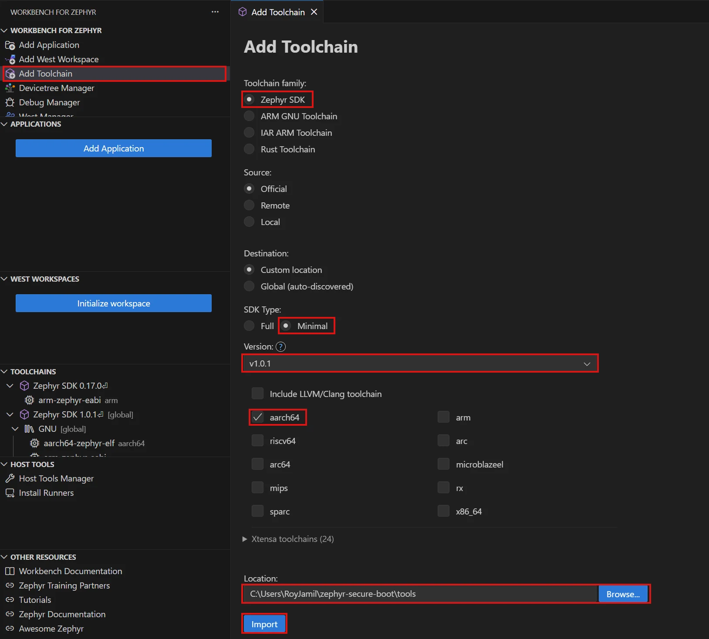
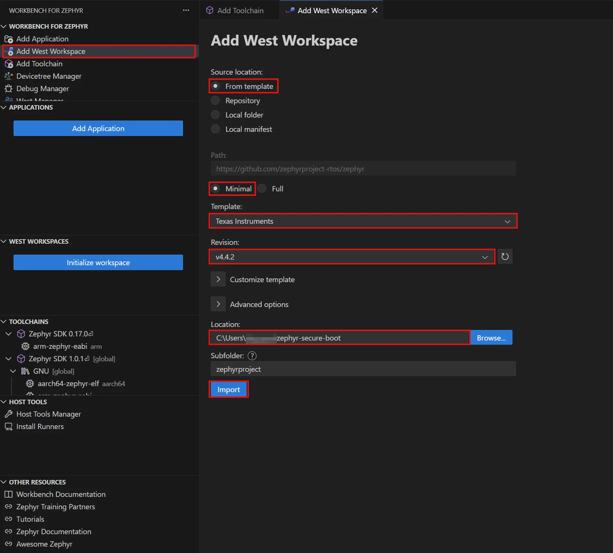
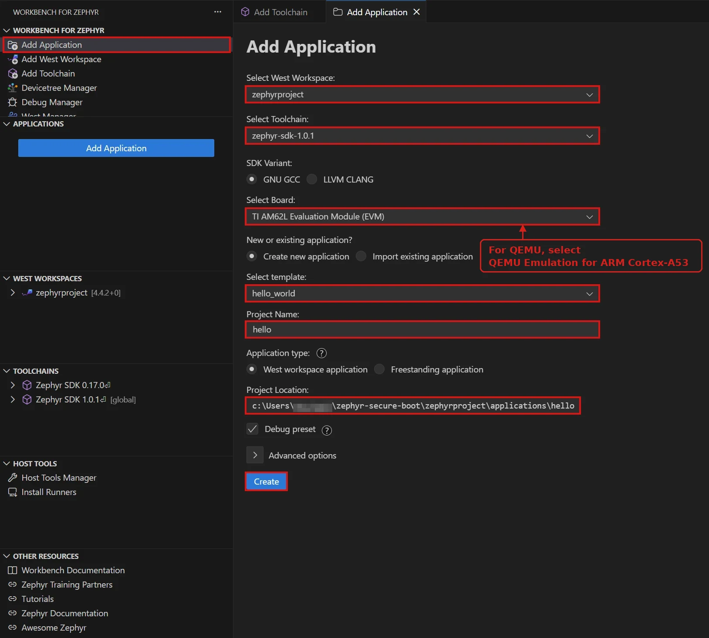
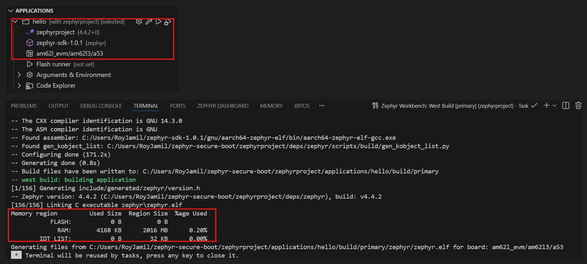

## Open Workbench for Zephyr

Use Workbench for Zephyr to import an AArch64 toolchain, create a Zephyr workspace, and build your application. The steps are the same for both targets. Select the board that matches your target.

Open VS Code on your working directory:

```bash
code $HOME/zephyr-secure-boot
```

Select the **Workbench for Zephyr** icon in the Activity Bar. Its panel contains the **Applications**, **West workspaces**, **Toolchains**, and **Host tools** views.

{}
The screenshots show Windows paths, a globally installed SDK, and the AM62L evaluation module (EVM). On Ubuntu, use your own paths and the SDK location that you choose. If you chose QEMU, select `qemu_cortex_a53` wherever a board is requested.
{}

## Import the AArch64 toolchain

Use the Zephyr SDK's `aarch64-zephyr-elf` compiler for your Cortex-A53 target. Select the **Minimal** SDK type and **aarch64** architecture to download that toolchain.

In the **Workbench for Zephyr** panel, select **Add Toolchain** and fill in the form:

1. For **Toolchain family**, select **Zephyr SDK**.
2. For **Source**, select **Official**.
3. For **Destination**, select **Custom location**.
4. For **SDK Type**, select **Minimal**.
5. For **Version**, select **v1.0.1**.
6. Select **aarch64** and clear the other architecture checkboxes.
7. For **Location**, specify a parent directory where Workbench creates the SDK folder, such as `$HOME/zephyr-secure-boot`. Workbench adds a versioned subdirectory such as `zephyr-sdk-1.0.1` inside it.



8. Select **Import**. 

The download takes a few minutes. When it finishes, the **Toolchains** view shows `Zephyr SDK 1.0.1` with a `GNU` entry and `aarch64-zephyr-elf` under it.

## Add a West workspace

Create a Zephyr 4.4.2 workspace for your chosen target. The same workspace supports QEMU and the AM62L EVM. Select **Add West Workspace** and fill in the form:

1. For **Source location**, select **From template**.
2. Under **Path**, select **Minimal**.
3. For **Template**, select **Texas Instruments** for either target.
4. For **Revision**, select **v4.4.2** or a later 4.x release.
5. For **Location**, specify **`$HOME/zephyr-secure-boot`** (shown expanded, such as `/home/ubuntu/zephyr-secure-boot`).
6. For **Subfolder**, select **`zephyrproject`**.



7. Select **Import**. 

Workbench downloads Zephyr, the vendor's hardware abstraction layer (HAL), and other modules into `zephyrproject/deps`. This can take several minutes. When it finishes, confirm that `zephyrproject` appears in the **West workspaces** view.

## Create the application

Select **Add Application** and fill in the wizard:

1. For **Select West Workspace**, select **`zephyrproject`**.
2. For **Select Toolchain**, select **`zephyr-sdk-1.0.1`**.
3. For **SDK Variant**, select **GNU GCC**.
4. For **Select Board**, enter **qemu** and select **QEMU Emulation for ARM Cortex-A53**, or enter **am62l** and select **TI AM62L Evaluation Module (EVM)**.
5. For **New or existing application?**, select **Create new application**.
6. For **Select template**, select **`hello_world`**, under **`deps/zephyr/samples/hello_world`**.
7. For **Project Name**, enter **`hello`**.
8. For **Application type**, select **West workspace application**.
9. For **Project Location**, ensure the value is **`zephyrproject/applications/hello`**, filled in by the wizard.

   Check that the board identifier matches `BOARD` in your environment file: `qemu_cortex_a53` for QEMU or `am62l_evm/am62l3/a53` for the AM62L EVM.
10. Select **Create**.

    

The application `hello` appears in the **Applications** view, marked `[with zephyrproject]`. `zephyrproject/applications/hello` holds the sample's `CMakeLists.txt`, `prj.conf` and `src/main.c`.

## Replace the sample's files

Leave `CMakeLists.txt` as it is and replace the other two files.

Replace the contents of `prj.conf` with the following four lines:

```text
CONFIG_ARMV8_A_NS=y
CONFIG_PRINTK=y
CONFIG_BOOT_BANNER=y
CONFIG_AARCH64_IMAGE_HEADER=y
```

`CONFIG_PRINTK` enables console output with `printk()`. `CONFIG_BOOT_BANNER` prints the `*** Booting Zephyr OS build ... ***` line, confirming that Zephyr has started.

Replace the contents of `src/main.c` with the following code. Its banner identifies image A and the key that you'll use to sign it. This helps you distinguish the images during the optional [wrong-key and tampered-image tests](/learning-paths/embedded-and-microcontrollers/zephyr-signed-fit-uboot-cortex-a/7-test-the-checks/).

```c
#include <zephyr/kernel.h>
#include <zephyr/sys/printk.h>

int main(void)
{
	printk("\n");
	printk("################################################\n");
	printk("#                                              #\n");
	printk("#   Hello from ZEPHYR IMAGE A                  #\n");
	printk("#   signed with key-a  (TRUSTED by U-Boot)     #\n");
	printk("#                                              #\n");
	printk("################################################\n");
	printk("\n");
	printk("board            : %s\n", CONFIG_BOARD_TARGET);
	printk("arch             : %s\n", CONFIG_ARCH);
	printk("started by       : U-Boot 'go' after FIT signature verification\n");
	printk("this image was verified by U-Boot before it ran.\n");
	return 0;
}
```

Save both files.

## Configure Non-secure execution and the arm64 header

`CONFIG_ARMV8_A_NS=y` tells Zephyr that it runs in the Non-secure world, the one U-Boot hands it. Without it, the driver of the Generic Interrupt Controller (GICv3) never programs the Non-secure registers. The timer interrupt never arrives, and Zephyr hangs right after its banner.

`CONFIG_AARCH64_IMAGE_HEADER=y` puts a 64-byte arm64 header at the start of `zephyr.bin`, in the same format as a Linux kernel image. The header's first instruction is `b __start`, a branch to Zephyr's real entry point. U-Boot needs that branch only at offset 0. Without the header, `go` jumps into whatever the linker placed there.

The configurations for `qemu_cortex_a53` and `am62l_evm/am62l3/a53` already set both options. Repeating them in `prj.conf` protects you on a board whose configuration doesn't.

## Build the application

In the **Applications** view, open the context menu for `hello` and select **Build**. Workbench runs `west build` in the terminal and writes the build outputs to the application's `build/primary` directory. Near the end, the linker prints a memory report similar to:

```output
Memory region         Used Size  Region Size  %age Used
           FLASH:           0 B          0 B
             RAM:       4168 KB      2016 MB      0.20%
        IDT_LIST:           0 B        32 KB      0.00%
```



The result is `$WORK/zephyrproject/applications/hello/build/primary/zephyr/zephyr.bin`, a raw binary linked at `ZEPHYR_ADDR`, the start of the target's `zephyr,sram` memory node. The binary is about 37 KB for `qemu_cortex_a53`, whose memory report shows 128 MB of RAM. It's about 58 KB for the AM62L EVM, which reports 2016 MB of RAM.

{}
On an `aarch64` host, the build can fail with `exec format error` when it invokes `cmake` from `~/.zinstaller`. Some versions of the Workbench for Zephyr host tools install `x86_64` builds of CMake and Ninja, which can't run on Arm. Verify that Host Tools can also report a misleading error, such as `-255 package(s) are not installed`, for the same reason.

Confirm the architecture of the installed tools:

```bash
file ~/.zinstaller/tools/cmake-*/bin/cmake ~/.zinstaller/tools/ninja/ninja
```

If the output reports `x86-64`, point the two tools at your system's Arm builds, after installing them with `sudo apt install -y cmake ninja-build`:

```bash
ln -sf "$(command -v cmake)" ~/.zinstaller/tools/cmake-*/bin/cmake
ln -sf "$(command -v ninja)" ~/.zinstaller/tools/ninja/ninja
```

Rebuild the application. The Zephyr SDK compiler is a native Arm binary and doesn't need this change.
{}

## Check the arm64 image header

Open a terminal with **Terminal > New Terminal** in VS Code, or use an existing shell. Load your target's environment file:

- QEMU: `source $HOME/zephyr-secure-boot/env-qemu.sh`
- AM62L EVM: `source $HOME/zephyr-secure-boot/env-am62l.sh`

Print the header's magic number at offset `0x38`:

```bash
od -An -c -j 0x38 -N4 $WORK/zephyrproject/applications/hello/build/primary/zephyr/zephyr.bin
```

The expected output is:

```output
   A   R   M   d
```

`ARMd` is the arm64 image magic, so the header is in place and the image starts with the branch instruction that `go` jumps to. If you see anything else, check that `$WORK/zephyrproject/applications/hello/build/primary/zephyr/.config` contains `CONFIG_AARCH64_IMAGE_HEADER=y`.

## What you've accomplished and what's next

You've built a Zephyr image for your target's Cortex-A53, linked at `ZEPHYR_ADDR`, and checked its arm64 header.
 
Next, you'll create the signing keys and package the image in a signed Flattened Image Tree (FIT) for U-Boot to verify.
