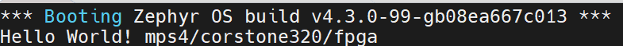

## Build the hello_world sample for MPS4 

The Zephyr hello_world sample prints “Hello World” to the console. Use it to validate that your board support and toolchain configuration work.

1. Activate your Python virtual environment for Zephyr.
2. Set the toolchain environment variables. Replace <toolchain_install_path> with the directory where you installed the Arm GNU Toolchain.
   ```bash 
	export ZEPHYR_TOOLCHAIN_VARIANT=gnuarmemb
	export GNUARMEMB_TOOLCHAIN_PATH=arm-gnu-toolchain-13.2.Rel1-x86_64-arm-none-eabi-install-path/
   ```
3. Build the sample for the Corstone-320 FPGA variant:
   ```bash
	west build -p always -b mps4/corstone320/fpga zephyr/samples/hello_world -- -DCONFIG_ROMSTART_RELOCATION_ROM=y
   ```
After a successful build, the output file zephyr.elf is available under build/zephyr/. The ELF image contains the application and the Zephyr kernel libraries.

## Run the application on the MPS4 board
1. Download the board files from [FI101](https://developer.arm.com/downloads/view/FI101?sortBy=availableBy&revision=r1p0-00eac0-2), 
2. Set up the MPS4 platform according to the [Using the FI101 on MPS4 board](https://developer.arm.com/documentation/109762/0100/?lang=en).

For the hello_world application, place the vector table in the FPGA boot ROM at address 0x11000000, and place the remaining code and data in SRAM at address 0x31000000. Create vector.bin and app.bin from zephyr.elf by using arm-none-eabi-objcopy.

Update images.txt under /MB/HBI0376B/FI101 to load the two images:

 ```
IMAGE0PORT: 2
IMAGE0ADDRESS: 0x00_1100_0000           ; Address to load into
IMAGE0UPDATE: RAM                       
IMAGE0FILE: \SOFTWARE\vector.bin          ; Image/data to be loaded

IMAGE1PORT: 1
IMAGE1ADDRESS: 0x31000000            ; Address to load into
IMAGE1UPDATE: RAM
IMAGE1FILE: \SOFTWARE\app.bin     ; Image/data to be loaded
 ```

Copy vector.bin and app.bin to \SOFTWARE, then power on the board.
If the setup is correct, the UART console prints the “Hello World” message, similar to the following example:

     

## What you accomplished
In this Learning Path, you learned
- How to explore the Corstone‑320 architecture, created board support files and configured device tree and Kconfig options to port Zephyr RTOS for the target hardware.
- How to built and run the Zephyr hello_world sample on MPS4 board.

These steps help you further customize Zephyr on the CS320 MPS4 platform and validate a complete build-and-run workflow.
