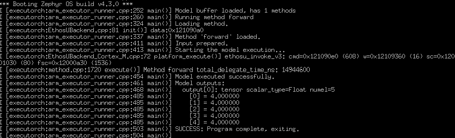

## Port hello-executorch for mps4/corstone320/fpga platform

[hello-executorch](https://github.com/pytorch/executorch/tree/main/zephyr/samples/hello-executorch) is a ML sample application in ExecuTorch. It deploys a model using the ExecuTorch runtime. We port the application to the Corstone-320 MPS4 platform to validate the ML application workflow on this platform.

### Change NPU region configuration settings for the project
The `ethosu_config_select()` function is a weak function defined in the Ethos-U driver file `ethosu_device_u85.c`. It configures the `QCONFIG` and `REGIONCFG` registers for the Ethos-U85.

Because the model is preprocessed in SRAM-only mode, all command streams, weights, and scratch data must reside in SRAM on the Corstone-320 platform. Therefore, we override `ethosu_config_select()` in the application to configure the AXI regions for the command stream and memory regions required by SRAM-only mode.

Create a new file, `ethosu_config_corstone320.c`, in the `hello-executorch/src` directory with the following content:

```C
unsigned int ethosu_config_select(uint64_t address, int index)
{
    (void)(address);  /* Not used in fixed configuration */
    
    assert(index >= -1 && index <= 7);
    
    switch (index)
    {
    case -1:
        /* QCONFIG: Command stream uses region 1 (SRAM path). Value = 1 */
        return 1;
        
    case 0:
        /* REGIONCFG_0: Read-only data region uses SRAM. Value = 1 */
        return 1;
        
    case 1:
      /* REGIONCFG_1: scratch/input/output buffer uses SRAM via MEM_ATTR[0]. */
        return 0;
    case 2:
     /* REGIONCFG_2: fast scratch uses SRAM via MEM_ATTR[0]. */
        return 0;
    case 3:
    case 4:
    case 5:
    case 6:
    case 7:
        /* Other regions are not used by this model; keep them on SRAM. */
        return 0;
        
    default:
        /* Should not reach here due to assert */
        return 0;
    }
}
```

Add `ethosu_config_corstone320.c` to the `app_sources` list in `modules/lib/executorch/zephyr/samples/hello-executorch/CMakeLists.txt`:

```makefile
set(app_sources
    src/arm_executor_runner.cpp
    src/ethosu_config_corstone320.c
    ${EXECUTORCH_DIR}/examples/arm/executor_runner/arm_memory_allocator.cpp
)
```


### Add the zephyr configuration files for MPS4 CS320 platform

Create the board-specific Kconfig file `boards/mps4_corstone320_fpga.conf` in the `hello-executorch` sample directory and add the following content:

```
CONFIG_ETHOS_U=y
CONFIG_ETHOS_U85_1024=y
CONFIG_EXECUTORCH_METHOD_ALLOCATOR_POOL_SIZE=1048576
CONFIG_EXECUTORCH_TEMP_ALLOCATOR_POOL_SIZE=32768
```
Add the following settings to `prj.conf` to enable logging:

```
CONFIG_LOG=y
CONFIG_LOG_MODE_IMMEDIATE=y
CONFIG_LOG_DEFAULT_LEVEL=3
CONFIG_CONSOLE=y
CONFIG_SERIAL=y
CONFIG_UART_CONSOLE=y
CONFIG_PRINTK=y

CONFIG_ASSERT=y
CONFIG_FAULT_DUMP=2
```

### Build the project 

Build the `hello-executorch` application by following these steps:

1. Activate the Python virtual environment for Zephyr.
2. Set the toolchain environment variables. The path should match where you installed the Arm GNU Toolchain in the prerequisite Learning Path. On aarch64, replace `x86_64` with `aarch64` in the directory name.

```bash
	export ZEPHYR_TOOLCHAIN_VARIANT=gnuarmemb
	export GNUARMEMB_TOOLCHAIN_PATH=$HOME/arm-gnu-toolchain-13.2.Rel1-x86_64-arm-none-eabi
```
3. Build the sample application for the Corstone-320 FPGA variant:

```bash
west build -p always \
  -b mps4/corstone320/fpga \
  -d build_hello_et_fpga \
  modules/lib/executorch/zephyr/samples/hello-executorch \
  -- -DET_PTE_FILE_PATH=add_u85_1024_sram_only.pte \
  -DSYSTEM_CONFIG=Ethos_U85_SYS_DRAM_Mid \
  -DMEMORY_MODE=Sram_Only
```

After a successful build, the output file `zephyr.elf` is available in `build_hello_et_fpga/zephyr/`.

Verify the build output exists:

```bash
ls -la build_hello_et_fpga/zephyr/zephyr.elf
```
The ELF image contains the Zephyr kernel, the Ethos-U driver, the ExecuTorch runtime, the generated `.pte` file, and the ML application.


### Run the application on the MPS4 board
1. Download the board files from [FI101](https://developer.arm.com/downloads/view/FI101?sortBy=availableBy&revision=r1p0-00eac0-2), 
2. Set up the MPS4 platform according to the [Using the FI101 on MPS4 board](https://developer.arm.com/documentation/109762/0100/?lang=en).

For the `hello-executorch` application, place the vector table in the FPGA boot ROM at address 0x11000000, and place the remaining code and data in SRAM at address 0x31000000. Create vector.bin and app.bin from zephyr.elf by using arm-none-eabi-objcopy.

Update images.txt under /MB/HBI0376B/FI101 to load the two images:

```
IMAGE0PORT: 2
IMAGE0ADDRESS: 0x00_1100_0000           ; Address to load into
IMAGE0UPDATE: RAM                       
IMAGE0FILE: \SOFTWARE\vector.bin        ; Image/data to be loaded

IMAGE1PORT: 1
IMAGE1ADDRESS: 0x31000000               ; Address to load into
IMAGE1UPDATE: RAM
IMAGE1FILE: \SOFTWARE\app.bin           ; Image/data to be loaded

```

Copy vector.bin and app.bin to \SOFTWARE, then power on the board.
If the setup is correct, the UART console prints the model delegate flow, similar to the following example:



## What you accomplished
In this Learning Path, you learned how to deploy a Zephyr-based ML application on the Arm Corstone-320 MPS4 platform using ExecuTorch. You learned how to preprocess a model for Ethos-U NPU delegation, develop a Zephyr-based ML application, and integrate the ExecuTorch runtime.

These steps help you validate ML applications on the platform and provide a foundation for developing more advanced ML workloads.
