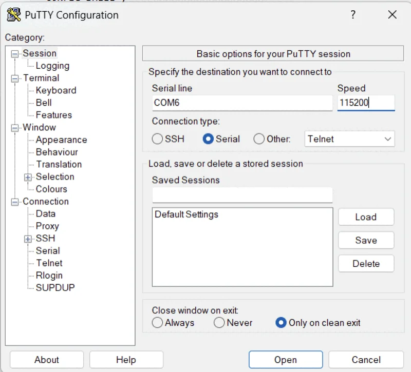
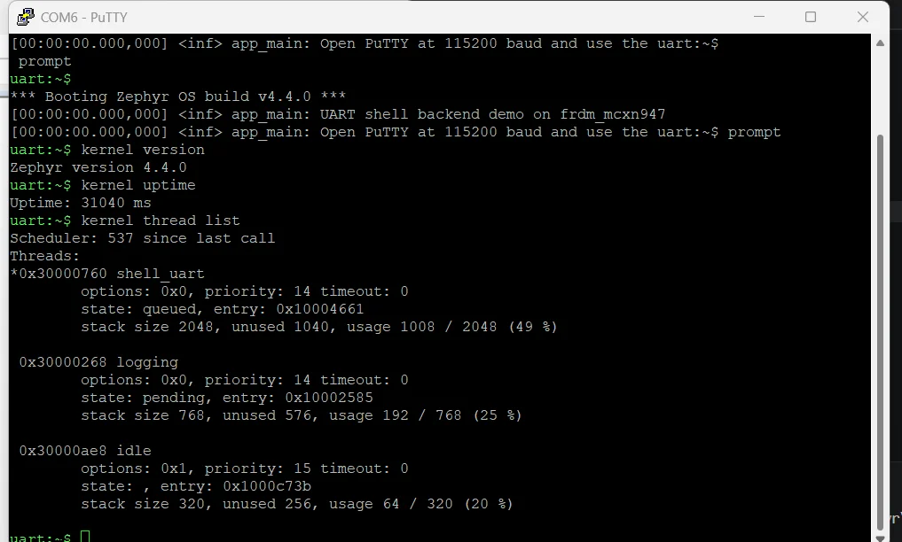

## Build a Zephyr application to enable the UART shell backend

Start by building a Zephyr application that enables the UART shell backend.

The example uses the FRDM-MCXN947 because it provides an onboard CMSIS-DAP/LinkServer debug interface together with a USB UART connection. These can be accessed from a serial terminal application such as PuTTY on Windows, or `screen` on macOS and Linux.

UART shell access uses the board's USB serial interface and doesn't require additional debug hardware or network connectivity. The Zephyr UART shell backend maps shell input and output to the active UART console. 

### Create an application project in Workbench for Zephyr

To create an application project in Workbench for Zephyr:

1. Open the **Workbench for Zephyr** panel.
2. In the panel, select **New Application** to open the **Create a new Zephyr Application Project** wizard. 
3. After opening the wizard, fill in the following fields:
    - For **Select West Workspace**, select your initialized West workspace for Zephyr v4.4.0.
    - For **Select Toolchain**, select `zephyr-sdk-1.0.1`.
    - For **Select Board**, select **FRDM-MCXN947** (Zephyr identifier `frdm_mcxn947/mcxn947/cpu0`).
    - For **Application type**, select **Create new application**.
    - For **Select Sample project**, select `hello_world`.
    - For **Project Name**, enter `frdm_uart_shell`.
    - For **Project Location**, select the directory where you want to create the project.
    - Leave **Debug preset** checked.
    - Leave **Advanced options** as the defaults.
4. Select **Create** to generate the project.

### Configure the application

The `hello_world` sample provides a working `CMakeLists.txt`, `prj.conf`, and `src/main.c`. Leave `CMakeLists.txt` unchanged, and replace `prj.conf` and `src/main.c` with the following contents.

Edit the `prj.conf` file and replace the contents with the following text:

```text
CONFIG_SHELL=y
CONFIG_LOG=y

CONFIG_SERIAL=y
CONFIG_CONSOLE=y
CONFIG_UART_CONSOLE=y
CONFIG_SHELL_BACKEND_SERIAL=y

CONFIG_MAIN_STACK_SIZE=2048
```

The UART shell backend routes shell input and output through the board's USB serial interface.

#### Update the main function

Edit the `main.c` file and replace the contents with the following code:

```c
#include <zephyr/logging/log.h>

LOG_MODULE_REGISTER(app_main, LOG_LEVEL_INF);

int main(void)
{
    LOG_INF("UART shell backend demo on %s", CONFIG_BOARD);
    LOG_INF("Connect a serial terminal at 115200 baud and use the uart:~$ prompt");
    return 0;
}
```

No shell initialization code is required in `main.c`. Zephyr registers and starts the UART shell backend from the Kconfig options in `prj.conf`.

### Build and flash the application

Connect the FRDM-MCXN947 board to your host computer over USB.

In the **Workbench for Zephyr** panel, select your project and build configuration. Select **Build**, then select **Flash**.

The FRDM-MCXN947 uses the onboard CMSIS-DAP/LinkServer interface for flashing and debugging.

## Connect with a UART terminal

After flashing, the board resets and starts running. Open a UART terminal application and connect to the board's serial port over USB.

### Windows with PuTTY

Configure PuTTY with:

- **Connection type**: `Serial`
- **Serial line**: your board's COM port (for example, `COM5`)
- **Speed**: `115200`

After configuring, select **Open** to connect to the UART shell.



### macOS with screen

Open a terminal window and identify the serial device:

```bash
ls /dev/tty.*
```

Connect to the UART shell, replacing `/dev/tty.usbmodemXXXX` with the serial device shown on your system:

```bash
screen /dev/tty.usbmodemXXXX 115200
```
To exit `screen`, press the `Ctrl` key and `A`, then `K`, then `Y` to confirm.

### Linux with screen

List available serial devices:

```bash
ls /dev/ttyACM* /dev/ttyUSB*
```

If you see a permission error, add your user to the `dialout` group, then log out and back in:

```bash
sudo usermod -aG dialout $USER
```

Connect to the UART shell, replacing `/dev/ttyACM0` with the device shown on your system:

```bash
screen /dev/ttyACM0 115200
```
To exit `screen`, press the `Ctrl` key and `A`, then `K`, then `Y` to confirm.

### Check the shell prompt

In your UART terminal application, you'll see the boot log followed by the shell prompt:

```output
uart:~$ *** Booting Zephyr OS build v4.4.0 ***
uart:~$ [00:00:00.001,037] <inf> app_main: UART shell backend demo on frdm_mcxn947
uart:~$ [00:00:00.001,037] <inf> app_main: Connect a serial terminal at 115200 baud and use the uart:~$ prompt
uart:~$
```

The `uart:~$` prompt confirms that the UART shell backend is active.

The boot banner and the `<inf>` log lines are prefixed with `uart:~$` because `SHELL_LOG_BACKEND` is enabled by default when `CONFIG_SHELL=y` and `CONFIG_LOG=y` are both set. Log output is routed through the active shell backend.

## Run shell commands

Type each of the following commands at the `uart:~$` prompt:

```bash
kernel version
kernel uptime
kernel thread list
```



The `*` next to `shell_uart` in the thread list marks the currently running thread, which is the shell that executed the command.

{}
Application log messages such as `LOG_INF` and `LOG_WRN` appear in the terminal together with the shell prompt. This is expected when both `CONFIG_SHELL=y` and `CONFIG_LOG=y` are enabled.
{}

## Debug while UART shell is connected

You can run a debug session in Workbench for Zephyr while the UART terminal remains connected.

To start debugging, select your build configuration in the **Workbench for Zephyr** panel and select **Debug**. You can set breakpoints, inspect variables, and step through code in Visual Studio Code while the UART shell remains open.

When execution stops at a breakpoint, shell output pauses with the target. After you continue execution, the UART shell becomes responsive again.

## (Optional) Switch to a different board

The application is portable across many Zephyr-supported boards because the UART shell backend is selected through Kconfig and there is no board-specific code in `main.c`.

To change the target board on an existing project:

1. Open the **Workbench for Zephyr** panel in the VS Code Activity Bar.
2. Expand the **Applications** section.
3. Right-click the board name and select **Change board**.
4. Right-click the application and select **Clean**.
5. Right-click the application and select **Build (pristine)**.

{}
You need a pristine build when you change the board because Workbench for Zephyr caches board-specific generated files in the build directory.
{}

After the pristine build completes, flash the board as before. The same `prj.conf` and `main.c` work without changes on any Zephyr-supported board with a USB UART interface.

## What you've accomplished

You've now built and flashed a Zephyr application that enables the UART shell backend on the FRDM-MCXN947. You connected with a UART terminal application, opened the Zephyr shell over USB serial, and ran Zephyr shell commands from the host computer.

You can use the workflows described in this Learning Path to add a command-line shell to your own Zephyr RTOS applications for debugging and testing.
