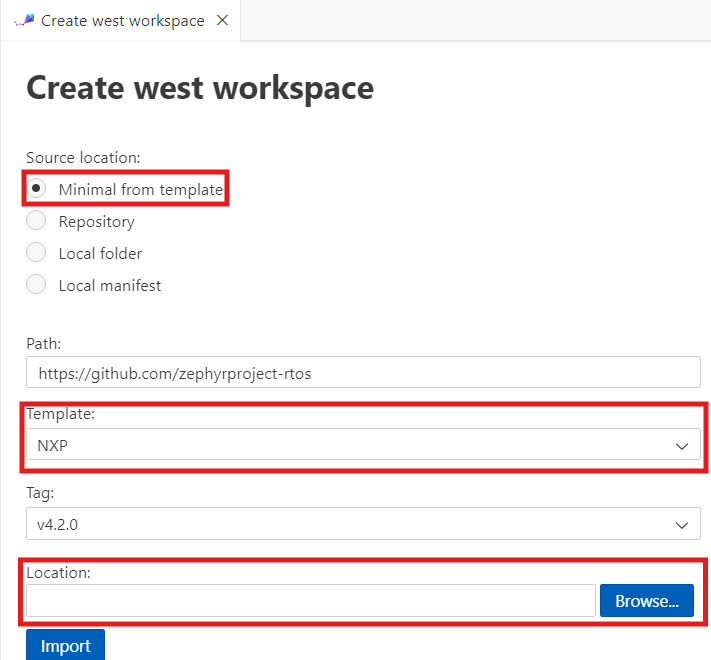

## Set Up Your Zephyr Development Environment

Setting up a [Zephyr](https://zephyrproject.org/) RTOS development environment from scratch can be challenging—requiring developers to manually install SDKs, configure toolchains, and initialize workspace directories. These steps often vary across operating systems and board vendors, leading to a fragmented and error-prone setup process.

***[Zephyr Workbench](https://zephyr-workbench.com/)*** is an open-source Visual Studio Code extension that transforms Zephyr RTOS development into a streamlined IDE experience. Created by [Ac6](https://www.ac6.fr/en/), it automates toolchain setup, project management, and debugging—making Zephyr projects faster to start and easier to scale.

In this learning path, you’ll walk through the essential steps to install Zephyr Workbench and configure a complete development environment on your local machine. Once complete, you’ll be ready to create, build, and debug applications for Arm Cortex-M platforms using Zephyr RTOS.

**Key capabilities:**

- One-Click Environment Setup: Automatically installs required host tools including Python, CMake, Ninja, and Git.
- SDK and Toolchain Management: Supports importing and managing Zephyr SDKs with version and architecture selection.
- Workspace and Project Initialization: Initializes west workspaces and creates board-specific applications from samples.
- Integrated Build and Flash: Builds Zephyr applications and flashes to hardware directly from the VS Code interface.
- Advanced Debug and Memory Analysis: Provides breakpoint debugging and memory usage insights with hardware probe support.

## What you need before installing Zephyr Workbench

To get started with Zephyr Workbench, ensure you have the following required Software:

**Visual Studio Code:**

- Download, install, and start Visual Studio Code on your desktop.

**Windows Requirements:**

- Windows 10 or later (64-bit)
- Administrator privileges for installing tools and drivers
- Internet connection for downloading packages and SDKs

Or

**macOS Requirements:**

- On macOS, the package manager "Homebrew" is required.
- To install Homebrew, run the following command:

```bash
/bin/bash -c "$(curl -fsSL https://raw.githubusercontent.com/Homebrew/install/HEAD/install.sh)"
```

**Supported Hardware:**

- STM32 development boards (STM32 Discovery, Nucleo series)
- Nordic Semiconductor boards (nRF52, nRF53, nRF91 series)
- NXP development boards (FRDM, LPCXpresso series)
- Espressif boards (ESP32-based boards)
- And many other Zephyr-supported platforms

## Set Up Zephyr Workbench Extension in Visual Studio Code

This module walks you through installing the Zephyr Workbench extension and setting up your Arm-ready development environment.

### Install the Extension

1. **Open VS Code Extension Marketplace**
   - Open Visual Studio Code
   - Navigate to the `Extensions view` by clicking the Extensions icon in the Activity Bar
   - Or use the keyboard shortcut `Ctrl+Shift+X` (Windows/Linux) or `Cmd+Shift+X` (macOS)
2. **Search and Install**
   - In the search box, type "Zephyr Workbench"
   - Locate the official "Zephyr Workbench" extension by Ac6
   - Click "Install" to add the extension to VS Code   
3. **Verify Installation**
   - After installation, you should see the Zephyr Workbench panel in the VS Code sidebar
   - The extension icon will appear in the Activity Bar
   - A welcome message may appear confirming successful installation

Once installed, the Zephyr Workbench icon appears in the sidebar with a welcome screen.


### Install Required Host Tools

In the Zephyr Workbench panel, click ***Install Host Tools*** to automatically install dependencies:
   - ***Python*** 3.x
   - ***CMake***
   - ***Ninja*** build system
   - ***Git***
   - ***Device Tree Compiler*** (DTC)
   - ***West*** meta-tool
   
   
   
{}
On Windows, you may be prompted for permission when tools are executed. Click "Allow" when requested.
{}

After host tools installation, click ***Verify Host Tools*** to check the version of each installed packages.


### Import and Configure Toolchain

Next, download and configure the ***Toolchain***.

   - Click ***Import Toolchain*** in the Zephyr Workbench panel
   - Select the toolchain family (***Zephyr SDK***)
   - configure the ***SDK Type***: choose ***Minimal*** for basic functionality
      - **Version:** Select desired version (e.g., v0.17.0 or v0.17.3)
      - **Toolchains:** Select target architectures (In this learning path, you only need to select ***arm***)
      - **Location:** Specify the parent directory for SDK installation
      - Click **"Import"** to download and install the SDK
   
   


### Initialize the Zephyr Project Workspace

Zephyr uses a Git-based workspace manager called West to organize its source code, modules, and samples. Use Zephyr Workbench to initialize your first ***west workspace***.

In the Zephyr Workbench panel, click “Initialize Workspace” and fill in the following settings:

   - Click "Initialize workspace" to set up your project environment
   - Configure workspace settings in the opened page:
     - **Source location:** Select "Minimal from template"
     - **Path:** Use default `https://github.com/zephyrproject`
     - **Template:** Choose target-specific template (e.g., STM32, NXP)
     - **Branch:** Select Zephyr version (e.g., v3.7.0, v4.1.0)
     - **Location:** Specify directory for workspace (takes ~10 minutes to initialize)
   - Click "Import" to create and update the workspace
   
   
   
   {}
   The workspace initialization downloads the Zephyr source code and dependencies. This process may take several minutes depending on your internet connection.
   {}

### Verify Setup

**Test your setup**
   - Confirm that the Zephyr Workbench panel shows all components as installed:
     - Host Tools installed successfully
     - SDK imported and detected
     - West workspace initialized
   - Ensure no error messages appear in the VS Code output panel

{}
**Troubleshooting tips:**
- Run VS Code as Administrator if host tool installation fails on Windows
- Ensure internet access is allowed through your firewall
- Check for minimum 2GB free disk space before importing SDK
{}

You’re now ready to create and build your first Zephyr application targeting an Arm Cortex-M board.

After completing this session, your environment is ready to create, build, and debug Zephyr applications in VS Code using Arm Cortex-M boards.
