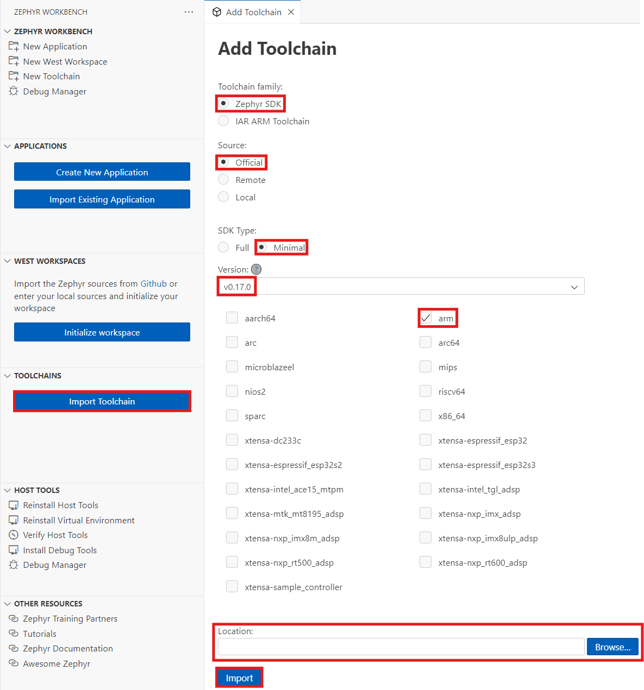

## Set up your Zephyr development environment

Setting up a [Zephyr](https://zephyrproject.org/) RTOS development environment from scratch can be challenging, requiring you to manually install SDKs, configure toolchains, and initialize workspace directories. These steps often vary across operating systems and board vendors, leading to a fragmented and error-prone setup process.

[Workbench for Zephyr](https://zephyr-workbench.com/) is an open-source Visual Studio Code [extension](https://marketplace.visualstudio.com/items?itemName=Ac6.zephyr-workbench) that transforms Zephyr RTOS development into a streamlined IDE experience. Created by [Ac6](https://www.ac6.fr/en/), it automates toolchain setup, project management, and debugging, making Zephyr projects faster to start and easier to scale.

In this Learning Path, you'll learn the essential steps to install Workbench for Zephyr and configure a complete development environment on your local machine. Once complete, you'll be ready to create, build, and debug applications for Arm Cortex-M platforms using Zephyr RTOS.

Workbench for Zephyr provides one-click environment setup that automatically installs the required tools including Python, CMake, Ninja, and Git. It supports importing and managing Zephyr SDKs with version and architecture selection, while initializing west workspaces and creating board-specific applications from samples. The extension builds Zephyr applications and flashes hardware directly from the VS Code interface. It also provides breakpoint debugging and memory usage insights with hardware probe support.

## What you need before installing Workbench for Zephyr

To get started with Workbench for Zephyr you need to have Visual Studio Code downloaded, installed, and running on your computer.

**Windows OS:**
For Windows, you need version 10 or later (64-bit x64), along with administrator privileges for installing runners and drivers. 

**MacOS:**
On MacOS, the Homebrew package manager is required. To install Homebrew, run the following command:

```bash
/bin/bash -c "$(curl -fsSL https://raw.githubusercontent.com/Homebrew/install/HEAD/install.sh)"
```

**Linux:**
- A recent 64-bit X64 distribution such as Ubuntu 20.04 or later, Fedora, Clear Linux OS, or Arch Linux
- Other distributions might work, but may require manual configuration of system packages
- After installation, use the Workbench host tools manager to verify that all required tools were installed correctly


Zephyr Workbench supports STM32 development boards (STM32 Discovery, Nucleo series), Nordic Semiconductor boards (nRF52, nRF53, nRF91 series), NXP development boards (FRDM, LPCXpresso series), Espressif boards (ESP32-based boards), and many other Zephyr-supported platforms like Renesas, Silabs or Infineon. You need a development board to try out the code examples.

## Configure the Workbench for Zephyr extension in Visual Studio Code

This section covers installing the Zephyr Workbench extension and configuring your Arm development environment.

### Install the extension

To install the Workbench for Zephyr extension, open Visual Studio Code and navigate to the Extensions view by selecting the Extensions icon in the Activity Bar. 

You can also use the keyboard shortcut `Ctrl+Shift+X` (Windows/Linux) or `Cmd+Shift+X` (macOS).

In the search box, type "Workbench for Zephyr" and locate the official "Workbench for Workbench" extension by Ac6. Select **Install** to add the extension to VS Code.

The extension icon appears in the Activity Bar, and a welcome message may appear confirming successful installation.

Once installed, the Workbench for Zephyr icon appears in the sidebar with a welcome screen.

### Install the required host tools

In the Workbench for Zephyr panel, select **Install Host Tools** to automatically install the required dependencies. 

This process installs Python 3.x, CMake, the Ninja build system, Git, Device Tree Compiler (DTC), and the West meta-tool.


   
{}
On Windows, you may be prompted for permission when tools are executed. Select "Allow" when requested.
{}

When the installation completes, select **Verify Host Tools** to check the version of each installed package.

### Import and configure the toolchain

Next, download and configure the toolchain by selecting **Import Toolchain** in the Workbench for Zephyr panel. Select the toolchain family (*Zephyr SDK*) and configure the SDK Type by choosing *Minimal* for basic functionality.

Select your desired version (such as v0.17.0 or v0.17.3) and choose the target architectures. For this Learning Path, you only need to select *arm*. 

Specify the parent directory for SDK installation and select **Import** to download and install the SDK.




### Initialize the Zephyr project workspace

Zephyr uses a Git-based workspace manager called West to organize its source code, modules, and samples. Use Workbench for Zephyr to initialize your first West workspace.

In the Workbench for Zephyr panel, select **Initialize Workspace** to set up your project environment. Configure the workspace settings by selecting "Minimal from template" for the source location and using the default path `https://github.com/zephyrproject-rtos/zephyr`. 

Choose a target-specific template (such as STM32 or NXP) and select your Zephyr version (such as v3.7.0 or v4.1.0). Specify the directory for your workspace, keeping in mind that initialization takes approximately 10 minutes to complete. 

Select **Import** to create and update the workspace.


   
{}
The workspace initialization downloads the Zephyr source code and dependencies. This process may take several minutes depending on your internet connection speed.
{}

### Verify setup

Test your setup by confirming that the Workbench for Zephyr panel shows all components as installed successfully. Verify the host tools are installed, the SDK is imported and detected, and the West workspace is initialized. Ensure no error messages appear in the VS Code output panel.

{}
**Troubleshooting tips:**
- Run VS Code as Administrator if host tool installation fails on Windows
- Ensure internet access is allowed through your firewall
- Check for minimum 2 GB free disk space before importing SDK
{}

You're ready to create and build your first Zephyr application targeting an Arm Cortex-M board.
