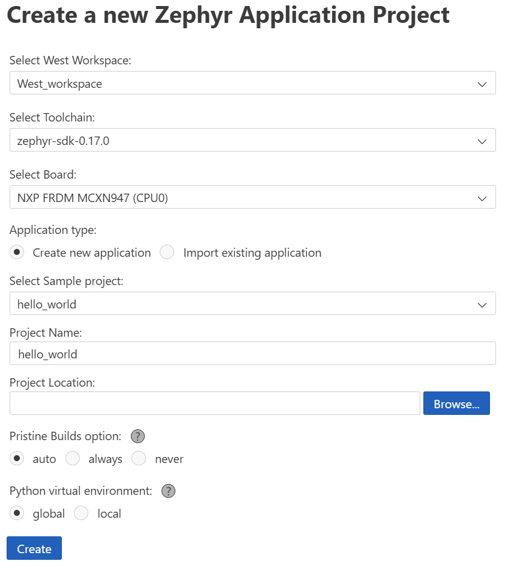
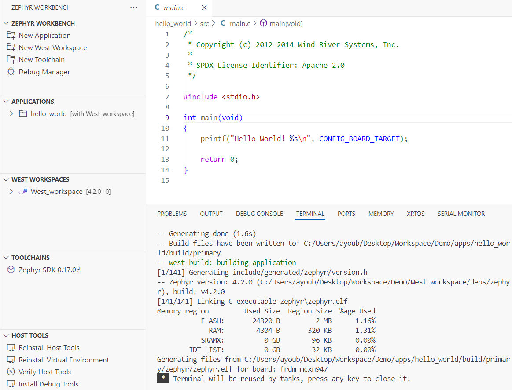

## Create and Build Your First Zephyr Application

In this session, you’ll learn how to create and build your first Zephyr application using Zephyr Workbench. This step prepares you to customize, test, and expand real firmware projects on Arm Cortex-M boards.

For demonstration, we will use an [NXP FRDM-MCXN947](https://www.nxp.com/design/design-center/development-boards-and-designs/FRDM-MCXN947) development board as the target device. However, the same steps apply to any Zephyr-supported Arm Cortex-M board. 
You can find the full list of supported boards in the [Supported Boards](https://docs.zephyrproject.org/latest/boards/#).

Depending on your board, you may need to install a different debug tool. We’ll cover that in the next module.

### Create Application

In the Zephyr Workbench panel:

1. Click **"Create New Application"**
2. Configure your project:
   - Select workspace and SDK
   - Choose your **target board** (e.g., NXP FRDM-MCXN947)
   - Select a sample app (e.g., `hello_world`)
   - Provide a project name




### Build the Application

Click the **Build** button in Zephyr Workbench or press `Ctrl+Shift+B`.

The build system compiles your application and links it against the Zephyr kernel and board-specific drivers.




### Install Board-Specific Debug Utilities

To enable debugging on your target hardware, you may need to install additional tools based on the board vendor.

For the NXP FRDM-MCXN947, download and install the LinkServer debug utility:
- LinkServer for Microcontrollers: [NXP LinkServer Download Page](https://www.nxp.com/design/design-center/software/development-software/mcuxpresso-software-and-tools-/linkserver-for-microcontrollers:LINKERSERVER)

Once installed, Zephyr Workbench will attempt to detect it automatically during a debug session.
If you’re using a different board, refer to your vendor’s documentation to install the appropriate debug utility.

{}
If Zephyr Workbench does not automatically detect the installed debug runner, you can manually configure it.
Open the ***Debug Manager*** from the Zephyr sidebar, and enter the full path to the runner executable.
{}

### Review Output

Check the build output at the bottom panel of VS Code. Ensure there are no errors or warnings. A successful build should display:

```
Building ‘hello_world’ for frdm_mcxn947
Memory region         Used Size  Region Size  % Used
           FLASH:      19844 B         1 MB      1.9%
            SRAM:       4048 B       256 KB      1.5%
```


### Code Walkthrough: hello_world

```c
#include <zephyr/kernel.h>
#include <zephyr/sys/printk.h>

int main(void)
{
    printk("Hello World! %s\n", CONFIG_BOARD); // Prints board name to serial console
    return 0;
}
```

`CONFIG_BOARD` expands to your target board name. Try modifying this app in the next module!

### Try This: Modify and Rebuild

Now that the app is working, try editing the message in `printk()` or changing the board target in the application settings. Then rebuild and observe the output. This helps verify that your toolchain and workspace respond correctly to code and config changes.

With your first Zephyr application successfully built, you’re ready to take the next step—debugging. In the next module, you’ll launch a debug session, set breakpoints, and perform memory analysis using Zephyr Workbench. These skills will help you validate and optimize applications running on real Arm Cortex-M hardware.
