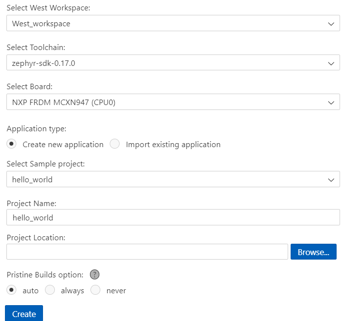

## Create and build your first Zephyr application

In this session, you'll learn how to create and build your first Zephyr application using Workbench for Zephyr. This step prepares you to customize, test, and expand real firmware projects on Arm Cortex-M boards.

For demonstration, you'll use an [NXP FRDM-MCXN947](https://www.nxp.com/design/design-center/development-boards-and-designs/FRDM-MCXN947) development board as the target device. However, the same steps apply to any Zephyr-supported Arm Cortex-M board. 
You can find the full list of supported boards in the [Supported Boards](https://docs.zephyrproject.org/latest/boards/#).

Depending on your board, you might need to install a different debug tool aka `runner`. The next module covers this setup.

### Create application

In the Zephyr Workbench panel:

1. Select **Create New Application**
2. Configure your project:
   - Select workspace and SDK
   - Choose your target board (for example, NXP FRDM-MCXN947)
   - Select a sample app (for example, `hello_world`)
   - Provide a project name



### Build the application

Select the **Build** button in Workbench for Zephyr or press `Ctrl+Shift+B`.

The build system compiles your application and links it against the Zephyr kernel and board-specific drivers.


### Install board-specific debug utilities

To enable debugging on your target hardware, you might need to install additional tools based on the board vendor.

For the NXP FRDM-MCXN947, download and install the LinkServer debug utility:
- LinkServer for Microcontrollers: [NXP LinkServer Download Page](https://www.nxp.com/design/design-center/software/development-software/mcuxpresso-software-and-tools-/linkserver-for-microcontrollers:LINKERSERVER)

Once installed, Workbench for Zephyr attempts to detect it automatically during a debug session.
If you're using a different board, see your vendor's documentation to install the appropriate debug utility.

{}
If Workbench for Zephyr doesn't automatically detect the installed debug runner, you can manually configure it.
Open the **Debug Manager** from the Zephyr sidebar, and enter the full path to the runner executable.
{}

### Review output

Check the build output at the bottom panel of VS Code. Make sure there are no errors or warnings. A successful build displays:

```output
Building ‘hello_world’ for frdm_mcxn947
Memory region         Used Size  Region Size  % Used
           FLASH:      19844 B         1 MB      1.9%
            SRAM:       4048 B       256 KB      1.5%
```

### Code walkthrough: hello_world

The following code shows a basic Zephyr application that prints a message to the console:

```c
#include <zephyr/kernel.h>
#include <zephyr/stdio.h>

int main(void)
{
    printk("Hello World! %s\n", CONFIG_BOARD_TARGET); // Prints board name to serial console
    return 0;
}
```

`CONFIG_BOARD` expands to your target board name. You'll modify this app in the next module!

### Try this: modify and rebuild

Now that the app works, try editing the message in `printk()` or changing the board target in the application settings. Then rebuild and observe the output. This helps verify that your toolchain and workspace respond correctly to code and config changes.

With your first Zephyr application successfully built, you're ready to take the next step—debugging. In the next module, you'll launch a debug session, set breakpoints, and perform memory analysis using Workbench for Zephyr. These skills help you validate and optimize applications running on real Arm Cortex-M hardware.
