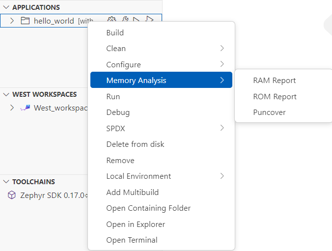
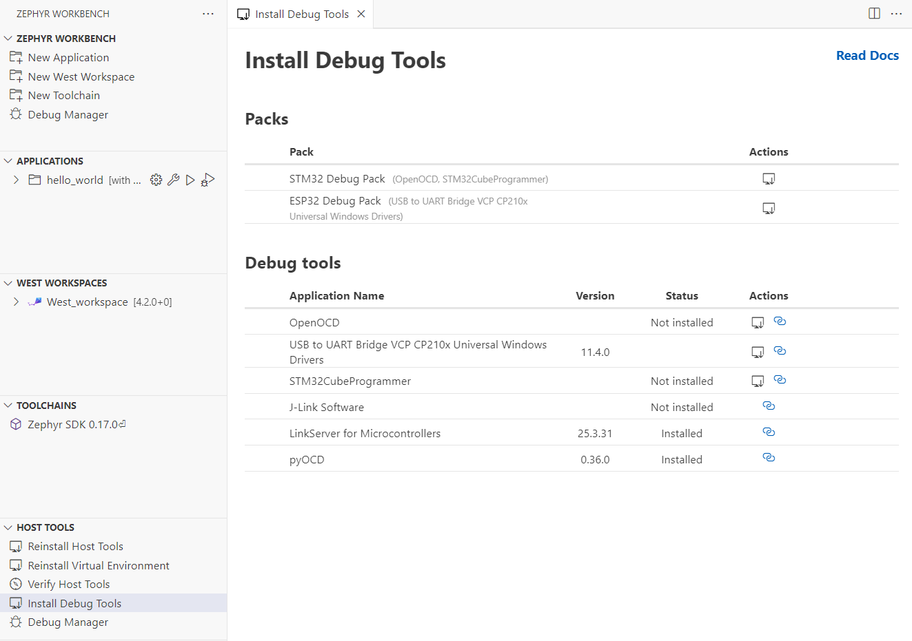
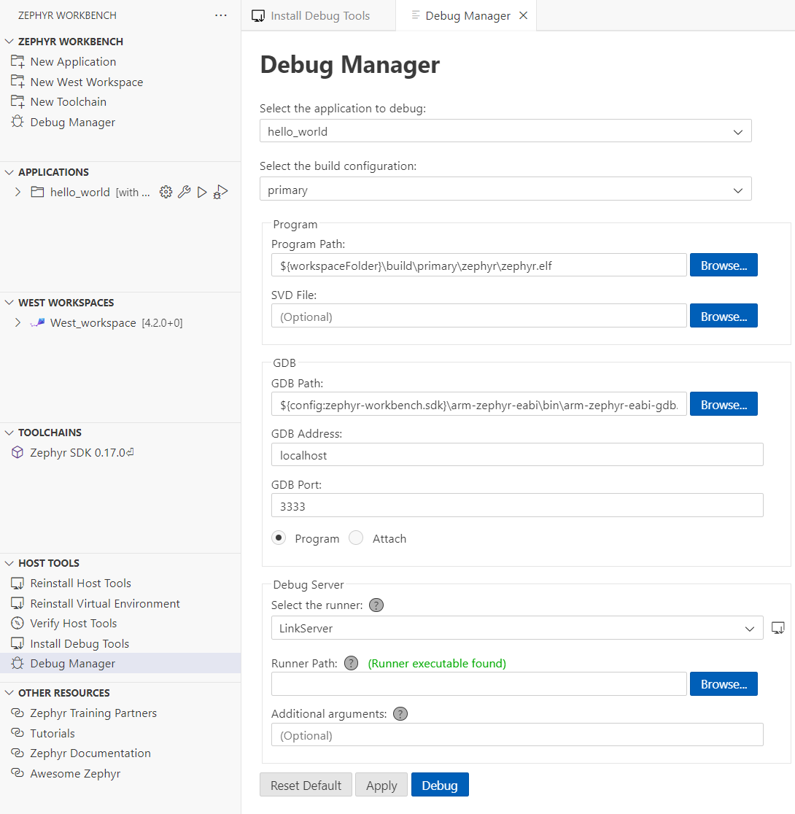
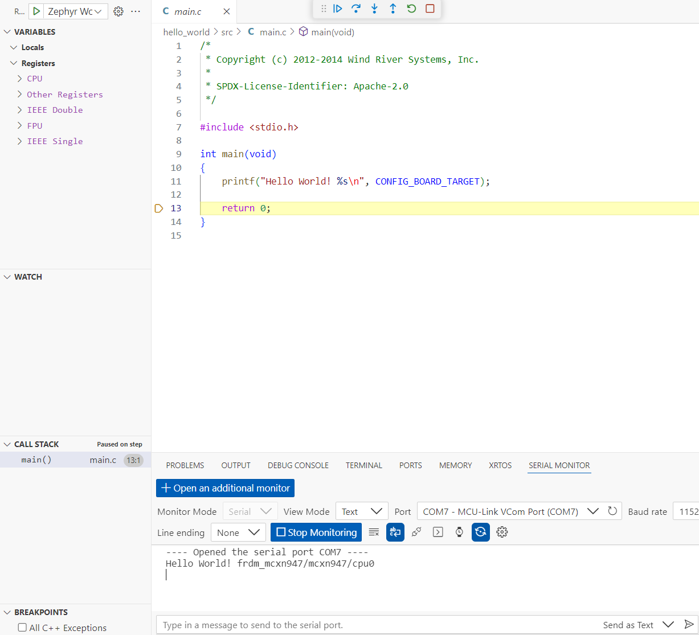

## Analyze and Debug Zephyr Applications in VS Code

In this module, you'll learn how to inspect memory usage and perform live debugging on your Zephyr applications using Zephyr Workbench. These capabilities are essential for diagnosing bugs and optimizing embedded firmware performance on Arm Cortex-M platforms.

## Analyze Memory Usage

Understanding how your application uses memory is crucial for optimizing embedded firmware on resource-constrained Arm Cortex-M systems. Zephyr Workbench provides built-in tools to generate detailed memory usage reports after a successful build, helping you identify ROM and RAM consumption hotspots early in development.

### Generate Memory Reports

After building your Zephyr application, it’s important to analyze how memory is allocated and used. Zephyr Workbench offers built-in memory reporting tools that help you visualize RAM and ROM usage, identify inefficient memory patterns, and guide optimization efforts. These insights are especially useful when working with constrained Arm Cortex-M platforms.

- Open the **Zephyr Workbench** panel
- Click **Memory Analysis** after a successful build
- Review detailed memory reports:
  - **RAM usage**: stack, heap, static variables
  - **ROM usage**: code size, constants
  - **Puncover**: binary analysis for function size, call graphs, and timing on ARM Cortex-M



The RAM Report looks like this:

```
Path                                                                                             Size       %  Address    Section
===================================================================================================================================
Root                                                                                             4323 100.00%  -
├── (hidden)                                                                                        4   0.09%  -
├── (no paths)                                                                                   3492  80.78%  -
│   ├── SystemCoreClock                                                                             4   0.09%  0x300000f4 datas
│   ├── _kernel                                                                                    32   0.74%  0x3000036c bss
│   ├── _thread_dummy                                                                             128   2.96%  0x30000240 bss
│   ├── z_idle_threads                                                                            128   2.96%  0x30000140 bss
│   ├── z_interrupt_stacks                                                                       2048  47.37%  0x300003a0 noinit
│   ├── z_main_stack                                                                             1024  23.69%  0x30000ce0 noinit
│   └── z_main_thread                                                                             128   2.96%  0x300001c0 bss
├── WORKSPACE                                                                                       8   0.19%  -
│   └── deps                                                                                        8   0.19%  -
│       └── modules                                                                                 8   0.19%  -
│           └── hal                                                                                 8   0.19%  -
│               └── nxp                                                                             8   0.19%  -
│                   └── mcux                                                                        8   0.19%  -
│                       └── mcux-sdk-ng                                                             8   0.19%  -
│                           └── devices                                                             8   0.19%  -
│                               └── MCX                                                             8   0.19%  -
│                                   └── MCXN                                                        8   0.19%  -
│                                       └── MCXN947                                                 8   0.19%  -
│                                           └── drivers                                             8   0.19%  -
│                                               └── fsl_clock.c                                     8   0.19%  -
│                                                   ├── s_Ext_Clk_Freq                              4   0.09%  0x300000fc datas
│                                                   └── s_Xtal32_Freq                               4   0.09%  0x300000f8 datas
└── ZEPHYR_BASE                                                                                   819  18.95%  -
    ├── arch                                                                                       25   0.58%  -
    │   └── arm                                                                                    25   0.58%  -
    │       └── core                                                                               25   0.58%  -
    │           ├── mpu                                                                            21   0.49%  -
    │           │   ├── arm_mpu.c                                                                   1   0.02%  -
    │           │   │   └── static_regions_num                                                      1   0.02%  0x30000398 bss
    │           │   └── arm_mpu_v8_internal.h                                                      20   0.46%  -
    │           │       └── dyn_reg_info                                                           20   0.46%  0x300002e4 bss
    │           └── tls.c                                                                           4   0.09%  -
    │               └── z_arm_tls_ptr                                                               4   0.09%  0x300002e0 bss
    ├── drivers                                                                                   376   8.70%  -
    │   ├── clock_control                                                                           2   0.05%  -
    │   │   └── clock_control_mcux_syscon.c                                                         2   0.05%  -
    │   │       └── __devstate_dts_ord_10                                                           2   0.05%  0x3000010c device_states
    │   ├── gpio                                                                                   70   1.62%  -
    │   │   └── gpio_mcux.c                                                                        70   1.62%  -
    │   │       ├── __devstate_dts_ord_12                                                           2   0.05%  0x30000116 device_states
    │   │       ├── __devstate_dts_ord_14                                                           2   0.05%  0x30000114 device_states
    │   │       ├── __devstate_dts_ord_157                                                          2   0.05%  0x3000010e device_states
    │   │       ├── __devstate_dts_ord_176                                                          2   0.05%  0x30000112 device_states
    │   │       ├── __devstate_dts_ord_19                                                           2   0.05%  0x30000110 device_states
    │   │       ├── gpio_mcux_port0_data                                                           12   0.28%  0x30000338 bss
    │   │       ├── gpio_mcux_port1_data                                                           12   0.28%  0x3000032c bss
    │   │       ├── gpio_mcux_port2_data                                                           12   0.28%  0x30000320 bss
    │   │       ├── gpio_mcux_port3_data                                                           12   0.28%  0x30000314 bss
    │   │       └── gpio_mcux_port4_data                                                           12   0.28%  0x30000308 bss
    │   ├── mfd                                                                                   232   5.37%  -
    │   │   └── mfd_nxp_lp_flexcomm.c                                                             232   5.37%  -
    │   │       ├── __devstate_dts_ord_119                                                          2   0.05%  0x3000011e device_states
    │   │       ├── __devstate_dts_ord_123                                                          2   0.05%  0x3000011c device_states
    │   │       ├── __devstate_dts_ord_127                                                          2   0.05%  0x3000011a device_states
    │   │       ├── __devstate_dts_ord_131                                                          2   0.05%  0x30000118 device_states
    │   │       ├── nxp_lp_flexcomm_children_0                                                     48   1.11%  0x300000c4 datas
    │   │       ├── nxp_lp_flexcomm_children_1                                                     48   1.11%  0x3000008c datas
    │   │       ├── nxp_lp_flexcomm_children_2                                                     48   1.11%  0x30000054 datas
    │   │       ├── nxp_lp_flexcomm_children_3                                                     48   1.11%  0x3000001c datas
    │   │       ├── nxp_lp_flexcomm_data_0                                                          8   0.19%  0x300000bc datas
    │   │       ├── nxp_lp_flexcomm_data_1                                                          8   0.19%  0x30000084 datas
    │   │       ├── nxp_lp_flexcomm_data_2                                                          8   0.19%  0x3000004c datas
    │   │       └── nxp_lp_flexcomm_data_3                                                          8   0.19%  0x30000014 datas
    │   ├── pinctrl                                                                                12   0.28%  -
    │   │   └── pinctrl_nxp_port.c                                                                 12   0.28%  -
    │   │       ├── __devstate_dts_ord_11                                                           2   0.05%  0x3000012a device_states
    │   │       ├── __devstate_dts_ord_13                                                           2   0.05%  0x30000128 device_states
    │   │       ├── __devstate_dts_ord_156                                                          2   0.05%  0x30000122 device_states
    │   │       ├── __devstate_dts_ord_175                                                          2   0.05%  0x30000126 device_states
    │   │       ├── __devstate_dts_ord_18                                                           2   0.05%  0x30000124 device_states
    │   │       └── __devstate_dts_ord_83                                                           2   0.05%  0x30000120 device_states
    │   ├── serial                                                                                 36   0.83%  -
    │   │   └── uart_mcux_lpuart.c                                                                 36   0.83%  -
    │   │       ├── __devstate_dts_ord_125                                                          2   0.05%  0x3000012e device_states
    │   │       ├── __devstate_dts_ord_133                                                          2   0.05%  0x3000012c device_states
    │   │       ├── mcux_lpuart_0_data                                                             16   0.37%  0x30000354 bss
    │   │       └── mcux_lpuart_1_data                                                             16   0.37%  0x30000344 bss
    │   └── timer                                                                                  24   0.56%  -
    │       └── cortex_m_systick.c                                                                 24   0.56%  -
    │           ├── announced_cycles                                                                8   0.19%  0x30000130 bss
    │           ├── cycle_count                                                                     8   0.19%  0x30000138 bss
    │           ├── last_load                                                                       4   0.09%  0x30000368 bss
    │           └── overflow_cyc                                                                    4   0.09%  0x30000364 bss
    ├── kernel                                                                                    378   8.74%  -
    │   ├── init.c                                                                                321   7.43%  -
    │   │   ├── z_idle_stacks                                                                     320   7.40%  0x30000ba0 noinit
    │   │   └── z_sys_post_kernel                                                                   1   0.02%  0x30000399 bss
    │   ├── timeout.c                                                                              20   0.46%  -
    │   │   ├── announce_remaining                                                                  4   0.09%  0x30000394 bss
    │   │   ├── curr_tick                                                                           8   0.19%  0x300002d8 bss
    │   │   └── timeout_list                                                                        8   0.19%  0x30000104 datas
    │   └── timeslicing.c                                                                          37   0.86%  -
    │       ├── pending_current                                                                     4   0.09%  0x3000038c bss
    │       ├── slice_expired                                                                       1   0.02%  0x3000039a bss
    │       ├── slice_max_prio                                                                      4   0.09%  0x30000390 bss
    │       ├── slice_ticks                                                                         4   0.09%  0x30000100 datas
    │       └── slice_timeouts                                                                     24   0.56%  0x300002c0 bss
    └── lib                                                                                        40   0.93%  -
        ├── libc                                                                                   32   0.74%  -
        │   ├── common                                                                             12   0.28%  -
        │   │   └── source                                                                         12   0.28%  -
        │   │       └── stdlib                                                                     12   0.28%  -
        │   │           └── malloc.c                                                               12   0.28%  -
        │   │               └── z_malloc_heap                                                      12   0.28%  0x300002fc bss
        │   └── picolibc                                                                           20   0.46%  -
        │       └── stdio.c                                                                        20   0.46%  -
        │           ├── __stdout                                                                   16   0.37%  0x30000004 datas
        │           └── _stdout_hook                                                                4   0.09%  0x300002f8 bss
        ├── os                                                                                      4   0.09%  -
        │   └── printk.c                                                                            4   0.09%  -
        │       └── _char_out                                                                       4   0.09%  0x30000000 datas
        └── utils                                                                                   4   0.09%  -
            └── last_section_id.c                                                                   4   0.09%  -
                └── last_id                                                                         4   0.09%  0x10005f00 .last_section
==========================================================================================================================================
                                                                                                 4323

```


## Install and Configure Debug Tools

Depending on your board, different debug utilities may be required. Zephyr Workbench integrates several common runners:

Go to **Host Tools > Install Debug Tools** in Zephyr Workbench. Debug tools vary depending on your target board.

- **OpenOCD**: Generic open-source debugger
- **LinkServer**: For NXP targets
- **STM32CubeProgrammer**: For STM32 boards
- **J-Link**: For SEGGER debug probes

### Install Debug Utilities

- Go to **Host Tools > Install Debug Tools** in the Zephyr Workbench panel.
- Select the tools applicable to your board.



## Configure Debug Settings

Before starting a debug session, ensure your settings match your application and board configuration.

### Application Configuration
- Select your application and build config (e.g., "primary").
- Wait for values to load or build the project if needed.

### Program Settings
- ELF executable path is auto-filled after build.
- *(Optional)* Add a **CMSIS-SVD** file to enable register-level view.

### Debug Server
- Choose the runner: OpenOCD, J-Link, LinkServer, or PyOCD.
- If not detected, enter the runner path manually.
- Click **Apply** to save or launch debug directly.



### Manual Debug Runner Configuration

If Zephyr Workbench does not automatically detect the installed debug runner:

- Open the **Debug Manager** from the sidebar.
- Locate your board profile and enter the path to the runner executable manually.

{}
Manual configuration may be required on first-time setups or if using custom runner versions.
{}


## Launch and Use the Debugger

Start from Zephyr Workbench:
- Click **Debug**

Or from VS Code:
- Go to **Run and Debug** (`Ctrl+Shift+D`)
- Select the debug config
- Click **Run**



### Debug Toolbar Controls

- **Continue/Pause (F5)**
- **Step Over (F10)**
- **Step Into (F11)**
- **Step Out (Shift+F11)**
- **Restart (Ctrl+Shift+F5)**
- **Stop (Shift+F5)**

### Debug Features

- Breakpoints and variable watches
- **Register view** for ARM CPU states
- **Call stack navigation**
- **Memory view** of address space

If using `pyocd`, target support may take a few seconds to initialize.

In this learning path, you learned how to analyze build-time memory usage and perform interactive debugging using Zephyr Workbench.
By integrating build artifacts, toolchain paths, and debug runners, Workbench simplifies the often complex setup process. These skills empower you to confidently inspect runtime behavior, troubleshoot issues, and optimize embedded applications on Arm Cortex-M platforms.
