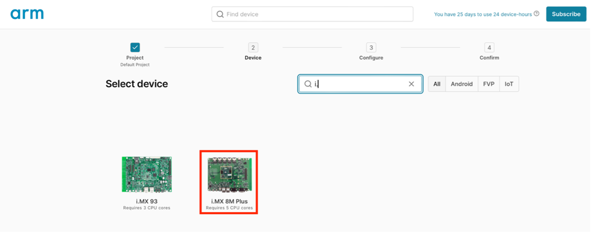

## Setup i.MX 8M Plus model

AVH offers a 30-day free trial to use.
-	Create an account in AVH. https://app.avh.arm.com/login 
-	Once logged in, you should see a similar screen as shown below. 
-	Click on create device.

- Click on Default Project.

- Select the i.MX 8M Plus device.

- Select the Yocto Linux (full) (2.2.1) image.
 (2.2.1) image")
- Click Select


-	Click on Create device, this could take few minutes.

-	A console to Linux running on the Cortex-A should appear. use “root” to login.

-	Run ip addr to find the ip address for the board model. This will be needed to ssh into the device.


{}
The GUI on the right side doesn’t always work for some reason, if you see the error shown in the picture above, just ignore it and continue with the demo.
{}

### Useful AVH tips
 


The “connect” pane shows the different ways that you can connect to the simulated board. The ip address specified should be the same as that visible in the output of the ip addr command. 


“Quick connect” allows you to ssh/scp to the AVH model without having to use a VPN configuration. In order to use Quick connect, it is necessary to add your ed25519 public key via the “manage ssh keys” here link.

{}
To generate an ssh key, you can run on your machine:  *ssh-keygen -t ed25519*

{}

## Download the pre-built hybrid-runtime

Once your AVH model is setup, we already have a pre-built hybrid-runtime and some necessary scripts packaged in a GitHub package, to download this package, run:

```console
wget https://github.com/smarter-project/hybrid-runtime/releases/download/v1.5/hybrid.tar.gz
```

Extract the files to /usr/local/bin using:
```console
tar -C /usr/local/bin/ -xvf hybrid.tar.gz
```
{}
If you want to build the hybrid-runtime on your own instructions can be found at the very end of this learning path.
{}

## Download Firmware container image

We provide a pre-built lightweight Docker container image available on GitHub for the i.MX8M-PLUS-EVK board that can be used for the AVH demo. The container image contains a simple FreeRTOS hello-world application built using the NXP SDK.

You can pull the pre-built image onto the AVH model using:

```console
ctr image pull ghcr.io/smarter-project/hybrid-runtime/hello_world_imx8mp:latest
```
Make sure the container image was pulled successfully:

```console
ctr image ls
```

An image with the name *ghcr.io/smarter-project/hybrid-runtime/hello_world_imx8mp:latest* should appear as an output of the previous command.  
