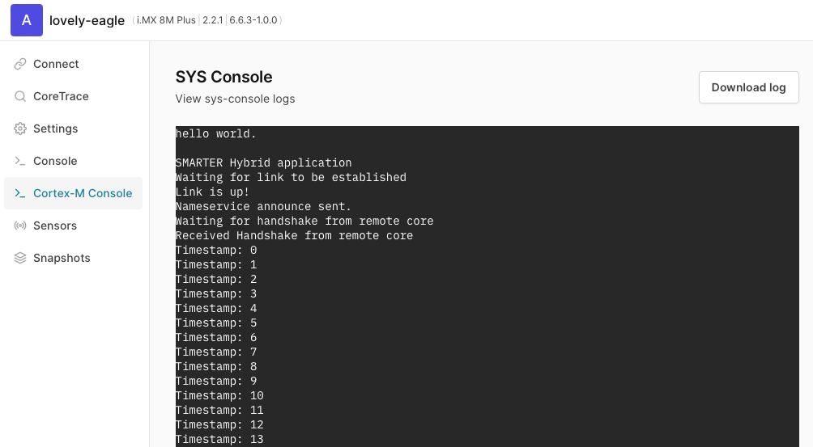

`Containerd` is a cloud-native container runtime used to deploy workloads across an array of platforms.

## Hello World example

Now that the container image has been pulled, you can try a few of the commands from the OCI specification. The expected output is shown after each command.

Create and start the container:
```bash
ctr run --runtime io.containerd.hybrid \
ghcr.io/smarter-project/hybrid-runtime/hello_world_imx8mp:latest test
```

Check that the container was created:
```bash
ctr c ls
```
```output
CONTAINER    IMAGE                                                               RUNTIME
test         ghcr.io/smarter-project/hybrid-runtime/hello_world_imx8mp:latest    io.containerd.hybrid
```

Check that the container is running:
```bash
ctr t ls
```
```output
TASK    PID    STATUS
test    808    RUNNING
```
The output from the hello-world application running on the Cortex-M can be seen in the AVH GUI by selecting “Cortex-M Console”:


Check the container info using the following command:
```bash
ctr c info test
```
The output should look something like this:

```output
{
    "ID": "test",
    (...)
    "Spec": {
        "ociVersion": "1.1.0-rc.1",
        (...)
        "linux": {
            (...)
            "namespaces": [
                {
                    "type": "pid"
                },
                {
                    "type": "ipc"
                },
                {
                    "type": "uts"
                },
                {
                    "type": "mount"
                },
                {
                    "type": "network"
                }
            ],
            "maskedPaths": [
                "/proc/acpi",
                "/proc/asound",
                "/proc/kcore",
                "/proc/keys",
                "/proc/latency_stats",
                "/proc/timer_list",
                "/proc/timer_stats",
                "/proc/sched_debug",
                "/sys/firmware",
                "/proc/scsi"
            ],
            "readonlyPaths": [
                "/proc/bus",
                "/proc/fs",
                "/proc/irq",
                "/proc/sys",
                "/proc/sysrq-trigger"
            ]
        }
    }
}
```

Stop the container:
```console
ctr t kill test
```
Check that the container has stopped:
```console
ctr t ls
```
```output
TASK    PID    STATUS
test    808    STOPPED
```
Now, delete the container:
```console
ctr c rm test
```

## SMARTER Demo firmware

The SMARTER project offers an additional pre-built container image, available on GitHub for the i.MX8M-PLUS-EVK AVH model. The container image contains a FreeRTOS application built using the NXP SDK. It outputs a timestamp to the serial console output of the board. The application also sends the output to the `cortexm_console` helper application running under Linux on the board.

You can pull the pre-built image onto the AVH model using the following:

```console
ctr image pull ghcr.io/smarter-project/smart-camera-hybrid-application/hybrid_app_imx8mp:latest
```
Now, create and run the container:
```console
ctr run --runtime io.containerd.hybrid ghcr.io/smarter-project/smart-camera-hybrid-application/hybrid_app_imx8mp:latest test2
```
The Cortex-M Console output will now appear as per below:



The output from the Cortex-M is also available under `/var/lib/hybrid-runtime/<container_name>/<container_name>.log`:
```output
cat  /var/lib/hybrid-runtime/test2/test2.log
Timestamp: 0
Timestamp: 1
Timestamp: 2
Timestamp: 3
Timestamp: 4
Timestamp: 5
Timestamp: 6
Timestamp: 7
Timestamp: 8
Timestamp: 9
Timestamp: 10
```
When the container is deleted, the log file will also be removed as shown below:
```console
ctr t kill test2
ctr c rm test2
cat  /var/lib/hybrid-runtime/test2/test2.log
```
```output
  cat: /var/lib/hybrid-runtime/test2/test2.log: No such file or directory
```
