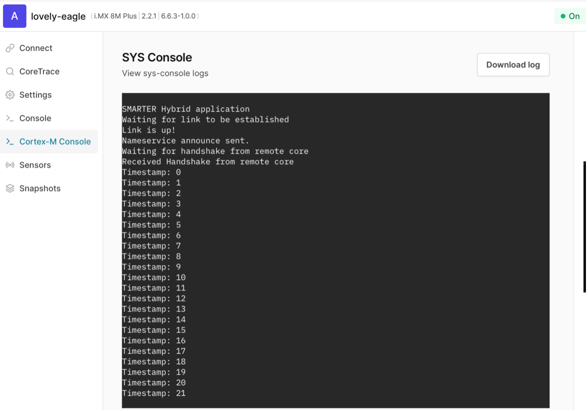

## K3s setup

We’ll be using a single node k3s cluster setup, to download k3s and set it up: (this command could take few minutes to run)
```console
curl -sfL https://get.k3s.io | INSTALL_K3S_EXEC="server --disable traefik --disable metrics-server --disable coredns --disable local-storage --flannel-backend=none --cluster-dns 169.254.0.2 \
--container-runtime-endpoint=unix://var/run/containerd/containerd.sock" sh -s -
```

Make sure k3s is running:
```console
systemctl status k3s
```
Next, we need to make k3s aware of the hybrid-runtime, to do so we need to update containerd config file, we’ve packaged the config file with the k3s example YAML files in GitHub 

Download the k3s demo example YAML files:
```console
wget https://github.com/smarter-project/hybrid-runtime/releases/download/v1.5/example.tar.gz 
```
Extract the files: (the tar file will be extracted to an example folder)
```console
tar -xvf example.tar.gz
```

Create a containerd directory under /etc and copy the config file there:
```console
mkdir /etc/containerd
mv example/config.toml /etc/containerd/ 
```
You need to restart containerd:
```console
systemctl restart cotnainerd
```
Make sure containerd is running: 
```console
systemctl status containerd
```
Now if you run:
```console
kubectl get nodes
```
You will see that the node is not ready 
```output
NAME     STATUS     ROLES                  AGE   VERSION
narsil   NotReady   control-plane,master   18m   v1.29.6+k3s2
```
To fix this, you need to apply a CNI, we’ll be using the smarter CNI, and label the node. Run:
```console
kubectl apply -f example/smarter_cni.yaml
kubectl label node narsil smarter.cni=deploy
```
Rerun kubectl get nodes, this time you should be able to see that the node is ready:

```output
root@narsil:~# kubectl get nodes 
NAME     STATUS   ROLES                  AGE   VERSION
narsil   Ready    control-plane,master   24m   v1.29.6+k3s2
```
## K3s demo

### Deploy SMARTER camera demo

For the k3s demo, we’ll be using the smarter camera demo.

First, we need to set a runtimeClass in k3s, it allows us to select the container runtime we want to use.
```console
kubectl apply -f example/runtime_class.yaml
```
Once this is done, we can run the smarter demo:
```console 
kubectl apply -f example/test_hybrid.yaml
```

The `test_hybrid.yaml` file contains the following:
```output
kind: Pod
apiVersion: v1
metadata:
  name: example3
  labels:
    k3s-app: example3
spec:
    runtimeClassName: hybrid          
    containers:
      - name: example-hybrid-pod3
        image: ghcr.io/smarter-project/smart-camera-hybrid-application/hybrid_app_imx8mp:latest
        imagePullPolicy: IfNotPresent
```
You can check that the firmware is running either by:
1- Go to the Cortex-M Console and you should see the following output:
2-	Run 
```console
kubectl get pods -A 
```
```output
root@narsil:~# kubectl get pods -A 
NAMESPACE     NAME                READY   STATUS    RESTARTS       AGE
default       example3            1/1     Running   0              6m57s
kube-system   smarter-cni-wplzn   1/1     Running   3 (141m ago)   4h29m 
```
A pod with the name example3 should be running.

### Kill the demo

To kill the demo, run: 
```console
kubectl delete pod example3 --grace-period=0 --force 
```
Make sure the pod was terminated: (the termination process takes few minutes)
1-	Go to the Cortex-M Console, same as before and check that there are no new outputs.



2-	Check that the firmware is offline: 
```console
root@narsil:~# cat /sys/class/remoteproc/remoteproc0/state 
```
Output:
```output
offline
```
3-	Make sure the created pod above was deleted:
```console
root@narsil:~# kubectl get pods -A 
NAMESPACE     NAME                READY   STATUS    RESTARTS       AGE
kube-system   smarter-cni-wplzn   1/1     Running   3 (143m ago)   4h31m
```
4-	Make sure all the container resources were deleted:
```console
ls /var/lib/hybrid-runtime/
```