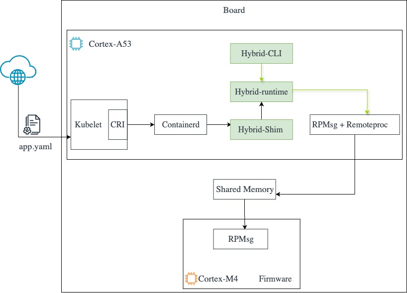

## Overview of the hybrid runtime

The hybrid-runtime is a low-level Open Container Initiative (OCI) compatible runtime. 
There are three components that make up the runtime (the ones in green in the figure below) and were all written in Rust:
1.	**A Command Line interface (CLI)**: the runtime implementation follows the OCI specification requirements and as stated in the specification "the runtime MUST provide an executable that supports commands (create / start / run / delete / kill / state / logs) with the following template”:
```console
$ runtime [global-options] <COMMAND> [command-specific-options] <command-specific-arguments>
```
2.	**Hybrid-runtime**: it provides the core functionality of each of the previously mentioned commands.
3.	**Hybrid-shim**: a lightweight component that sits between the hybrid-runtime and containerd, it helps facilitate communication between both, handling tasks such as the container process management and keeps track of the status of the container.


Hybrid runtime high-level architecture:

