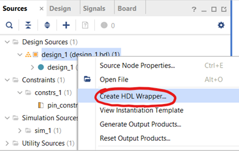
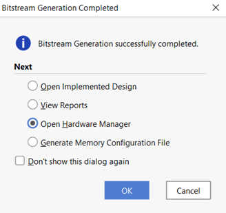
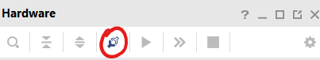
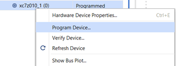
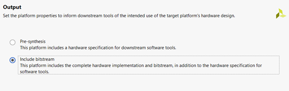
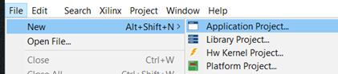
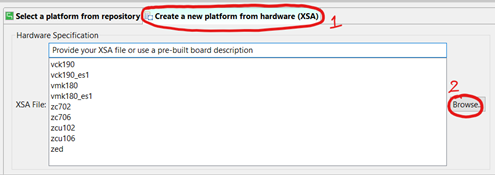
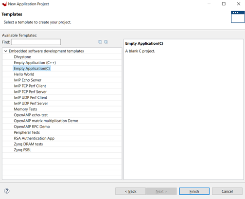
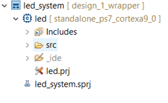
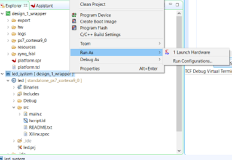

---
# User change
title: "Generate the bitstream and write your application using Vitis IDE" 

weight: 5 # 1 is first, 2 is second, etc.

# Do not modify these elements
layout: "learningpathall"
---

In this section you will generate the bitstream for this project and write a C program to toggle the LEDs using the Xilinx Vitis IDE tools .

1. Under the “Sources” tab on the left, expand the “Design Sources” folder, right-click the design1.bd file, choose the “Create HDL Wrapper” and select all default options. 

     

    *Figure 3.1. Creating HDL Wrapper*

2. Save any other changes and click “Generate Bitstream” on the left and click “Ok” for all pop-ups. This process takes some time. Once the process is done, select “Open Hardware Manager”:

     

    *Figure 3.2. Generating bitstream and uploading to board*

3. Connect the board and make sure the jumper (JP3) above the red LED on the Zybo board is in JTAG mode. Then, in Vivado, click “Auto Connect” in the Hardware Manager as shown below:

     

    *Figure 3.3. Connecting the board*

4. Right-click on the board, select “Program Device” as shown below and click “Program” on the pop-up window. 

     

    *Figure 3.4. Programming the board*

5. Once the board is programmed, the green LED labeled “LD12” should light up on the board. Click “File” on the main menu bar and select “Export” -> “Export Hardware” and click “Next” on the pop-up window. Choose the following option on the next page:

     

    *Figure 3.5. Exporting hardware and bitstream file* 

6. Choose the “export to” location as the project folder and save the file. Then click “Finish”. Next, click “Tools” on the main menu bar and select “Launch Vitis IDE”. Choose the same project folder as your workspace. Click “File” -> “New” -> “Application Project”.

     

    *Figure 3.6. Creating a new application project*

7. Select the “Create a new platform from hardware (XSA)” tab and click browse to select the XSA file you saved earlier:

     

    *Figure 3.7. Adding the XSA file*

8. Click next and give a name (e.g. led_system) to the application project. Click “Next” until you reach the following page and choose “Empty Application(C)” and click “Finish”:

     

    *Figure 3.8. Creating an empty C Application*


9. Then right-click the “src” folder within the application project you created and add a new file called “main.c”. 

     

    *Figure 3.9. Adding a main.c file*

10. Add the following code to the file and save all your changes:

    ```
    volatile unsigned int value;
    int main(){
        while(1){
            value = *(unsigned int*)0x43c00000;
            *(unsigned int*)0x43c00004 = value;
        }
    }
    ```

11. From the address tab in Vivado, observe that the switches are located at the address “0x43c00000”. All switches together are read as 4 bits with sw[3] being the MSB (most significant bit) and sw[0] as the LSB (least significant bit). If a switch is turned on then it’s corresponding bit will be 1, else it will be 0. Store the positions of the switches into a variable called “value” and write that into the address of the LEDs “0x43c00004” so that the LEDs mirror the On/Off state of the switches.

12. Right-click the application project in the explorer tab, select “Build Project” and ensure that the build is successful. Then right click again and select “Run As” and then “1 Launch Hardware” to upload everything to the board.

     

    *Figure 3.10. Running the program on the board.*

13. Once this is done, you should be able to toggle the LEDs using the switches. 
