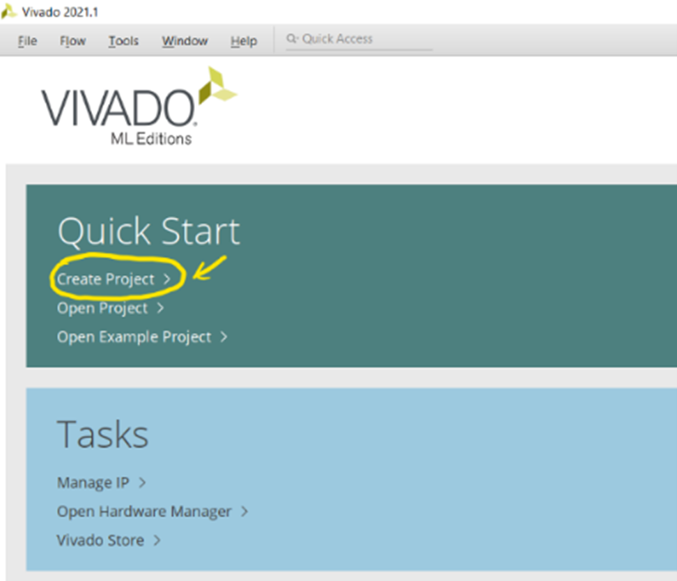
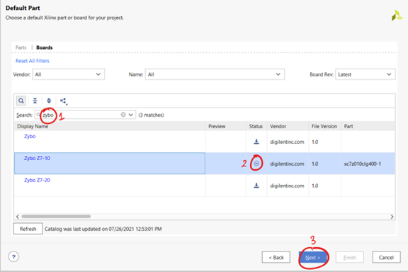
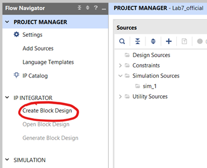
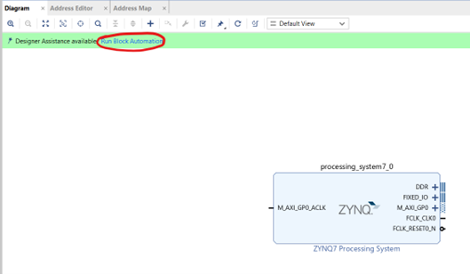
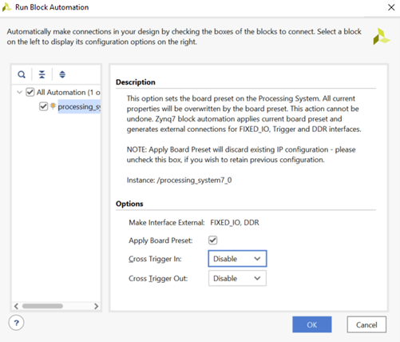

---
# User change
title: "Setup a Workspace in Xilinx Vivado" 

weight: 2 # 1 is first, 2 is second, etc.

# Do not modify these elements
layout: "learningpathall"
---

On your Windows machine, start by downloading and installing the [Xilinx Vivado Design Tools](https://www.xilinx.com/support/download/index.html/content/xilinx/en/downloadNav/vivado-design-tools.html).

After installation is complete, follow the steps outlined below to setup a workspace for this project.

1. Create a new workspace such that the path to the workspace does not contain any spaces. For Windows this could be a folder in C directory. For example: `C:/Workspace`. 

2. Open Xilinx Vivado and create a new project in your workspace as shown below:

     

    *Figure 1.1. Creating a project*

3. Give it a meaningful name and click "Next". Select RTL Project and click “Next”. You will not be adding any sources or constraints so click “Next” for the next two pages. In the next page, click the “Boards” tab and search for “Zybo” in the search bar and click the download button next to “Zybo Z7-10” if the option is available. Then select it and click “Next”. Do not click on the hyperlink but click on the empty area next to “Zybo Z7-10”. 

     

    *Figure 1.2. Board Selection*

4. Click “Finish”. In the “Flow Navigator” menu on the left, click “Create Block Design” under “IP Integrator”:

     

    *Figure 1.3. Creating a new block design*

5. Choose a design name or use the default one and click “Ok”. Within the empty “Diagram” box on the right-hand side, right-click and select “Add IP”. Enter “Zynq” in the search box and choose “ZYNQ7 Processing System”. Click the “Run Block Automation” option that has now appeared.

     

    *Figure 1.4. Running Block Automation*

6. Click “Ok” on the pop-up window. 

     

    Figure 1.5. Run Block Automation default settings*

You have now completed setting up the workspace for this project.
