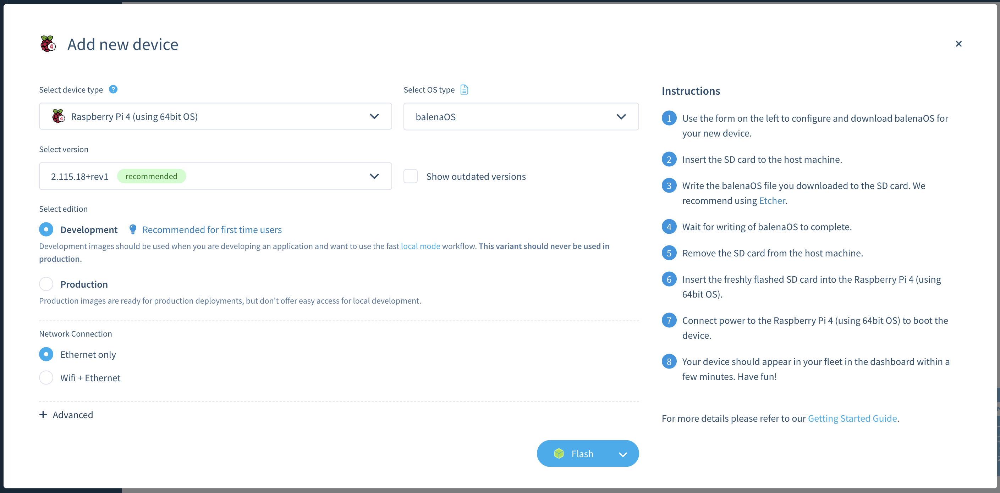

## Signup for Balena Cloud

For this Learning Path we will be using the free Balena Cloud service to manage devices and applications. You could deploy Balena apps without Balena Cloud using the open source OpenBalena project, but for simplicity in this tutorial we are going to use the hosted service.

Navigate to the [Balena Cloud Signup](https://dashboard.balena-cloud.com/signup) form and create a new account. The free account lets you manage up to 10 devices for free. We will only be using one device for this tutorial so you'll have plenty left over to continue exploring Balena.

Once you have an account, the first thing you will need to do is create a Fleet. A Fleet is how Balena manages a collection of devices as a single target for deploying applications. Call your new fleet `AVH-Testing`.

## Download Balena OS Image

Next you will need to add a device to your fleet. Navigate to the `Devices` section of your fleet and click on the `Add Device` button. This will open a dialog window for you to create a custom device image.



We will be using the Raspberry Pi 4 device on AVH (Arm Virtual Hardware), so on this screen select `Raspberry Pi 4 (using 64-bit OS)` as the device type, and the recommended version for that type. Also select `Development` for the edition. Everything else can be left on the defaults.

To download the image, click the drop-down arrow on the `Flash` button and select `Download balenaOS` to begin the download. This is a large file, so it may take some time.

## Convert to AVH Custom Image

Once your download is finished, you will need to convert this Balena OS device image into a custom AVH image that you can upload to the AVH service. To do that we will use a script copied from [this article](https://intercom.help/arm-avh/en/articles/7851972-package-custom-u-boot-firmware-for-avh) about creating custom uboot images for AVH.

[Download the script from here](../mkbalenaosimg.sh) and save it as `mkbalenaosimg.sh` on your computer.

> Note that this script requires a Linux environment to run.

Then execute the script, passing in your downloaded Balena OS image file as the only parameter:

```
./mkbalenaosimg.sh balena-cloud-AVH-Testing-raspberrypi4-64-2.115.7+rev4-v14.11.2.img.zip
```

If successful, this will create a new file named `balenaos_rpi4b.zip` in the same directory. You are now ready to install is onto AVH.
