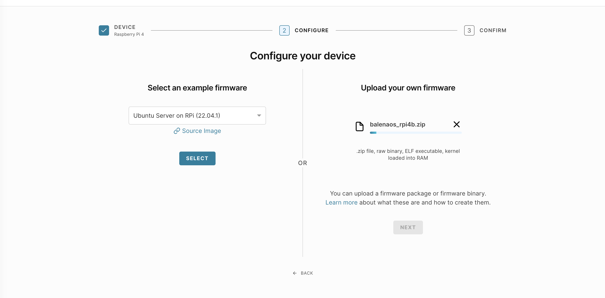
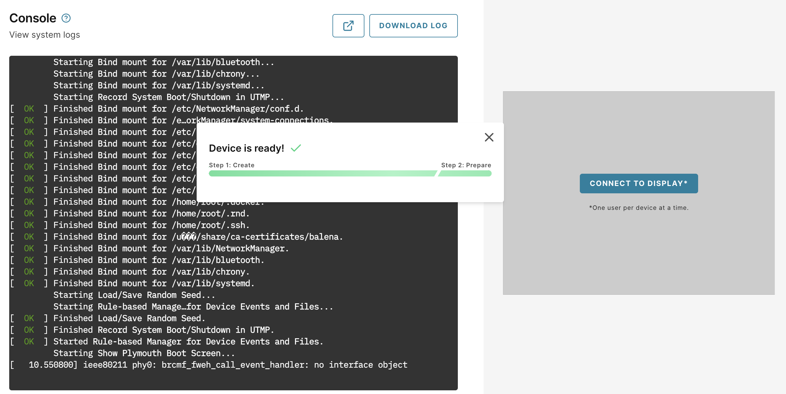
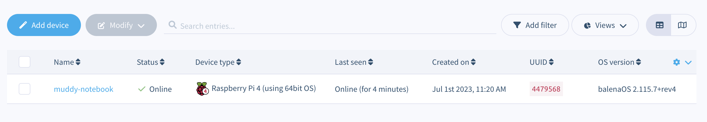

## Create a Device

You will need a user account for [Arm Virtual Hardware 3rd Party Hardware](https://avh.arm.com/). Refer to [Arm Virtual Hardware install guide](/install-guides/avh#thirdparty) for more information.

From the AVH dashboard, click on the `Create Device` button. You will be presented with a list of devices to choose from, for this tutorial we are using a Raspberry Pi 4, so select that device.

On the next screen you will be asked to configure your device by choosing the firmware to use. Normally you could use a pre-built firmware such as Ubuntu or Raspberry Pi OS, but for this tutorial we will be uploading the custom AVH image of Balena OS that we created in the previous step. So on this screen upload the `balenaos_rpi4b.zip` file into the `Upload your own firmware` section on the right hand side.



This process may again take some time, as the image file is quite large. Once the upload has finished the `Next` button will be enabled and you can click it to begin the creation of your new device.

The last step is to give your new AVH device a unique name. You can use whatever you'd like, or go with `balena-testing-device` for this tutorial. You do not need to set any advances boot options.



## Verify that your device is ready

Once your device has finished being created by AVH, you will have access to the console and be presented with a login prompt. Login using the default username `root` and password `balena` to gain access to the shell.

Balena OS uses the Docker engine to manage applications on your device. You can verify that it's available by running:

```
balena version
```

You can now go back to your Balena Cloud dashboard and refresh the `Devices` page, and you will see your newly deployed device already registered and connected to your fleet. You are now ready to deploy applications to your device!

