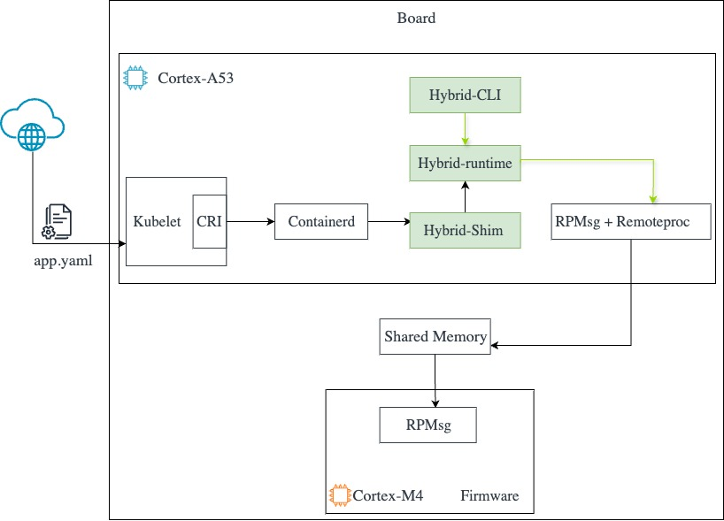

## Overview

The `hybrid-runtime` is a low-level Open Container Initiative (OCI) compatible runtime. It's written in Rust.
There are three components that make up the runtime (shown as green in the figure below):
1. The **Command Line interface (CLI)**, which follows the OCI specification requirements. The runtime provides an executable that supports an array of commands, using the following template:
```console
$ runtime [global-options] <COMMAND> [command-specific-options] <command-specific-arguments>
```
The list of commands are as per the v1.2 [specification](https://github.com/opencontainers/runtime-spec): `create`, `start`, `run`, `delete`, `kill`, `state`, `logs`

2. The **hybrid-runtime** provides the core functionality of each of the previously mentioned commands.
3. The **hybrid-shim** is a lightweight component that sits between the `hybrid-runtime` and `containerd`. It helps facilitate communication between both, handling tasks such as the container process management and keeping track of the status of the container.


You can review the runtime high-level architecture in the image below:



Now that you have an understanding of the hybrid-runtime, let's move on to the deployment part.
