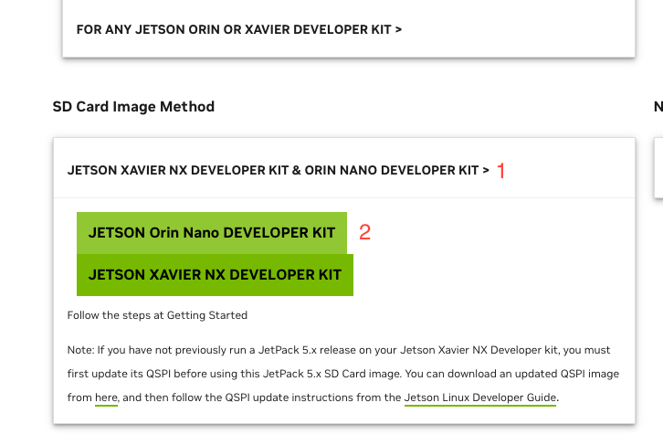
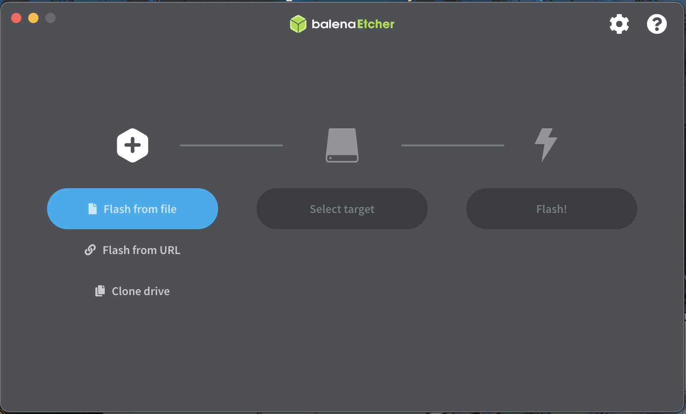
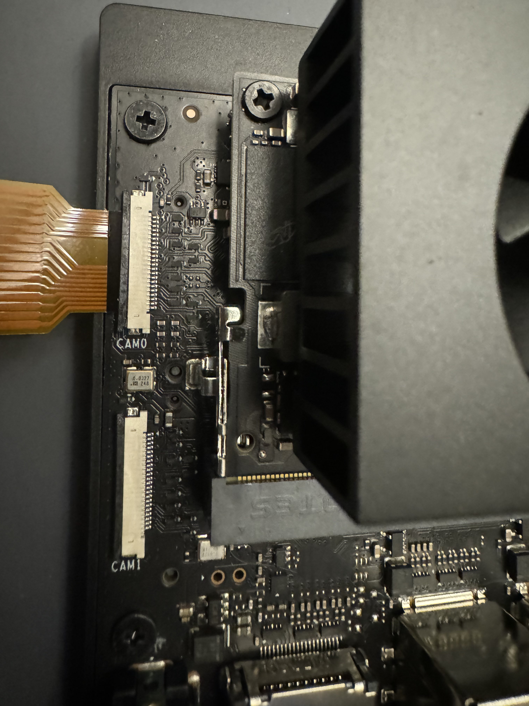

## Before you begin

Download and install [balenaEtcher](https://etcher.balena.io/) in order to write the software image to the microSD card.

### Download the latest image

Navigate to the [NVIDIA developer website](https://developer.nvidia.com/embedded/jetpack). 

Click on the box titled "JETSON XAVIER NX DEVELOPER KIT & ORIN NANO DEVELOPER KIT" to expand, and then click on "JETSON Orin Nano DEVELOPER KIT" to download the latest image.



### Write the downloaded image to the microSD card with balenaEtcher

1. Open balenaEtcher
2. Click "Flash from file"

3. Select the zip file of the image you just downloaded (you don't need to unzip the file).
4. Click "Select target" and choose your microSD card
5. Click "Flash" and wait for the process to complete which will take around 10 minutes. You may be prompted to enter a username and password before it will start.
6. Eject the microSD card from your computer, and insert it into the Jetson Orin Nano. **Don't power on the device yet.**

### Connect the camera to the Jetson Orin Nano

Insert the 22 pin side (it is smaller than the 15 pin side) of the ribbon into the CSI connector labeled "CAM0." It should be inserted silver pin side down.
If you are unsure of how to insert the ribbon into the connector [watch the video explaining the process](https://www.youtube.com/watch?v=EuRXAUU61yM&t=7s).

{}
You can use a USB camera instead for object detection, but the instructions below assume a MIPI CSI-2 camera.
{}



### Power on the Jetson Orin Nano

The initial startup process will take some time, respond to the prompts as required. 

When you reach the desktop with NVIDIA wallpaper, run the following commands in a terminal to update the software:

```console
sudo apt update
sudo apt upgrade -y
```

If you are prompted to restart the system, do so before continuing.

### Verify that the camera is working

In a terminal, check that the camera is detected:

```console
ls /dev/video0
```

If everything is connected properly you should see the following output:

```output
/dev/video0
```

To test the capture, enter the command below. The number following `--orientation` determines how the picture is rotated. The options are 0 - 3. It might take a couple minutes to start the first time, during which your device will be locked up. Subsequent uses of the command should only take a few seconds.

```console
nvgstcapture-1.0 --orientation 2
```

Use Ctrl+C in the terminal to end the capture.
