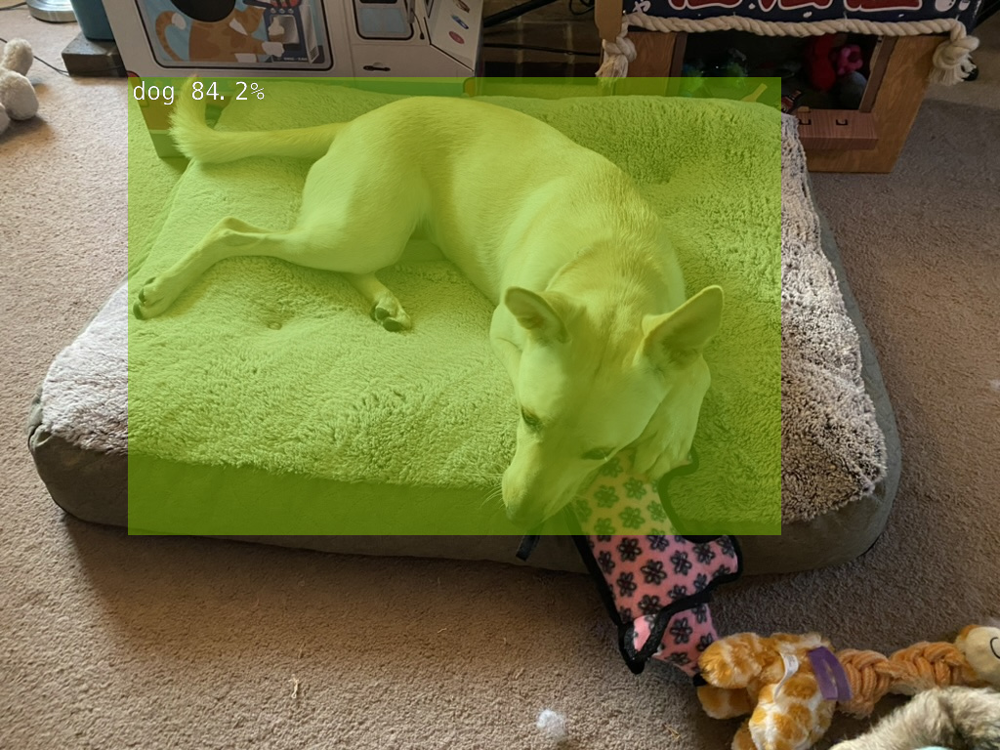

## Detecting objects in video and images

**Note: The first time you run a new model it will take a while to start up. All subsequent launches should be much faster**

Make sure you are currently in the **"build/aarch64/bin"** directory

### DetectNet for object detection on a video feed

To start DetectNet using your camera
```
./detectnet csi://0
```

If you want to increase or decrease the sensitivity, add a threshold parameter. By default it is set to 0.5.
```
./detectnet csi://0 --threshold=0.25
```


### DetectNet for object detection on image files

The following command is using one of the sample images provided in the docker image. Replace "peds_0.jpg" with your own image, and change output.jpg to an appropriate name
```
# --network=ssd-mobilenet-v2 is an optional parameter
./detectnet --network=ssd-mobilenet-v2 images/peds_0.jpg images/test/output.jpg
```





