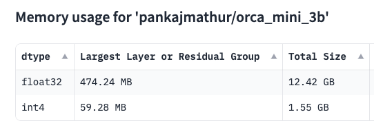

## Set up your Raspberry Pi 5

You need a Raspberry Pi 5 running Raspberry Pi OS, though these instructions can be used on any Arm Linux computer with minor modifications. 

Install Raspberry Pi OS on your Raspberry Pi 5 using the [Raspberry Pi documentation](https://www.raspberrypi.com/documentation/computers/getting-started.html). There are numerous ways to prepare an SD card, but Raspberry Pi recommend [Raspberry Pi Imager](https://www.raspberrypi.com/software/) on a Windows, Linux, or macOS computer with an SD card slot or SD card adapter.

Make sure to install the 64-bit version of Raspberry Pi OS. 

The 8GB RAM Raspberry Pi 5 model is preferred for exploring an LLM. 

## Introduction to Large Language Models on edge devices

In this Learning Path, you learn how to run an LLM chatbot on a Raspberry Pi 5. You can do this by downloading an LLM which is suitable for the performance and memory size of the Raspberry Pi 5.

You use [llama.cpp](https://github.com/ggerganov/llama.cpp), an open source C/C++ project developed by Georgi Gerganov, along with bindings to control llama.cpp from Python. Everything is done on the local Raspberry Pi 5 without using any cloud services.

## LLM performance and memory size

Memory size is an important factor to consider when selecting an LLM because many LLMs have memory requirements that are too large for edge devices, such as the Raspberry Pi 5. An idea of the required memory size can be obtained by looking at the number of parameters of the model. A higher number of parameters means more memory used. 

You can also use the [Memory Model Calculator](https://huggingface.co/docs/accelerate/main/en/usage_guides/model_size_estimator
) from Hugging Face to estimate memory size. 

Copy the string below:

```console
pankajmathur/orca_mini_3b
```

Paste the string into the `Model name or URL` box, check `int4` and click `Calculate Memory Usage` to see the memory that this model uses. 



In addition to parameter values, the data type the model uses also impacts memory size, performance, and accuracy. 

You can see from the picture above that `float32` uses significantly more memory than `int4`. This is why many edge and mobile applications commonly use the `int4` data type.

## Install the Hugging Face CLI and download an LLM

You can use the Hugging Face CLI and download an LLM using [pkgx](https://pkgx.sh/), a fast, cross-platform binary to run software. 

First, install pkgx:

```bash
curl -fsS https://pkgx.sh | sh
```

Next, download a Large Language Model from Hugging Face using the CLI:

```bash
pkgx huggingface-cli download Aryanne/Orca-Mini-3B-gguf  q4_0-orca-mini-3b.gguf  --local-dir .
```

The model uses int4 weights and is in the GGUF format for `llama.cpp`.

Everything on the Raspberry Pi 5 is done in Python using the Python bindings for `llama.cpp`. There is no need to get `llama.cpp` from GitHub or build it from source code using `make`.

Create and activate a Python virtual environment:

```bash
python -m venv venv
source venv/bin/activate
```

Your terminal prompt now has the `(venv)` prefix indicating that the virtual environment is active. Use this virtual environment for the remaining commands.

Install the Hugging Face accelerate CLI to see another way to estimate memory usage:

```bash
pip install accelerate transformers
```

You can estimate memory using the `accelerate` command. 

To see the memory estimates for various data types: 

```bash
accelerate estimate-memory pankajmathur/orca_mini_3b
```

The output is similar to:

```output
┌────────────────────────────────────────────────────────┐
│  Memory Usage for loading `pankajmathur/orca_mini_3b`  │
├───────┬─────────────┬──────────┬───────────────────────┤
│ dtype │Largest Layer│Total Size│  Training using Adam  │
├───────┼─────────────┼──────────┼───────────────────────┤
│float32│  474.24 MB  │ 12.42 GB │        49.69 GB       │
│float16│  237.12 MB  │ 6.21 GB  │        24.85 GB       │
│  int8 │  118.56 MB  │ 3.11 GB  │          N/A          │
│  int4 │   59.28 MB  │ 1.55 GB  │          N/A          │
└───────┴─────────────┴──────────┴───────────────────────┘
```

You can see from the output that `float32` is not going to work on a Raspberry Pi 5, but the `int4` total memory size is suitable. 

## Python bindings for llama.cpp

There are [Python bindings](https://github.com/abetlen/llama-cpp-python) for `llama.cpp` available.

Install the `llama.cpp` Python package:

```bash
pip install llama-cpp-python
```

You can use Python to configure and run the LLM. 

Use a text editor to copy and paste the Python code below into a file named `run.py`:

```python
import llama_cpp

MODEL_PATH = "./q4_0-orca-mini-3b.gguf"
MODEL_THREADS = 4
MODEL_PREFIX = "### User: "
MODEL_SUFFIX = "### Response: "
MODEL_INIT = "### System: You are a coding assistant, skilled in programming."

llm = llama_cpp.Llama(
    model_path=MODEL_PATH,
    verbose=False,
    n_threads=MODEL_THREADS)

print ("\nHow can I help you? ")

while True:
    user_prompt = input("\n> ")
    if (user_prompt.lower() == "quit") or (user_prompt.lower() == "exit"):
        break
    full_prompt = f"{MODEL_PREFIX}{user_prompt}\n{MODEL_SUFFIX}"
    ptokens = llm.tokenize(bytes(full_prompt, "utf-8"))
    resp_gen = llm.generate(
        ptokens,
        reset=False,
        logits_processor=llama_cpp.LogitsProcessorList([]))

    for tok in resp_gen:
        if tok == llm.token_eos():
            break

        word = llm.detokenize([tok]).decode("utf-8", errors="ignore")
        print (word, end="", flush=True)
    print ()
```

Review the code to see how to load the GGUF model file and loop for user input, generate responses to the input, and print the results.

Run the chat model:

```bash
python ./run.py
```

When the program starts, you are presented with a prompt to type input:

```output
How can I help you? 

> 
```

You can type your request and then see the output from the model.

For example, enter:

```console
Write a C program to print a floating point number with 2 decimal places
```

The generated output is:

```output
 Here's the C program that prints a floating point number with 2 decimal places:

#include <stdio.h>
#include <float.h>

int main() {o
 float num = 3.14159265; // Assign a floating point number to a variable
 printf("%.2f", num); // Print the number with 2 decimal places
 return 0;
}

The program first includes the `stdio.h` and `float.h` headers. Then, it assigns a floating point number to a variable named `num`. 

Finally, it uses the `printf()` function to print the number with 2 decimal places using the format specifier `%.2f`, which prints the floating point number with 2 decimal places.

```

Type `quit` or `exit` when you are ready to exit the LLM.

## Check memory usage with mprof

You can check the memory the Python program uses through a memory profiler:

```console
pip install memory_profiler
```

Run the LLM with the memory profiler:

```console
mprof run --python python ./run.py
```

To display the peak memory used by the previous run, execute the `peak` command:

```console
mprof peak
```

The `.dat` file from the profile is read and the maximum memory used is printed:

```output
Using last profile data.
mprofile_20240508154711.dat	2124.641 MiB
```

You can move on to experiment with different LLMs, modify the `run.py` Python script, and learn how to use the memory profiler. 


