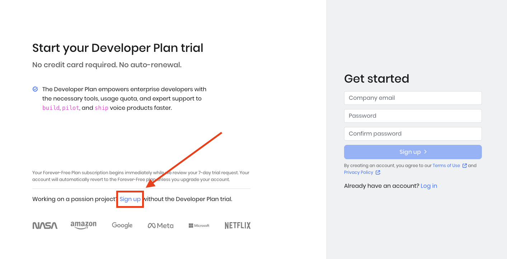

## Install Raspberry Pi OS

Download, install, and use Raspberry Pi Imager to create a microSD card with [Raspberry Pi OS](https://www.raspberrypi.com/software/).

If you are new to Raspberry Pi or would like more information the [Raspberry Pi getting started documentation](https://www.raspberrypi.com/documentation/computers/getting-started.html) is excellent. 

The steps to install using Imager are:

1. Select your Raspberry Pi device, such as Raspberry Pi 5
2. Under Operating System, choose Raspberry Pi OS (64-bit)
3. Under Storage, select your microSD card
4. Click Next
5. When it asks you "Would you like to apply OS customization settings?", select `EDIT SETTINGS`
6. Check Set username and password, Configure wireless LAN, Set locale settings, enter the settings, and click `SAVE`
7. Click `YES` to apply the settings 
8. Click `YES` to erase the card and start writing the data

When Imager is finished writing and verifying the microSD card, you can remove it from your computer. 

## Power on the Raspberry Pi 

Insert the microSD card into the Raspberry Pi, power it on, and boot to the Raspberry Pi OS desktop.

{}
Make sure the Raspberry Pi is connected to your network before proceeding.
{}

## Install the required software

Open the terminal application by opening the menu on the top left corner and select `Accessories` and `Terminal`. 

Copy and paste the commands below at the terminal prompt: 

```console
sudo apt update
sudo apt upgrade -y
```

Install the required software for the project: 

```console
sudo apt install portaudio19-dev python3-pyaudio mpg321 flac vim -y
```

Restart the Raspberry Pi:

```console
sudo reboot
```

## Setup the required services and access keys

### Porcupine

Porcupine, from [Picovoice](https://picovoice.ai/), is a wake word detection engine which can be accessed as a cloud service. 

Create a Forever-Free account to use for personal projects by following the steps below:

1. Use a browser and navigate to [Picovoice's Porcupine](https://picovoice.ai/platform/porcupine/)

2. Click `Start Free`

3. Click `Sign Up` to create a Forever-Free account as shown below:



4. On the right, under Get started, sign in using your GitHub, Google, or LinkedIn account

5. Get your access key for Porcupine wake word, save it somewhere safe, and don't share it with anyone

### OpenAI 

The OpenAI API provides a bridge to machine learning models so you can integrate AI features in applications. 

1. The OpenAI API is not free with pricing based on usage. You can find out more by reviewing the [OpenAI pricing](https://openai.com/pricing).

2. Create an OpenAI account at [OpenAI account sign up](https://platform.openai.com/signup) or, if you already have an account, log in at [OpenAI account login](https://platform.openai.com/login). 

3. Navigate to the [API key page](https://platform.openai.com/account/api-keys) and select `Create new secret key`

4. Save the key somewhere safe (don't share it with anyone)

You have now set up your Raspberry Pi as well as the required API keys. You are ready to start the project.
