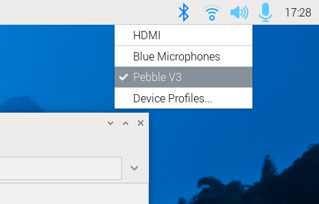
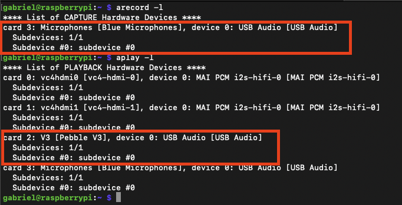

## Test Raspberry Pi speakers and microphone

Plug in your speakers and microphone to test if they are working. If both are working you can skip ahead to the next section. If not, you will need to manually configure the audio.

Right click on the speaker icon and select your speakers:



In a terminal, run the following command, and speak into the microphone for about five seconds.

```console
arecord -d 5 test.wav
```

This will record a five second audio clip using the default microphone and then save a file named `test.wav` in the current directory. 

Next, run the following command to attempt to play back `test.wav` using your default speakers:

```console
aplay test.wav
```

If the record and playback worked correctly and you heard what you had recorded, you can click to the next section of this learning path. If the test did not work, you can manually configure the audio settings.

## Manual audio setup

Try the steps below to manually configure audio.

### Find the audio devices for speakers and microphone

Use the following commands to find the card and device for your microphone and your speakers:

```console
arecord -l
aplay -l
```

The output should look like the following:



In the example above, you can see a USB microphone on card 3, device 0 (3,0)

USB speakers are card 2, device 0 (2,0)

To find out if the devices are running correctly, you can run `arecord` and `aplay` again but this time with the card and device information.

Change your card and device numbers in `plughw` to match your configuration, and try recording a five second clip by speaking into your microphone again.

To record:

```console
arecord -D plughw:3,0 -d 5 test.wav
```

To play back:

```console
aplay -D plughw:2,0 test.wav
```

If you can hear what you recorded, you can create a configuration file.

#### Troubleshooting

If the above doesn't work, you'll have to investigate further. 

Here are some steps you can take:

1. Verify that the speakers and microphone are properly connected and check for loose connections

2. Use `alsamixer` or `amixer` to check that your devices aren't muted and that the volume levels are high enough

3. Check online and see if your microphone and / or speakers are Linux compatible

4. Try other speakers and microphones

### Create a configuration file to set the defaults

Use a text editor to create the file `/etc/asound.conf` and add the appropriate information from `aplay -l` and `arecord -l`

Copy and paste the information below into the file, changing the `pcm.!default` playback and `ctl.!default` to match the `aplay -l` output. Change the `pcm.!default` capture section to the `arecord -l` output:

```console
pcm.!default {
    type asym
    playback.pcm {
        type plug
        slave.pcm "hw:2,0"
    }
    capture.pcm {
        type plug
        slave.pcm "hw:3,0"
    }
}

ctl.!default {
    type hw
    card 2
}
```

Save the file, exit your text editor, and reboot the Raspberry Pi. 

```console
sudo reboot
```

After rebooting, try the commands again to verify everything is now working:

```
arecord -d 5 test.wav
aplay test.wav
```

Your speakers and microphone are now ready to use. 
