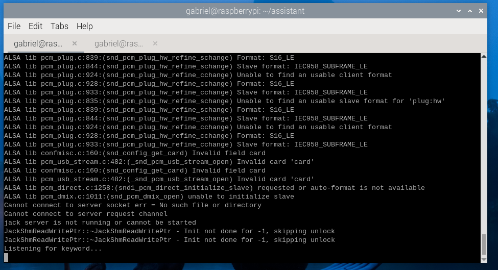
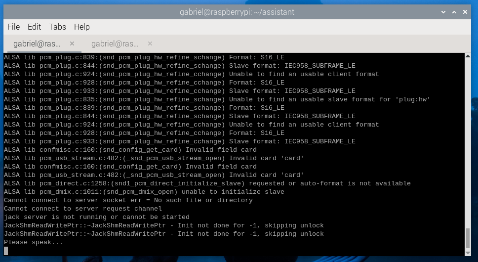

You should still be in the Python virtual environment but, if you are not or if you open a new terminal, make sure to activate the virtual environment using: 

```console
cd $HOME/assistant
source env/bin/activate
```

Run the application:

```console
python main.py
```

Say the wake work, "computer", wait a second, then ask a question. 

Wait a couple seconds and it will audibly reply to you.

The application will run indefinitely until you manually stop it (use Ctrl+C). 

The normal output while the application is waiting for the keyword is shown below: 



After the keyword is heard, you will see the `Please speak...` message indicating it is ready for your question: 



{}
The errors are normal and do not affect the operation of the bot. 
{}

You have constructed a bot on your Raspberry Pi which wakes up on a keyword and answers your questions. 

**Note** - Arm is committed to making the language we use inclusive, meaningful, and respectful. Our goal is to remove and replace non-inclusive language from our vocabulary to reflect our values and represent our global ecosystem. Arm is working actively with our partners, standards bodies, and the wider ecosystem to adopt a consistent approach to the use of inclusive language and to eradicate and replace offensive terms. We recognize that this will take time. We also recognize that part of the ALSA (Advanced Linux Sound Architecture) configuration syntax shown here as screen shots still contains references to non-inclusive language; it will be updated with newer terms as those terms are agreed and ratified with the wider community.
