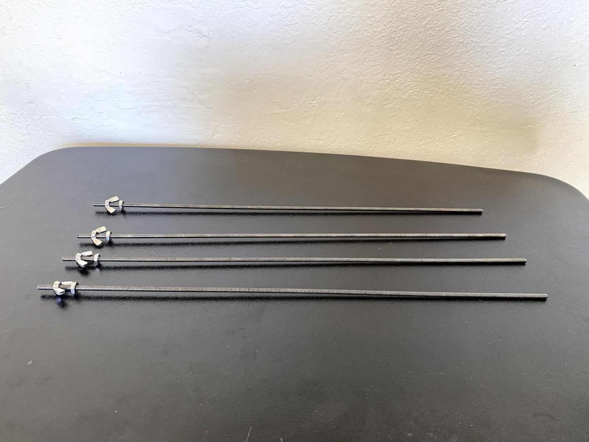
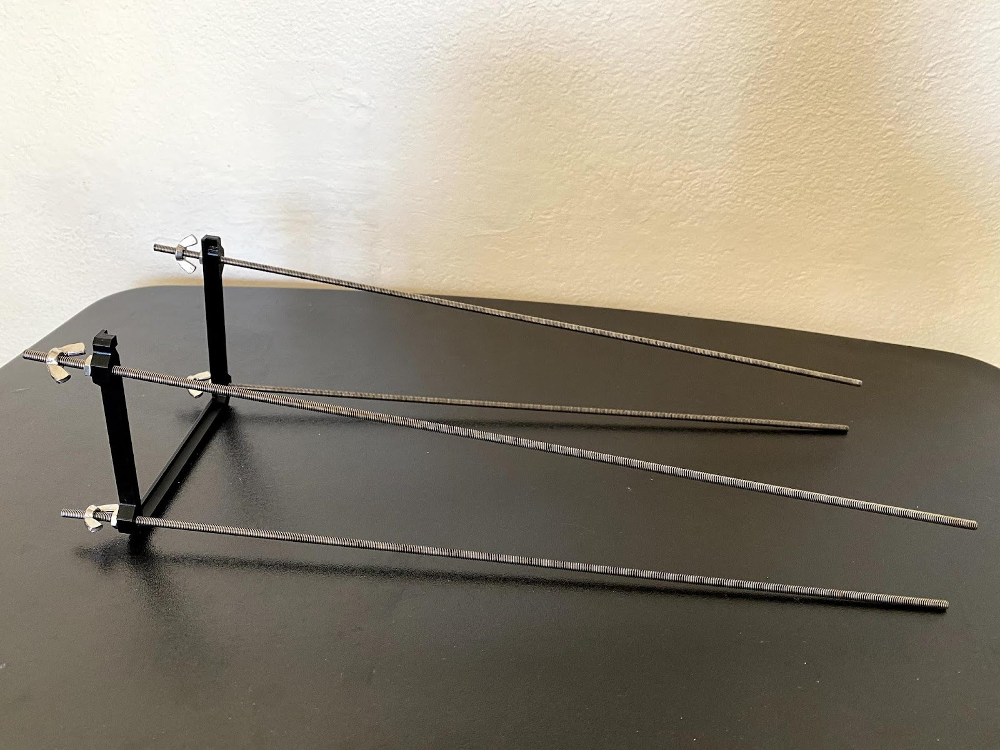
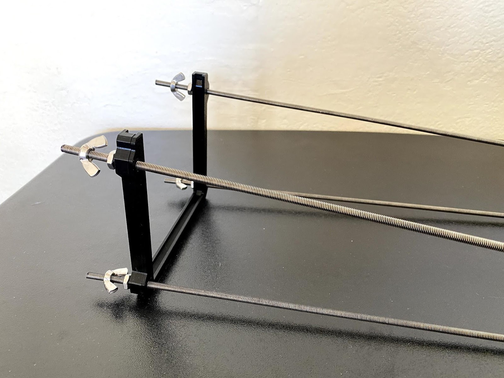
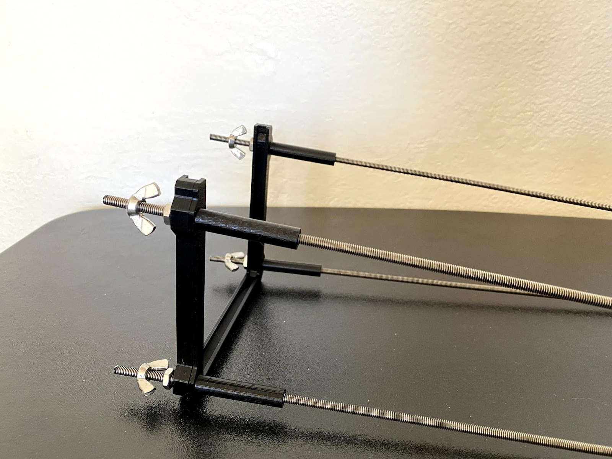
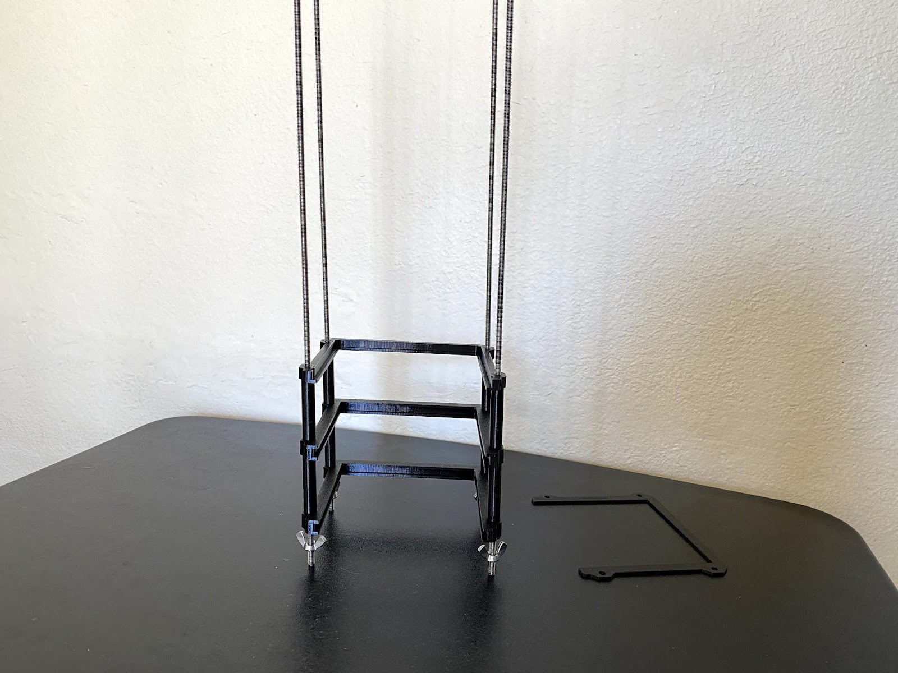
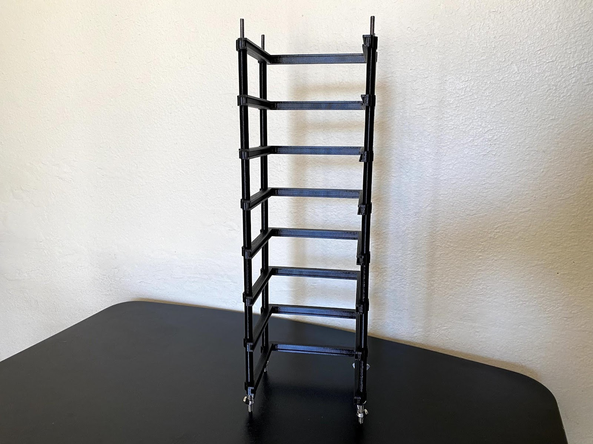
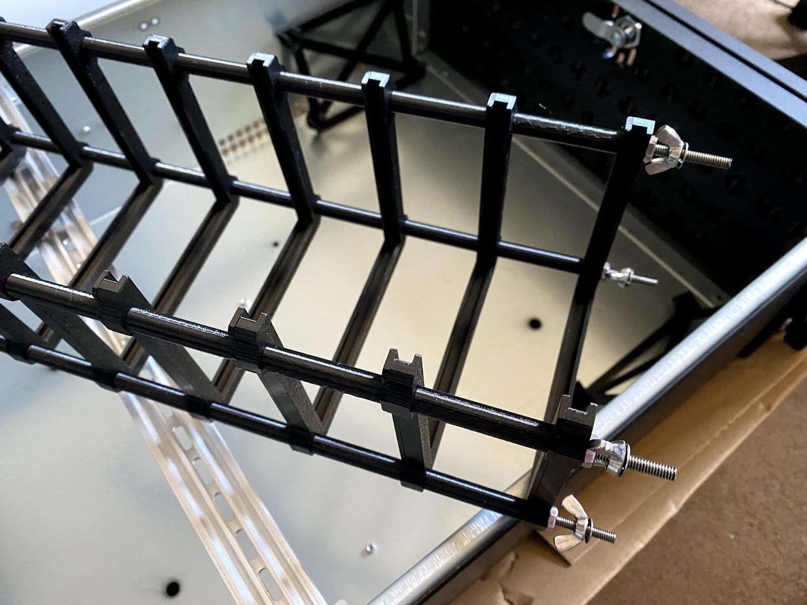
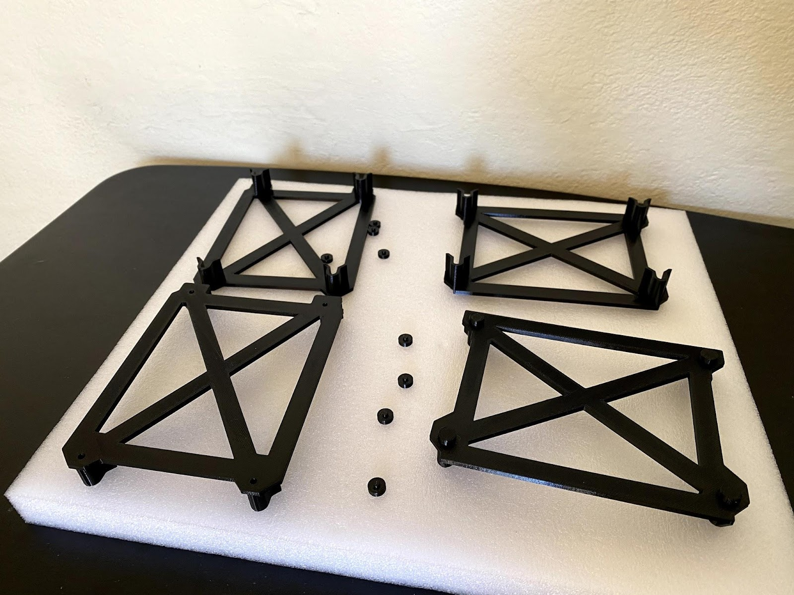
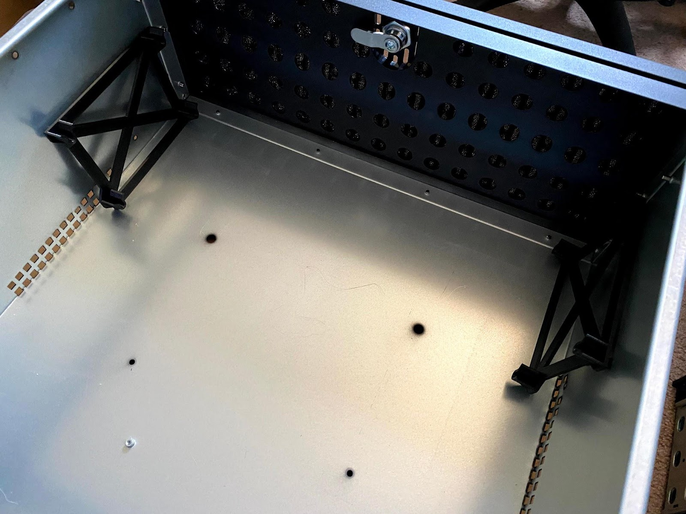
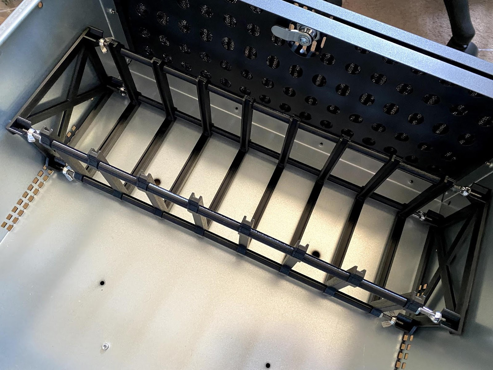

---
# User change
title: Assembly Instructions for the Chassis Bays

weight: 3 # 1 is first, 2 is second, etc.

# Do not modify these elements
layout: "learningpathall"
---
## Chassis bays assembly steps

Assemble the bays using the steps below. 

1. Wash the grease off the threaded rods with soap and hot water. They will almost certainly arrive coated in grease, and these are stainless steel parts being used in a dry environment. Leaving it on will just end up with the whole project being greasy.

2. Cut each rod to 405 mm long. If you haven’t done this before [this is the best way to do so that I’ve used if you’re using a hacksaw](https://www.familyhandyman.com/article/cutting-threaded-rod/). I recommend a chop saw, however.

3. Thread a hex nut around 15 mm in, doing so on the side you cut, followed by a wing nut with the wings facing inward / towards the long side. The exact distance doesn’t matter as long as all the hex nuts are roughly the same. Don’t worry about getting them exactly the same now, as it is better to fine tune it after all the parts are together.

4. Slide the rods into the first bay body with the hex nuts pressing against the back of the bay body piece.

5. Slide down the bay cover. 

6. Followed by four spacers of the same length.

7. Repeat these steps until you’ve almost entirely covered the rods. It is easier to do this with the entire thing rotated so the rods point upward.

8. Thread a hex nut onto each rod. At this point it is a good idea to fine tune the distance so that the hex nuts on one side are exactly the same distance from the end. Then thread in a wing nut with the wings facing inwards followed by a washer next to each wing nut.

9. Snap the circular feet into the back of the end pieces.

10. Place end pieces into the rack.

11. Drop the unit into the slots on the end pieces and tighten the wing nuts until they just firmly press into the end pieces. Don’t over tighten to the point of the rods bowing.

