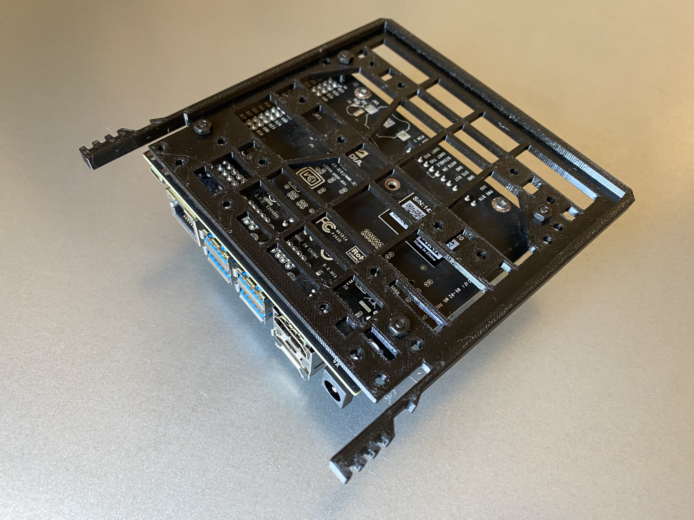
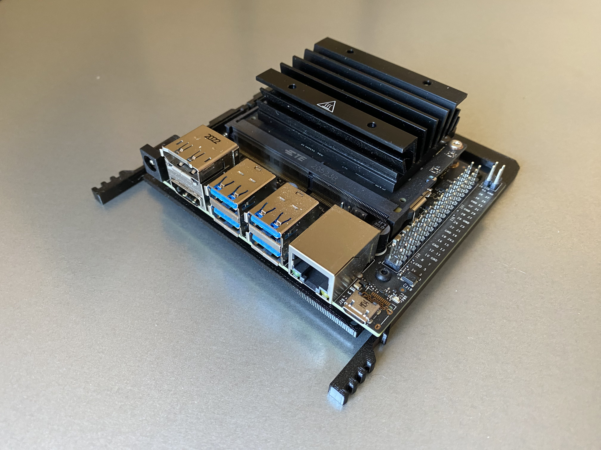
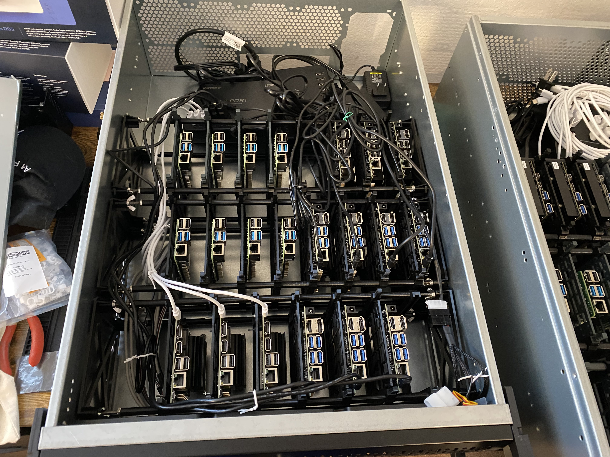

---
# User change
title: Assembly Instructions for the Chassis Bays

weight: 4 # 1 is first, 2 is second, etc.

# Do not modify these elements
layout: "learningpathall"
---
## Card plate assembly steps

Follow the steps below to add single board computers to the rack:

1. Place bolts through the bolt holes in the single board computer

2. Slide standoffs onto bolts on back of card. They should be just snug enough they hold the bolt into place to make the next step easier

3. Keeping in mind this has been designed so the back edge of the SBC will be flush with the grip side of the card plate, find the appropriate bolt holes and insert the card

4. Place and tighten hex nuts on back

5. Insert card and plate into a bay slot

