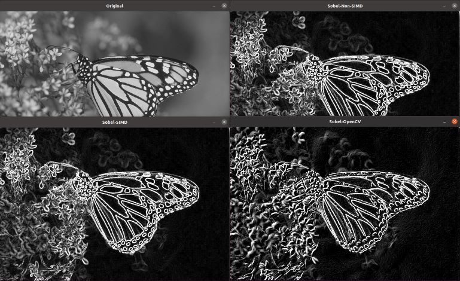

---
# User change
title: "Application setup" 

weight: 2 # 1 is first, 2 is second, etc.

# Do not modify these elements
layout: "learningpathall"
---

# Application setup

In this Learning Path, we are going to port an edge detection algorithm on an embedded Linux aarch64 system using Docker containers.

The application already builds on x86_64. Clone the repository with:

```bash
git clone https://github.com/m3y54m/sobel-simd-opencv.git
cd sobel-simd-opencv
```

Install the required dependencies:

```bash
sudo apt install -y build-essential g++ libopencv-dev cmake
```

Build the application:
```bash
cmake -S src -B build
cd build/
```

Run with:
```bash
./sobel_simd_opencv
```

The application will run several implementations of the same algorithm:
- a pure C version
- a version with x86_64 AVX intrinsics to enable SIMD processing
- an OpenCV version

The output in the terminal should be similar to:
```output
Execution time for non-SIMD Sobel edge detection:
5559.47 us
Execution time for SIMD Sobel edge detection:
2993.71 us
Execution time for OpenCV Sobel edge detection:
5650.26 us
```
In addition, it will open several windows allowing to compare the results between the different versions:




