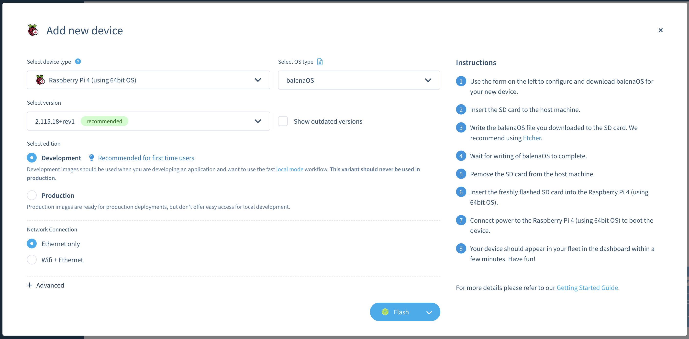

## Sign up for Balena Cloud

The free Balena Cloud service manages IoT devices and applications. You can deploy Balena apps without Balena Cloud using the open source [OpenBalena project](https://github.com/balena-io/open-balena), but for simplicity this tutorial uses the hosted service.

Navigate to the [Balena Cloud Sign up](https://dashboard.balena-cloud.com/signup) form and create a new account. The free account lets you manage up to 10 devices with no cost. This Learning Path requires only one device. 

After you have created your account, you can create a fleet. A fleet is a collection of devices serving as a single target for deploying applications. 

Create a new fleet and name it `AVH-Testing`.

## Download the Balena OS image

Add a device to your fleet. Navigate to the `Devices` section of your fleet and click on the `Add Device` button. This will open a dialog to create a custom device image.



You can use the Raspberry Pi 4 device on Arm Virtual Hardware (AVH) as the new device.

Select `Raspberry Pi 4 (using 64-bit OS)` as the device type.

Select `Development` for the edition. 

Leave the default values for everything else.

Download the image by clicking on the drop-down arrow on the right side of the `Flash` button and select `Download balenaOS`.

{}
There is no need to install Balena Etcher, the tool used to write SD cards.
{}

The file is large so the download may take some time. 

## Convert the download to an AVH custom image

When the download is finished, you can convert the Balena OS device image into a custom AVH image that you can upload to the AVH service and run on a Raspberry Pi 4 device. 

The conversion can be done using a Linux shell script. 

[Download the script](/learning-paths/iot/avh_balena/mkbalenaosimg.sh) and save it as `mkbalenaosimg.sh` on your computer.

{}
The conversion script requires a Linux environment with root access. If needed, copy the script and the Balena OS image .zip file to a Linux machine and log in to the machine. The `zip` and `unzip` commands are also required. Install them using your Linux package manager.
{}

On a Linux machine, execute the script as root with the downloaded Balena OS image file as the only parameter:

```
bash ./mkbalenaosimg.sh balena-cloud-AVH-Testing-raspberrypi4-64-2.115.7+rev4-v14.11.2.img.zip
```

If successful, the conversion script will create a new file named `balenaos_rpi4b.zip` in the same directory. 

{}
If needed, copy the `balenaos_rpi4b.zip` file back to your original machine. 
{}

You are now ready to install Balena OS on a Raspberry Pi 4 in AVH.
