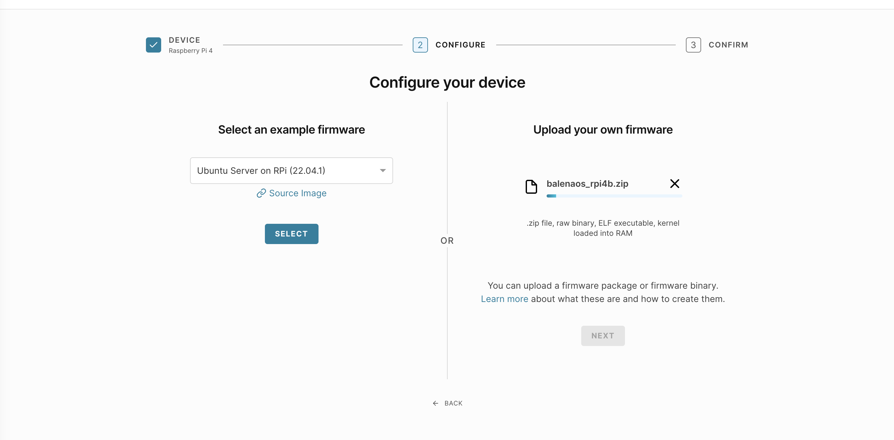
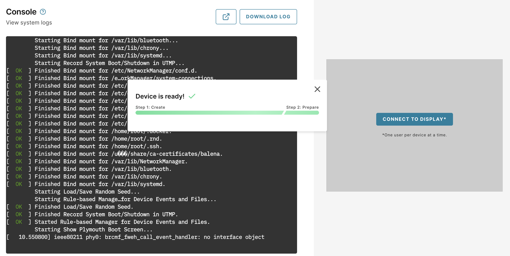

## Create a new device

To create a new device, you need a user account for [Arm Virtual Hardware (AVH)](https://app.avh.arm.com/). If you don't have an account, you can create one using the `Create an Arm account` link below the `LOGIN` button. If you create a new account, you will be automatically enrolled in a free 30-day trial. 

From the AVH dashboard, click on the `Create Device` button. Select Raspberry Pi 4 from the list of devices. 

On the next screen you will be asked to configure your device by choosing the firmware to use. 

Use the `Upload your own firmwware` on the right side to drag or browse for the file  `balenaos_rpi4b.zip`. 



Uploading the file takes some time. 

After the file is uploaded, click `NEXT`.

The final step is to name the AVH device. Select your own name or use `balena-testing-device`.

You do not need to set any advanced boot options.

Wait for the device to be created. It is ready to use when you see the ready message:



## Verify your device is ready

You now have access to the console and be are presented with a log in prompt. 

Log in with the username `root`. If a password is required, use `balena`.

Balena OS uses a container engine to manage applications.

Verify `balena` available by running:

```console
balena version
```

You will see output similar to:

```output
Client:
 Version:           v20.10.38
 API version:       1.41
 Go version:        go1.16.2
 Git commit:        8f374c29395adff1f6f7796b06418e593a479a7d
 Built:             Mon Jul  3 14:00:08 2023
 OS/Arch:           linux/arm64
 Context:           default
 Experimental:      true

Server:
 Engine:
  Version:          v20.10.38
  API version:      1.41 (minimum version 1.12)
  Go version:       go1.16.2
  Git commit:       8f374c29395adff1f6f7796b06418e593a479a7d
  Built:            Mon Jul  3 14:00:08 2023
  OS/Arch:          linux/arm64
  Experimental:     true
 containerd:
  Version:          1.6.6+unknown
  GitCommit:
 runc:
  Version:          unknown
  GitCommit:
 balena-engine-init:
  Version:          0.13.0
  GitCommit:        949e6fa-dirty
```

Return to your Balena Cloud dashboard and refresh the `Devices` page. 

You will see your newly deployed device is registered and connected to your fleet. You are now ready to deploy applications to your device!


