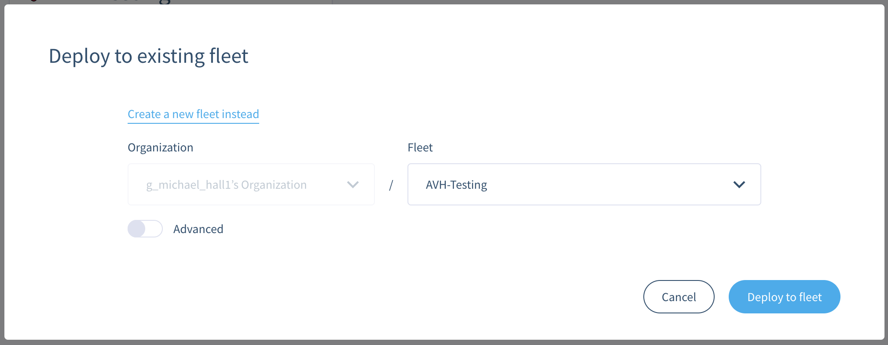

## Deploy from Balena Hub

You can build and deploy your own custom applications on Balena OS, or use a pre-built application from [Balena Hub](https://hub.balena.io/). 

As an example, you can deploy a Grafana dashboard from Balena Hub that will show the state of your Balena OS device.

Open Balena Hub in a new tab by clicking on the Balena Hub button on the top right corner of your Balena Cloud dashboard.

On the Balena Hub, click `Apps` in the top navigation bar, then search for `balena-app`. This is a pre-built dashboard backed by Grafana and served by Nginx.

Click on the app to open the details page. 

Look for the `Deploy` button in the upper-right corner of the page. 

Clicking this button will take you back to your Balena Cloud dashboard with a dialog to deploy `balena-app` to a fleet.

Select `Use an existing fleet instead` and choose the `AVH-Testing` fleet.

You don't need to do any advanced configuration for this app. Click the `Deploy to fleet` button to begin the deployment.

{}
If you have more than one device in your fleet, this process will deploy the selected application to all devices in your fleet simultaneously.
{}

Once the deployment is finished, click on your device in Balena Cloud dashboard to open up the device page. You will see that the Grafana and Nginx services have been deployed to and are running on your device.

You will also be able to see the system logs from your device, and optionally get access to the device's terminal from this Balena Cloud screen.

## Accessing your Grafana dashboard

Your application is now running, but it's not accessible from the outside world. In order to view your Grafana dashboard in your browser, you will need to tell Balena to make your device accessible from a public URL. 

Toggle the `Public Device URL` switch to the `On` position. 

A link will appear next to the switch, click on it to open the newly created public URL.

This will open the `balena-app` on your device in your browser. You will be presented with a log in screen, use the default username `admin` and password `admin` to log in. You will be prompted to set a new password for the `admin` user before continuing.

You now see the Grafana dashboard monitoring your Balena OS installation on this device, including the containers running Grafana and Nginx.
