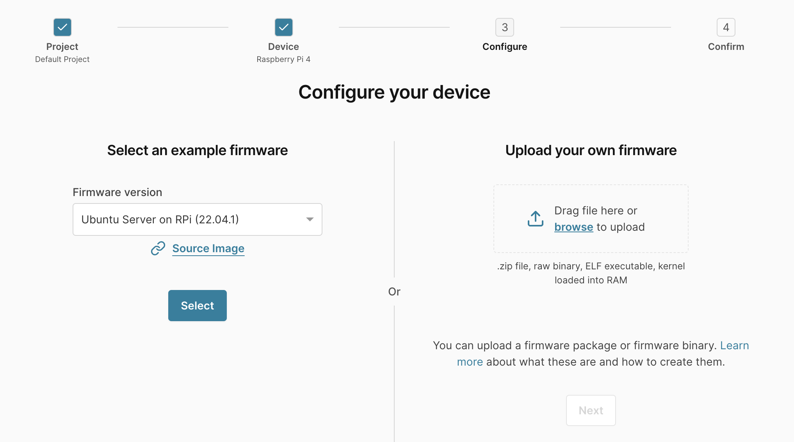
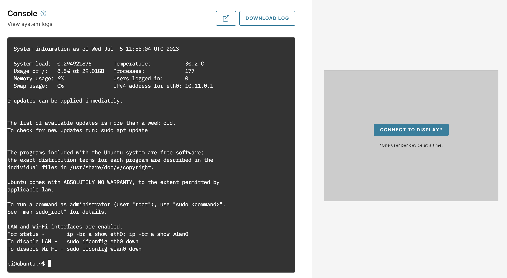

## Before you begin

You will need accounts for Arm Virtual Hardware (AVH) and Amazon Web Services (AWS) for this Learning Path.

### AVH account 

You need a user account for [AVH](https://app.avh.arm.com/). If you don't have an account, you can create one using the `Create an Arm account` link below the `LOGIN` button. If you create a new account, you will be automatically enrolled in a free 30-day trial. 

### AWS account

You also need a user account for [AWS](https://aws.amazon.com). AWS requires a credit card, but this Learning Path uses free tier only. It can be completed without incurring any charges.

Click the `Create an AWS Account` button to start creating a new account.

## Create a Device

Log in to [AVH](https://app.avh.arm.com/) to begin.

From the AVH dashboard, click the `Create Device` button. Next, select the project to add the device to. 

You will be presented with a list of devices to choose from. 

Select Raspberry Pi 4 from the list of devices and proceed to the configure dialog. 

AWS IoT Greengrass Core runs on Ubuntu Server and Raspberry Pi OS. 

For this Learning Path select `Ubuntu Server on RPi` and click `Next`.

The last step is to give your new AVH device a unique name. Select your own name or use `greengrass-testing-device`.

You do not need to set any advanced boot options.

Wait for the device to be created. 

 When it is ready, log in with the default username `pi` and password `raspberry`.

You are now ready to install AWS IoT Greengrass Core on your virtual Raspberry Pi.

## Install AWS IoT Greengrass Core

AWS IoT Greengrass Core is the software component that runs on your IoT devices. You will need to install and configure it on your new AVH device. You can do this using the AVH console or an SSH connection.

Follow the [AWS IoT Greengrass install guide](/install-guides/aws-greengrass-v2/) to finish setting up your device.

