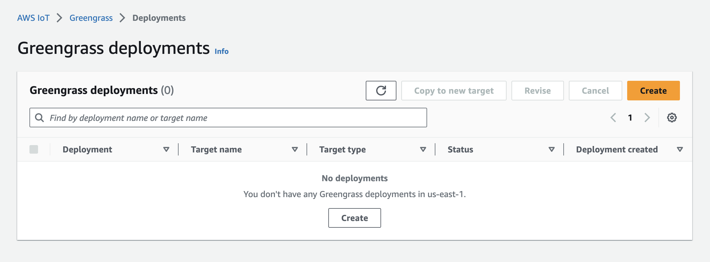
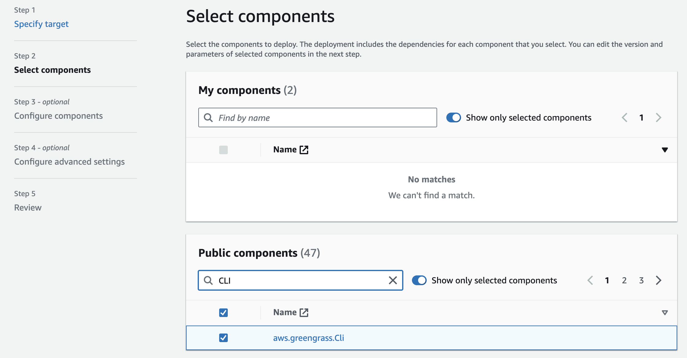
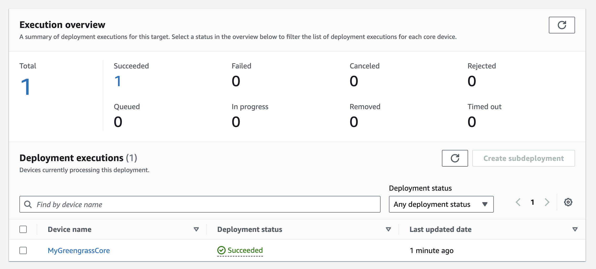
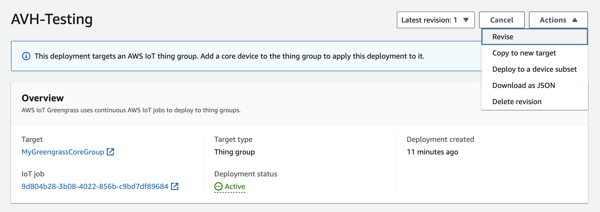

## Create a new Greengrass deployment

AWS IoT Greengrass manages a set of applications, called components, in a deployment. You define a deployment as a set of components and their configurations. Deployments can be modified to change configurations, add components, or remove components.

Find the `IoT Core` service in the AWS console.

Navigate to `Manage -> Greengrass devices -> Deployments` on the left-side navigation.

Click the `Create` button to start a new Greengrass deployment.



Name your deployment `AVH-Testing`.

For the `Deployment target` select `Thing group`.

For the `Target name` select the `MyGreengrassCoreGroup` that was created when you installed AWS IoT Greengrass.


The next step is to select which components should be in your deployment. 

As an example, you can deploy the AWS Greengrass CLI (which is different from the AWS CLI) on your virtual device. 

In the Public Components section, search for `CLI` and then select `aws.greengrass.Cli` from the list.



There is no configuration needed for the AWS Greengrass CLI component, so you can skip the next screens until you get to the `Review` step. 

Verify your component selection and deployment target and click the `Deploy` button.

## Verify your deployment

After deploying you will be redirected to your `AVH-Testing` deployment page.



After a moment you should see that the deployment to your `MyGreengrassCore` device was successful.


Clicking the device will show you a list of installed and running components.

## Run the CLI

Return to your AVH console and run the AWS Greengrass CLI. 

Copy the command below and run it at the Raspberry Pi console. 

```bash { target="ubuntu:latest" command_line="pi@ubuntu:~$ | 2-16"}
/greengrass/v2/bin/greengrass-cli --help
Usage: greengrass-cli [-hV] [--ggcRootPath=<ggcRootPath>] [COMMAND]
Greengrass command line interface

      --ggcRootPath=<ggcRootPath>
                  The AWS IoT Greengrass V2 root directory.
  -h, --help      Show this help message and exit.
  -V, --version   Print version information and exit.
Commands:
  help                Show help information for a command.
  component           Retrieve component information and stop or restart components.
  deployment          Create local deployments and retrieve deployment status.
  logs                Analyze Greengrass logs.
  get-debug-password  Generate a password for use with the HTTP debug view component.
  pubsub              Publish or subscribe to local topic.
  iotcore             Publish or subscribe to IoT Core.
  ```

You should see a similar help message printed.

  ## Revising your deployment

  This is the first revision of your deployment. In the future, you can add components, remove the Greengrass CLI component, and change configurations by simply revising your `AVH-Testing` deployment.

  

  When you create a new revision of your deployment, the new components and configurations are automatically deployed to every device in your deployment simultaneously.