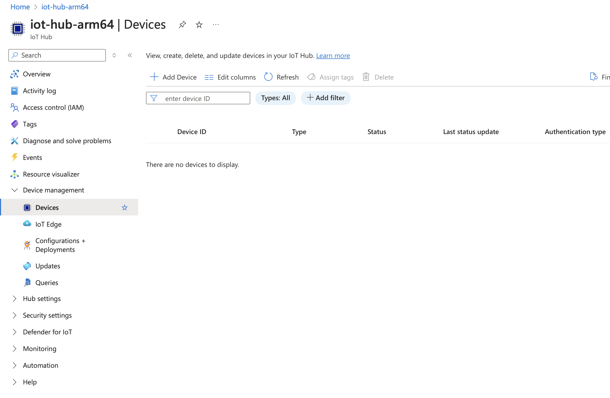
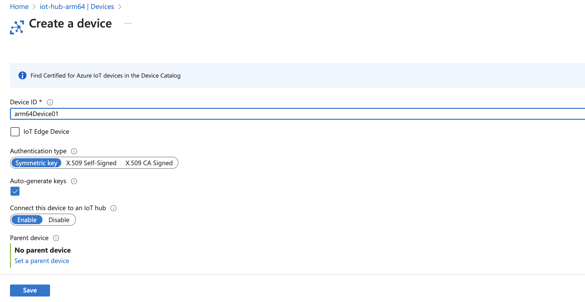
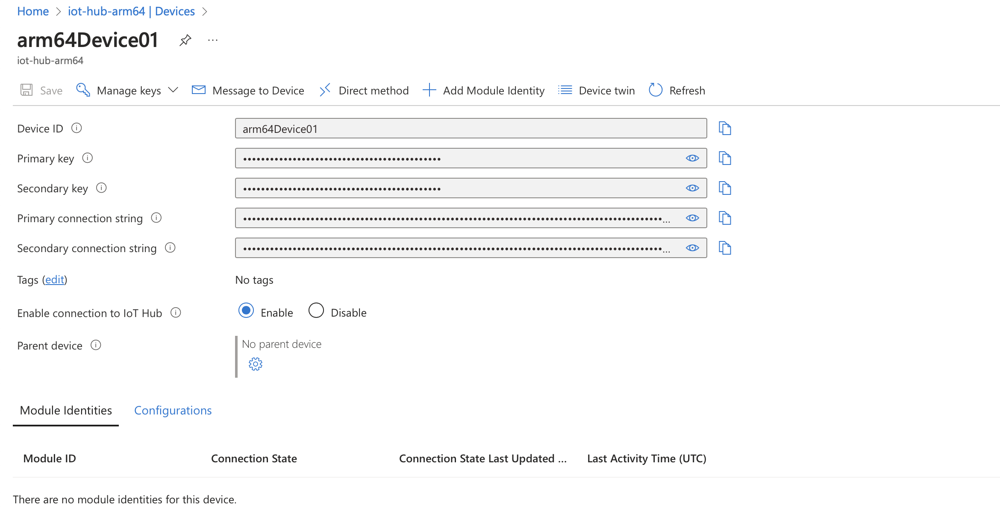

---
# User change
title: "Device registration"

weight: 4

layout: "learningpathall"
---

## Intro
In this section, you’ll learn how to build a comprehensive IoT simulation using Azure IoT Hub and Python. You’ll create a reusable SensorReading class designed to simulate realistic sensor readings, including temperature, pressure, humidity, and timestamps. Additionally, you’ll implement a telemetry simulator that periodically sends these sensor readings to Azure IoT Hub, enabling you to observe real-time data streaming and cloud integration.

Finally, you’ll configure your Python application to connect securely to Azure IoT Hub, allowing you to monitor and validate the continuous data flow. By the end of this section, you’ll have hands-on experience simulating IoT telemetry, providing a solid foundation for developing more advanced data analytics and visualization solutions in Azure.

## Azure IoT device SDK
Begin by installing the Azure IoT Device SDK for Python, which provides essential tools and libraries needed to develop IoT applications that communicate seamlessly with Azure IoT Hub. This SDK enables secure device connectivity, message transmission, and management functionalities directly from Python code.

You can install the SDK easily using Python’s package manager pip. Open a terminal or command prompt and run the following command:
```
pip install azure-iot-device
```
The output should look similar to the following one:
```output
Collecting azure-iot-device
  Downloading azure_iot_device-2.14.0-py3-none-any.whl.metadata (15 kB)
Requirement already satisfied: urllib3<3.0.0,>=2.2.2 in /Library/Frameworks/Python.framework/Versions/3.10/lib/python3.10/site-packages (from azure-iot-device) (2.2.3)
Collecting deprecation<3.0.0,>=2.1.0 (from azure-iot-device)
  Downloading deprecation-2.1.0-py2.py3-none-any.whl.metadata (4.6 kB)
Collecting paho-mqtt<2.0.0,>=1.6.1 (from azure-iot-device)
  Downloading paho-mqtt-1.6.1.tar.gz (99 kB)
  Preparing metadata (setup.py) ... done
Requirement already satisfied: requests<3.0.0,>=2.32.3 in /Library/Frameworks/Python.framework/Versions/3.10/lib/python3.10/site-packages (from azure-iot-device) (2.32.3)
Collecting requests-unixsocket2>=0.4.1 (from azure-iot-device)
  Downloading requests_unixsocket2-0.4.2-py3-none-any.whl.metadata (3.9 kB)
Collecting janus (from azure-iot-device)
  Downloading janus-2.0.0-py3-none-any.whl.metadata (5.3 kB)
Collecting PySocks (from azure-iot-device)
  Downloading PySocks-1.7.1-py3-none-any.whl.metadata (13 kB)
Requirement already satisfied: typing-extensions in /Library/Frameworks/Python.framework/Versions/3.10/lib/python3.10/site-packages (from azure-iot-device) (4.12.2)
Requirement already satisfied: packaging in /Library/Frameworks/Python.framework/Versions/3.10/lib/python3.10/site-packages (from deprecation<3.0.0,>=2.1.0->azure-iot-device) (24.1)
Requirement already satisfied: charset-normalizer<4,>=2 in /Library/Frameworks/Python.framework/Versions/3.10/lib/python3.10/site-packages (from requests<3.0.0,>=2.32.3->azure-iot-device) (3.3.2)
Requirement already satisfied: idna<4,>=2.5 in /Library/Frameworks/Python.framework/Versions/3.10/lib/python3.10/site-packages (from requests<3.0.0,>=2.32.3->azure-iot-device) (3.10)
Requirement already satisfied: certifi>=2017.4.17 in /Library/Frameworks/Python.framework/Versions/3.10/lib/python3.10/site-packages (from requests<3.0.0,>=2.32.3->azure-iot-device) (2024.8.30)
Downloading azure_iot_device-2.14.0-py3-none-any.whl (168 kB)
Downloading deprecation-2.1.0-py2.py3-none-any.whl (11 kB)
Downloading requests_unixsocket2-0.4.2-py3-none-any.whl (7.8 kB)
Downloading janus-2.0.0-py3-none-any.whl (12 kB)
Downloading PySocks-1.7.1-py3-none-any.whl (16 kB)
Building wheels for collected packages: paho-mqtt
  Building wheel for paho-mqtt (setup.py) ... done
  Created wheel for paho-mqtt: filename=paho_mqtt-1.6.1-py3-none-any.whl size=62116 sha256=2ef0547e1a8e9d70c8e2e10bf98593bdeed291e1ceb03ab19a3f47189da31a6c
  Stored in directory: /Users/db/Library/Caches/pip/wheels/8b/bb/0c/79444d1dee20324d442856979b5b519b48828b0bd3d05df84a
Successfully built paho-mqtt
Installing collected packages: paho-mqtt, PySocks, janus, deprecation, requests-unixsocket2, azure-iot-device
Successfully installed PySocks-1.7.1 azure-iot-device-2.14.0 deprecation-2.1.0 janus-2.0.0 paho-mqtt-1.6.1 requests-unixsocket2-0.4.2
```

## Creating a Python IoT Simulator Application
In this section, you’ll create a Python application that simulates realistic sensor data generated by an Arm64-powered IoT device and streams this data securely to Azure IoT Hub. You’ll define a reusable and structured SensorReading class, capable of generating randomized yet realistic sensor measurements, including temperature, pressure, humidity, and timestamps.

Following this, you’ll implement an asynchronous telemetry simulator method, which continuously generates sensor readings at predefined intervals and transmits them to Azure IoT Hub.

To achieve the above, create the iot_simulator.py file and modify it as follows:

```python
import asyncio
import json
import random
import logging
from datetime import datetime, timezone
from azure.iot.device.aio import IoTHubDeviceClient

# Configure logging
logging.basicConfig(level=logging.INFO, format='%(asctime)s - %(levelname)s - %(message)s')

class SensorReading:
    """
    Represents a sensor reading from an IoT device.
    """
    def __init__(self, device_id, temperature, pressure, humidity, timestamp):
        self.device_id = device_id
        self.temperature = temperature
        self.pressure = pressure
        self.humidity = humidity
        self.timestamp = timestamp

    def to_json(self):
        """
        Serialize the sensor reading to a JSON string.
        """
        return json.dumps({
            "deviceId": self.device_id,
            "temperature": self.temperature,
            "pressure": self.pressure,
            "humidity": self.humidity,
            "timestamp": self.timestamp.isoformat()
        })

    @staticmethod
    def generate_random(device_id):
        """
        Generate a sensor reading with random values for temperature, pressure, and humidity.
        """
        return SensorReading(
            device_id=device_id,
            temperature=round(random.uniform(20.0, 30.0), 2),
            pressure=round(random.uniform(990.0, 1020.0), 2),
            humidity=round(random.uniform(30.0, 80.0), 2),
            timestamp=datetime.now(timezone.utc)
        )

async def send_telemetry(connection_string, device_id, interval_seconds=1):        
    device_client = IoTHubDeviceClient.create_from_connection_string(connection_string)
    
    try:
        await device_client.connect()
        logging.info("Connected to Azure IoT Hub.")

        while True:
            reading = SensorReading.generate_random(device_id)
            message = reading.to_json()
            await device_client.send_message(message)
            logging.info("Telemetry sent: %s", message)
            await asyncio.sleep(interval_seconds)
            
    except KeyboardInterrupt:
        logging.info("Telemetry sending stopped by user.")
    except Exception as e:
        logging.error("An error occurred: %s", e)
    finally:
        await device_client.disconnect()
        logging.info("Disconnected from Azure IoT Hub.")

def main():
    # Replace with your actual device connection string from Azure IoT Hub.
    CONNECTION_STRING = "<YOUR_DEVICE_CONNECTION_STRING>"
    DEVICE_ID = "arm64Device01"
    INTERVAL_SECONDS = 1

    try:
        asyncio.run(send_telemetry(CONNECTION_STRING, DEVICE_ID, INTERVAL_SECONDS))
    except Exception as e:
        logging.error("Error running the telemetry sender: %s", e)

if __name__ == "__main__":
    main()
```

The SensorReading class is designed to encapsulate and manage data from an IoT sensor. It models a single sensor reading by holding key attributes such as the device’s unique identifier, the measured temperature, pressure, and humidity, along with a timestamp that records exactly when the reading was taken. This structured representation allows you to easily handle and process sensor data within your application.

In addition to storing these values, the class provides a to_json method, which converts the sensor reading into a JSON-formatted string. This makes it particularly useful for transmitting data over the network, as JSON is a widely accepted format in IoT communications and web services.

Furthermore, the class includes a static method called generate_random. This method is a utility that simulates sensor data by generating random, yet realistic, values for temperature, pressure, and humidity. It also automatically sets the current UTC time (with proper timezone awareness) as the timestamp for the reading. This feature is especially useful when you need to simulate sensor output for testing or demonstration purposes, allowing you to mimic the behavior of a real IoT device without requiring actual sensor hardware.

Then we have the send_telemetry method. It is an asynchronous function designed to connect an IoT device to Azure IoT Hub and continuously transmit telemetry data at specified intervals. When invoked, it begins by creating a device client instance using the provided connection string, which contains the necessary credentials to authenticate with the IoT Hub. Once the connection is established, the send_telemetry method logs a confirmation message indicating a successful connection.

Inside an infinite loop, the function repeatedly generates a new sensor reading by calling the generate_random method of the SensorReading class, which simulates realistic sensor data for temperature, pressure, and humidity along with a current timestamp. This sensor data is then converted to a JSON string using the to_json method, making it suitable for transmission. The JSON message is sent to the Azure IoT Hub using the device client, and a log entry records each transmission for monitoring purposes.

The function includes error handling to gracefully manage interruptions. For instance, if the user stops the process (via a keyboard interrupt), it logs that the telemetry sending has been halted. Additionally, any unexpected errors are caught and logged. Finally, regardless of how the loop is exited, the function ensures that the device client is properly disconnected from the IoT Hub, logging this disconnection to maintain clear operational records.

The main function serves as the entry point of the application, where essential configuration values for connecting to Azure IoT Hub are defined. Here, it sets the CONNECTION_STRING—which you need to replace with your actual device connection string from Azure IoT Hub—along with a unique DEVICE_ID and an INTERVAL_SECONDS value that determines how frequently the telemetry data is sent (in this case, every second).

Within the main function, the asynchronous send_telemetry function is executed using asyncio.run(), which manages the event loop and ensures that the asynchronous operations run correctly. This function call initiates the process of connecting to the IoT Hub, generating sensor readings, and transmitting telemetry data at regular intervals. The entire operation is wrapped in a try-except block to catch and log any errors that might occur during execution.

Finally, the conditional check if __name__ == "__main__": ensures that the main function is called only when the script is executed directly, rather than when it is imported as a module in another script. This structure provides a clear and organized starting point for the application, making it easier to understand and maintain.

## Connecting IoT Device to Azure IoT Hub
To connect the Python application you developed earlier to Azure IoT Hub, follow these detailed steps.

1. Register a Device on Azure IoT Hub:
* Open the Azure Portal, go to your IoT Hub, and click Devices under Device management:

* Click “Add Device”, enter a device ID (e.g., arm64Device01), and leave the authentication type as “Symmetric key.”

* Click “Save”.

2. Next, you’ll need to retrieve the connection string to integrate your Python application with Azure IoT Hub: 
* From the device list, select your newly created device (arm64Device01)
* Copy the Primary Connection String from the device details page. You’ll need this connection string to authenticate your Python application when connecting and streaming telemetry data


Ensure this connection string is stored securely, as it provides authentication credentials for your device. In the next step, you’ll integrate this connection string into your Python simulator app, enabling secure communication and real-time data streaming to Azure IoT Hub

## Streaming Telemetry Data to Azure IoT Hub
Now you’re ready to stream telemetry data from your Python application directly to Azure IoT Hub. Follow these steps to configure and run the application:
1. Open your Python IoT simulator script (iot_simulator.py).
2. Update the connection string. Replace the placeholder with your actual Azure IoT device primary connection string, which you retrieved from the Azure portal:
```python
CONNECTION_STRING = "HostName=iot-hub-arm64.azure-devices.net<THE_REST_OF_THE_CONNECTION_STRING>"
```
Ensure this connection string exactly matches the string copied from Azure IoT Hub to establish a secure connection.

3. Run your Python application. Open a terminal or command prompt, navigate to the script location, and execute:
```
python3 iot_simulator.py
```

Upon successful execution, you should see output similar to the following, confirming a stable connection and periodic telemetry data transmission to Azure IoT Hub:

```output
2025-03-16 19:39:12,944 - INFO - Creating client for connecting using MQTT over TCP
2025-03-16 19:39:12,949 - INFO - Connecting to Hub...
2025-03-16 19:39:12,949 - INFO - Connect using port 8883 (TCP)
2025-03-16 19:39:13,617 - INFO - connected with result code: 0
2025-03-16 19:39:13,617 - INFO - _on_mqtt_connected called
2025-03-16 19:39:13,618 - INFO - Connection State - Connected
2025-03-16 19:39:13,618 - INFO - Successfully connected to Hub
2025-03-16 19:39:13,618 - INFO - Connected to Azure IoT Hub.
2025-03-16 19:39:13,619 - INFO - Sending message to Hub...
2025-03-16 19:39:13,620 - INFO - publishing on devices/arm64Device01/messages/events/
2025-03-16 19:39:13,922 - INFO - payload published for 1
2025-03-16 19:39:13,922 - INFO - Successfully sent message to Hub
2025-03-16 19:39:13,922 - INFO - Telemetry sent: {"deviceId": "arm64Device01", "temperature": 27.96, "pressure": 1013.59, "humidity": 41.94, "timestamp": "2025-03-16T18:39:13.619102+00:00"}
2025-03-16 19:39:14,924 - INFO - Sending message to Hub...
2025-03-16 19:39:14,925 - INFO - publishing on devices/arm64Device01/messages/events/
2025-03-16 19:39:15,165 - INFO - payload published for 2
2025-03-16 19:39:15,166 - INFO - Successfully sent message to Hub
2025-03-16 19:39:15,167 - INFO - Telemetry sent: {"deviceId": "arm64Device01", "temperature": 25.28, "pressure": 1006.62, "humidity": 79.14, "timestamp": "2025-03-16T18:39:14.924209+00:00"}
2025-03-16 19:39:16,168 - INFO - Sending message to Hub...
2025-03-16 19:39:16,170 - INFO - publishing on devices/arm64Device01/messages/events/
2025-03-16 19:39:16,401 - INFO - payload published for 3
2025-03-16 19:39:16,402 - INFO - Successfully sent message to Hub
2025-03-16 19:39:16,402 - INFO - Telemetry sent: {"deviceId": "arm64Device01", "temperature": 28.87, "pressure": 994.86, "humidity": 50.39, "timestamp": "2025-03-16T18:39:16.168566+00:00"}
2025-03-16 19:39:17,404 - INFO - Sending message to Hub...
2025-03-16 19:39:17,405 - INFO - publishing on devices/arm64Device01/messages/events/
2025-03-16 19:39:17,634 - INFO - payload published for 4
2025-03-16 19:39:17,635 - INFO - Successfully sent message to Hub
2025-03-16 19:39:17,635 - INFO - Telemetry sent: {"deviceId": "arm64Device01", "temperature": 24.44, "pressure": 1015.0, "humidity": 70.05, "timestamp": "2025-03-16T18:39:17.404173+00:00"}
2025-03-16 19:39:18,636 - INFO - Sending message to Hub...
2025-03-16 19:39:18,637 - INFO - publishing on devices/arm64Device01/messages/events/
2025-03-16 19:39:18,873 - INFO - payload published for 5
2025-03-16 19:39:18,874 - INFO - Successfully sent message to Hub
2025-03-16 19:39:18,874 - INFO - Telemetry sent: {"deviceId": "arm64Device01", "temperature": 26.26, "pressure": 1002.21, "humidity": 43.71, "timestamp": "2025-03-16T18:39:18.636419+00:00"}
2025-03-16 19:39:19,875 - INFO - Sending message to Hub...
2025-03-16 19:39:19,875 - INFO - publishing on devices/arm64Device01/messages/events/
2025-03-16 19:39:20,108 - INFO - payload published for 6
2025-03-16 19:39:20,109 - INFO - Successfully sent message to Hub
2025-03-16 19:39:20,109 - INFO - Telemetry sent: {"deviceId": "arm64Device01", "temperature": 25.71, "pressure": 996.22, "humidity": 54.84, "timestamp": "2025-03-16T18:39:19.874801+00:00"}
```

Each telemetry message contains randomized sensor data (temperature, pressure, humidity), device ID, and a timestamp, providing realistic simulated data for IoT applications.

To stop streaming telemetry data, press Ctrl+C in the terminal. The application will gracefully disconnect from Azure IoT Hub.

This step completes the telemetry-streaming component of your Azure IoT application, laying the groundwork for subsequent steps like data processing, monitoring, and visualization

## Summary
In this part, you’ve successfully created and configured a Python IoT simulator application designed specifically for streaming realistic sensor data from Arm64-powered IoT devices. You’ve implemented a robust and reusable SensorReading class, generating randomized values for key sensor metrics—temperature, pressure, humidity—and timestamping these readings accurately. Additionally, you connected the Python application securely to your newly created Azure IoT Hub using the Azure IoT device SDK, establishing real-time telemetry data streaming capabilities.

With this setup in place, your simulated IoT device continuously transmits data to Azure IoT Hub, providing a solid foundation to explore more advanced IoT scenarios, such as real-time data analytics, cloud storage, monitoring, alerts, and data visualization within the Azure ecosystem.