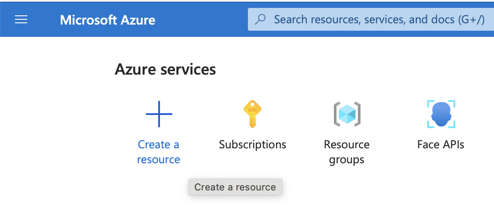
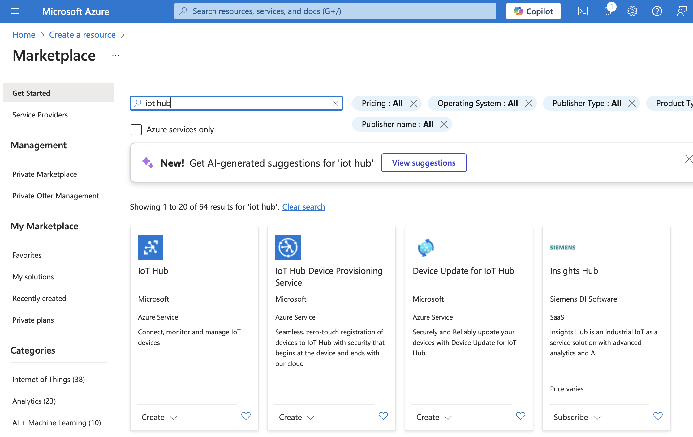
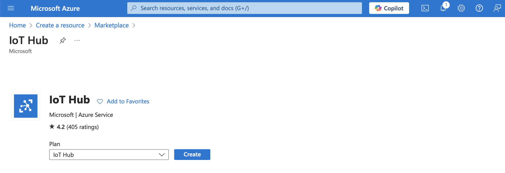
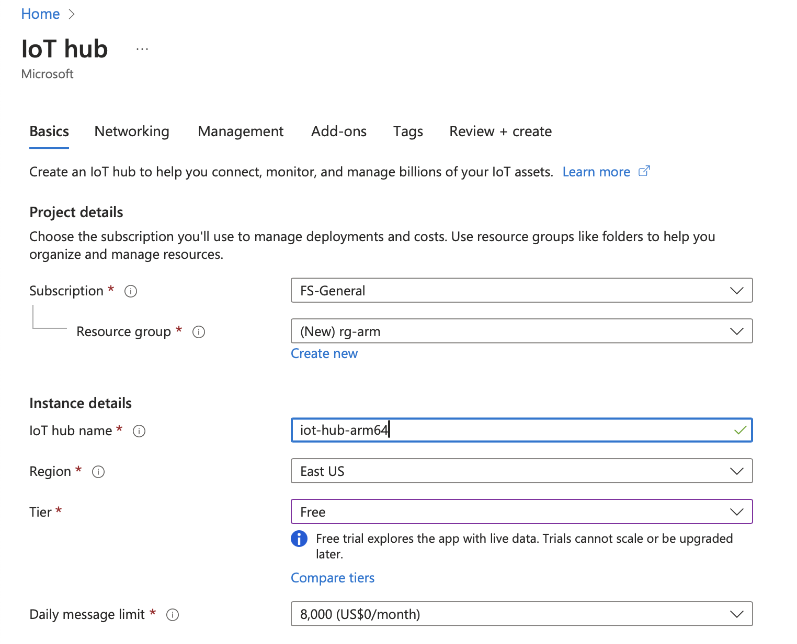
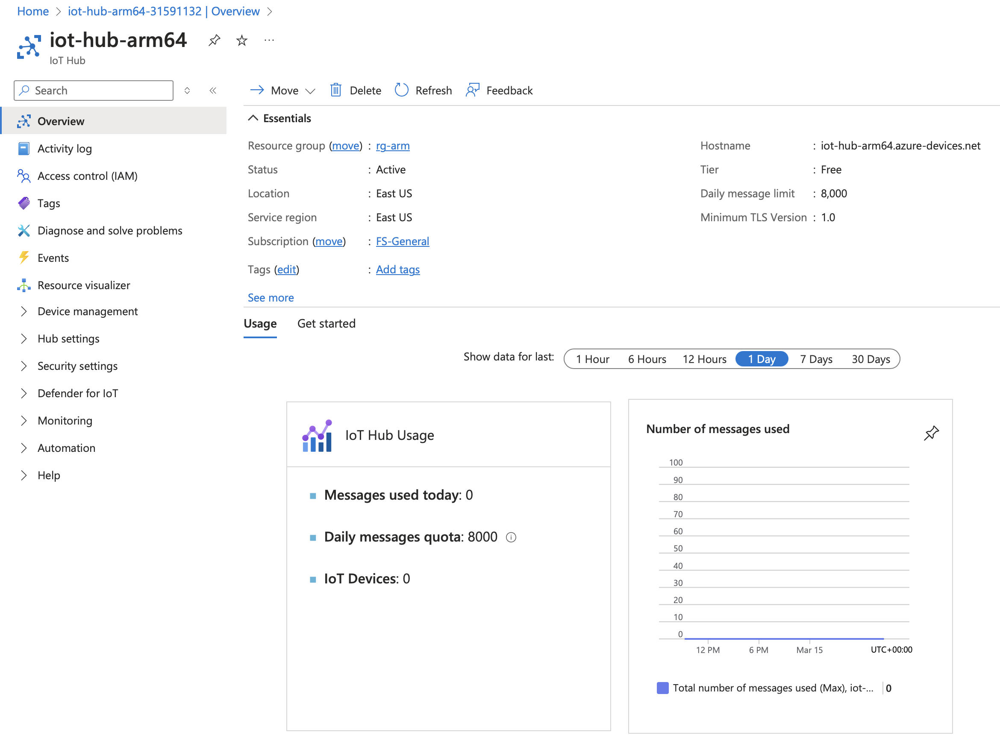

---
# User change
title: "Azure IoT Hub"

weight: 3

layout: "learningpathall"
---

## Azure IoT Hub
Azure IoT Hub is a fully managed cloud service from Microsoft Azure, designed as a secure, scalable communication gateway for connecting IoT devices to cloud-hosted applications and analytics systems. It's the core element of Azure-based IoT solutions, supporting reliable two-way communication between millions of IoT devices and the cloud. 

IoT Hub supports bi-directional messaging, enabling not only device-to-cloud telemetry data transfer but also cloud-to-device commands, configuration updates, and remote device management.

A key advantage of Azure IoT Hub is its built-in device provisioning, authentication, and management capabilities, which allow you to securely onboard, register, and manage IoT devices at scale. It supports multiple communication protocols, including MQTT, AMQP, and HTTPS, making it versatile and compatible with a broad range of devices. IoT Hub integrates seamlessly with other Azure services, such as Azure Stream Analytics, Azure Cosmos DB, Azure Functions, and Azure Blob Storage, facilitating the development of sophisticated IoT solutions with minimal complexity.

Additionally, Azure IoT Hub provides monitoring and diagnostics capabilities, making it easier to identify connectivity issues, analyze device performance, and maintain operational efficiency. Its built-in security features, such as per-device authentication and secure device identity management, ensure that sensitive data remains protected throughout its lifecycle.

In the following sections of this Learning Path, you’ll learn how to:

* Create and configure an Azure IoT Hub.
* Register an Arm64-based IoT device
* Use Python to stream sensor data securely and efficiently into Azure.

## Create Azure IoT Hub
Start by creating an Azure IoT Hub.
1. Sign in to the Azure Portal:
	* Open your web browser and go to https://portal.azure.com.
	* Sign in using your Azure account credentials.

2. Create a new Azure IoT Hub resource
* On the Azure Portal home page, select **Create a resource** at the top left as shown below:

* In the Search services and marketplace box, type “IoT Hub” and press **Enter**.
* Click on IoT Hub from the search results:

3. Click the **Create** button:

4. Configure Basic IoT Hub Settings
* Subscription: Select your Azure subscription.
* Resource group: Choose an existing resource group or click **Create new** to create one, such as *rg-arm*.
* IoT Hub Name: Enter a unique name for your IoT Hub. This must be globally unique; for example, iot-hub-arm-64).
* Region: Select a region closest to your location or users.
* Tier: Free. This updates the daily message limit accordingly:

5. Click **Next: Networking**.
6. Configure Networking:
* Keep the default setting (Public access) unless specific network restrictions apply.
* Select 1.0 for the minimum TLS version.
* Click **Next: Management**.
7. Management Settings (Optional)
* Under Management, you can keep default settings.
* Click **Next: Add-ons**.
8. Add-ons - keep default settings. Then, click **Next: Tags**.
9. Add tags as needed and then click **Next: Review + Create**.
10. Wait for the configuration to be validated, and click Create.
11. Verify IoT Hub Deployment:
* Once deployed, you’ll see a message stating “Your deployment is complete”.
* Click **Go to resource** to open the newly-created Azure IoT Hub.
12. Check IoT Hub Overview and Details. From the IoT Hub overview page, verify important details such as the hub name, region, status, and hostname, which you’ll use to connect devices:

## Next steps
Now that your Azure IoT Hub is ready, you can proceed to register and configure your IoT devices. In the next step, you’ll learn how to register an Arm64-based IoT device and start streaming data using Python and Azure IoT SDK.
