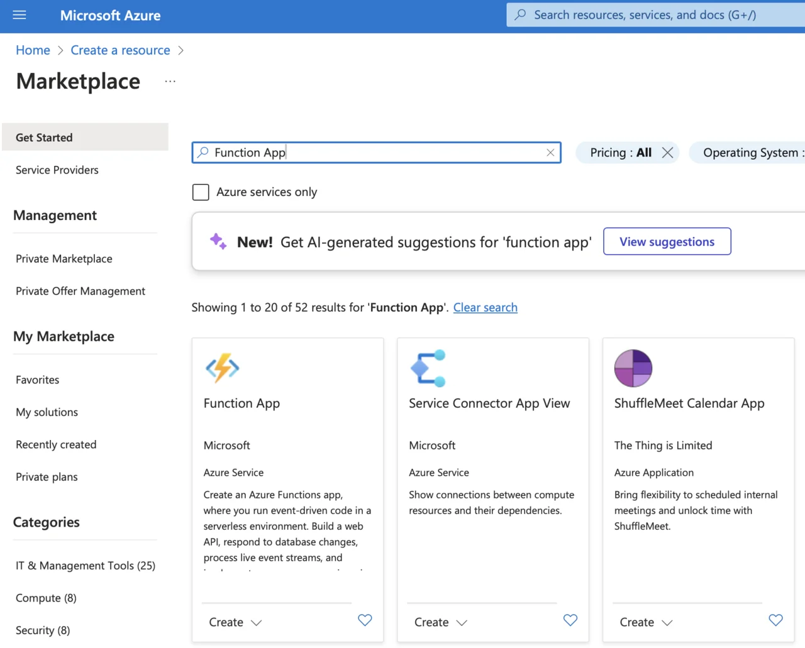
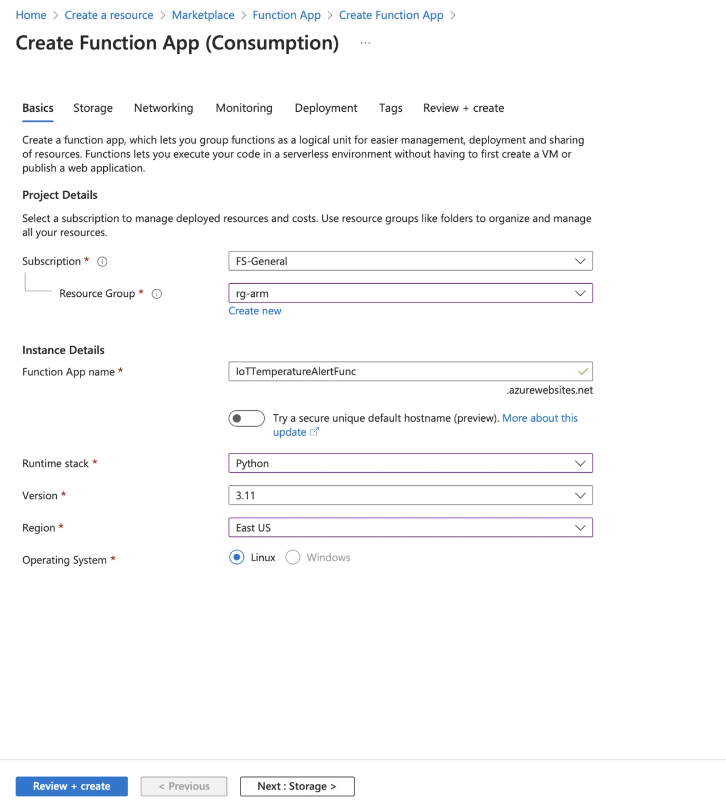
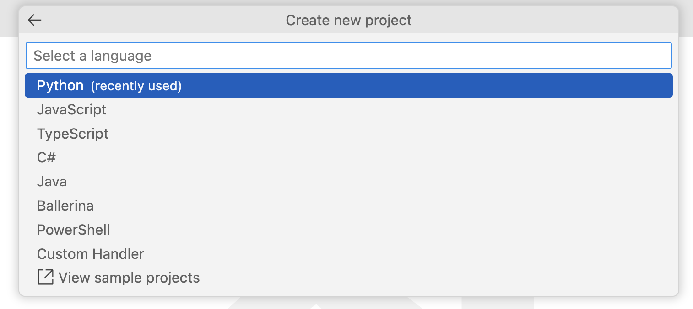
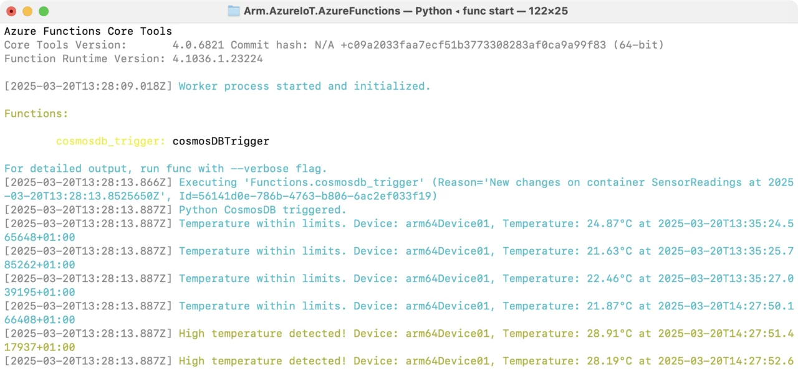
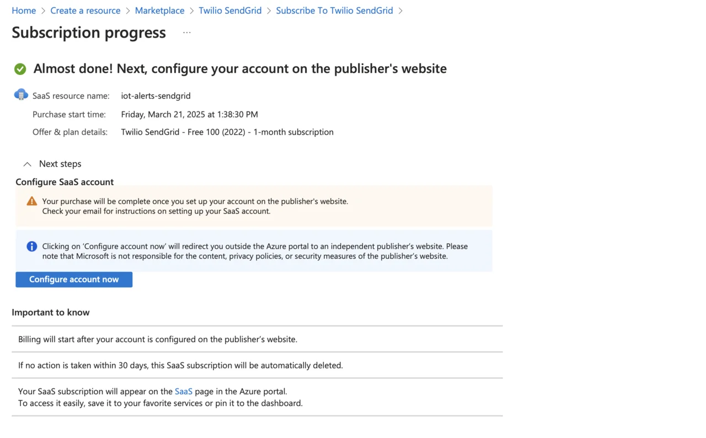
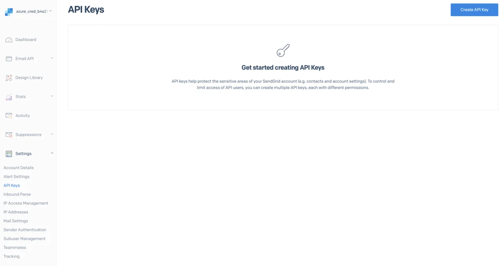

---
# User change
title: "Set up data monitoring and alerts with Azure Functions"

weight: 7

layout: "learningpathall"
---

In the previous section, you successfully configured Azure Stream Analytics to store incoming IoT telemetry data securely in Azure Cosmos DB. The stored sensor data is now readily accessible for further analysis, monitoring, and action. In this section, you will enhance your IoT solution by implementing real-time data monitoring and alerting capabilities using Azure Functions.

Azure Functions is a lightweight, serverless compute platform provided by Azure, enabling you to execute custom code in response to specific events or triggers without the need to manage infrastructure. You'll will create an Azure Function that regularly queries temperature data from Cosmos DB, evaluates sensor readings against predefined thresholds, and sends notifications when critical values are exceeded, such as detecting overheating or environmental anomalies. By adding this functionality, you will build proactive monitoring into your IoT pipeline, ensuring timely responses to sensor data events and improving overall operational reliability.

## Azure Functions
Azure Functions is a serverless computing platform provided by Microsoft Azure, designed to enable developers to run event-driven code without having to provision or manage infrastructure. With Azure Functions, you easily create small, focused applications or services that automatically respond to events, such as database updates, HTTP requests, IoT sensor data events, or scheduled tasks. Because Azure Functions is serverless, it automatically scales based on workload, providing elasticity, rapid deployment, and simplified maintenance, developers only pay for resources actually consumed during execution.

In IoT, Azure Functions are particularly valuable for responding to real-time data events, such as sensor readings exceeding specific thresholds. You can integrate Azure Functions seamlessly with services like Azure Cosmos DB, Azure IoT Hub, or Azure Notification Hubs, enabling functions to trigger automatically when new data is received or when certain conditions are met. This flexibility allows you to build responsive, cost-effective, and efficient IoT applications that require minimal setup yet offer highly scalable, real-time processing capabilities.

### Event-driven Architecture
Azure Functions are inherently event-driven, meaning your code is automatically executed in direct response to specific events or triggers, without manual intervention. Each Azure Function remains dormant and consumes no resources until activated by a defined event, at which point the function is instantly executed. Common triggers include events like new data being written to Azure Cosmos DB, telemetry messages arriving in Azure IoT Hub, incoming HTTP requests, scheduled timers, or even queue-based messages.

This event-driven design ensures real-time responsiveness, making Azure Functions especially well-suited for IoT scenarios, where timely reactions to incoming sensor data or critical events are crucial. For instance, an Azure Function can immediately activate upon detecting new sensor data in Cosmos DB, evaluate the data (such as checking whether temperature thresholds are exceeded), and promptly send alerts or trigger follow-up actions. 

### Serverless and Scalability
Azure Functions is built on a serverless computing model, meaning you can execute custom code in response to specific events without having to provision or maintain any underlying server infrastructure. This approach enables developers to focus purely on application logic rather than spending time on managing servers, operating systems, or runtime environments. When an event such as an HTTP request, database update, or new IoT sensor reading occurs, Azure Functions automatically triggers your custom code, scales the necessary resources dynamically, and executes the function.

In the context of IoT solutions, the serverless model offered by Azure Functions is especially valuable because it can efficiently handle unpredictable workloads, scaling instantly as data volume fluctuates. Functions can scale out horizontally to accommodate spikes in IoT data without manual intervention, providing real-time responsiveness and reliability. This automatic scaling, coupled with a consumption-based billing model (paying only for resources actually consumed), makes Azure Functions an optimal choice for cost-effective, efficient, and responsive IoT monitoring, alerting, and analytics applications.

### Triggers and Events
In Azure Functions, the concepts of triggers and events are central to how functions are executed. A trigger defines how and when an Azure Function is executed. Triggers respond to specific events, such as data arrival, HTTP requests, scheduled timers, or changes to database content. When the defined event occurs, the trigger initiates the execution of your custom code automatically, without manual intervention.

Examples of triggers include:
* HTTP Trigger - executes functions via HTTP requests.
* Timer Trigger - executes code at scheduled intervals.
* Cosmos DB Trigger - runs whenever new data is added or updated in Cosmos DB.
* IoT Hub/Event Hub Triggers - respond immediately to events like incoming IoT device messages.

In IoT scenarios, triggers tied to Cosmos DB are particularly powerful. For example, an Azure Function can automatically activate when new sensor readings are stored in Cosmos DB, allowing you to implement real-time monitoring, send immediate notifications, or perform analytics. Each function's event-driven execution ensures your application remains highly responsive, efficient, and scalable, crucial for maintaining performance and cost-effectiveness in IoT solutions

### Azure Functions Bindings
In addition to triggers, Azure Functions provide another powerful feature called bindings. Bindings allow you to effortlessly connect your functions to other Azure services or external resources, simplifying both input and output integration. Using bindings, you can directly access data from services like Azure Cosmos DB, Azure Blob Storage, Azure Queue Storage without the need to write custom integration code or manage connection logic manually.

Bindings greatly accelerate development, as you can easily read from or write to external services declaratively just by defining simple configurations. For instance, when working with IoT solutions, you can configure a Cosmos DB input binding to automatically retrieve sensor data as documents, or set up an output binding to seamlessly persist aggregated data or alerts back to Cosmos DB or Azure Storage. This eliminates repetitive integration code, reduces complexity, and significantly enhances productivity.

Overall, Azure Function bindings simplify and speed up your development workflow, allowing you to focus entirely on your application logic rather than managing integration details

### Deployment Options
When working with Azure Functions, there are two primary deployment approaches: using the Azure Portal directly or developing and deploying locally from your development environment. 

Azure Portal provides a user-friendly interface to quickly create, configure, and manage Azure Functions directly from your web browser. It's particularly suitable for simple scenarios or quick prototypes, as it requires minimal setup and no installation of additional tools. You can easily define triggers, bindings, environment variables, and monitor function execution directly through the portal interface.

However, there's an important limitation for Python based Azure Functions. If you choose Python with a Linux-based hosting plan (required for Python functions), the Azure Portal does not support in-portal code editing. In other words, while you can manage and monitor your Python functions in the portal, you can’t directly edit or modify the function's Python source code there.

To overcome this limitation, local development is highly recommended for Python-based Azure Functions. Local development involves developing and testing your Azure Functions on your own computer using the Azure Functions Core Tools and a IDE like Visual Studio Code. After development and local testing, you deploy your function to Azure using command-line tools (func CLI), IDE integrations, or continuous integration solutions such as GitHub Actions. 

For Python functions on Linux-based plans, local development and deployment represent the best-practice approach, enabling you to efficiently create, debug, test, and manage more sophisticated IoT solutions. Therefore, in this section you will use local development.

## Create an Azure Function App
You will start by creating an Azure Function App, in which you will create an Azure Function that regularly queries temperature data from Cosmos DB. In the next step, you will add the capability to send notifications, whenever the temperature reading exceeds a predefined threshold. Proceed as follows:
1. Sign in to the Azure Portal.
2. Click **Create a resource**, type “Function App”, and select it:

3. Click **Create**, then select Consumption as a hosting option:

4. Provide the required details:
* Subscription: Your Azure subscription.
* Resource Group: Select your existing IoT resource group.
* Function App Name: Provide a unique name (e.g., IoTTemperatureAlertFunc).
* Runtime Stack: Select Python.
* Version: Select 3.11
* Region: Select the same region as your Cosmos DB and IoT Hub.
* Operating System: Select Linux as Windows is unavailable for Python.
5. Click Review + Create, and then Create.



## Install Prerequisites
Before writing the code make sure you have the following tools installed:
1. Python (≥3.8 recommended) ([download](https://www.python.org/downloads/))
2. Azure Functions Core Tools ([installation guide](https://learn.microsoft.com/en-gb/azure/azure-functions/functions-run-local?tabs=macos%2Cisolated-process%2Cnode-v4%2Cpython-v2%2Chttp-trigger%2Ccontainer-apps&pivots=programming-language-python))
3. Azure CLI ([installation guide](https://learn.microsoft.com/en-gb/cli/azure/install-azure-cli))
4. Visual Studio Code.

Ensure Azure Functions Core Tools are properly installed by running:
```console
func --version
```

The output should look like:
```output
func --version
4.0.6821
```

Ensure you also see a v4.x.x output, indicating compatibility with Python v2 model.

## Create Azure Function to Read Cosmos DB Data 
Follow these steps to create an Azure Function locally using Visual Studio Code:
1. In Visual Studio Code, click View->Command Palette... 
2. Type "Create Function":

3. Select Azure Functions: Create Function...
4. Select folder for your new function. For example create a new folder `Arm.AzureIoT.AzureFunctions`
5. Visual Studio Code will display the wizard, which enables you to configure your function:

6. Use this wizard to configure the function:
* Select a language: Select Python
* Select a Python programming model: Model V2 (Recommended)
* Select a Python interpreter to create a virtual environment: Select python3
* Select a template for your project's first function: CosmosDB trigger
* Name of the function you want to create: Use the default (cosmosdb_trigger)
* Name of the container to be monitored: `SensorReadings` (or the one you created during Azure Cosmos DB provisioning)
* Name of the Cosmos DB database that includes the container to be monitored: `IoTDatabase` (or the one you created during Azure Cosmos DB provisioning)
* Select the app setting with your Cosmos DB account connection string from "local.settings.json": Select + Create new local app setting
* Select your Azure subscription, and then select a database account (armiotcosmosdb or the one you used during Azure Cosmos DB provisioning)
* Select how you would like to open your project: Open in current window

Visual Studio Code will create the following files:
* `function_app.py` - this primary function code file. In the Azure Functions Python V2 programming model, bindings and triggers are defined using Python decorators directly within this file
* `local.settings.json` - this file is specifically used for local development, storing connection strings, app settings, and environment variables. It's not deployed to Azure, so it's safe to include sensitive data (like connection strings) locally for testing purpose.
* `host.json` - defines global configuration settings that affect the behavior of your entire Azure Functions application. Examples include function timeout limits, logging levels, and concurrency settings
* `requirements.txt` - this file lists all Python packages and dependencies required by your function app. Azure Functions uses this file to automatically install the necessary Python packages when deploying the function to Azure

### Modify Function Code
You will now modify the function code to check whether the temperature of the new sensor readings is above a threshold. To do so, open the `function_app.py` and modify it as follows:

```Python
import azure.functions as func
import logging

app = func.FunctionApp()

TEMPERATURE_THRESHOLD = 28.0 

@app.cosmos_db_trigger(arg_name="azcosmosdb", container_name="SensorReadings",
                        database_name="IoTDatabase", connection="armiotcosmosdb_DOCUMENTDB")  
def cosmosdb_trigger(azcosmosdb: func.DocumentList):
    logging.info('Python CosmosDB triggered.')
    if azcosmosdb:
        for doc in azcosmosdb:
            device_id = doc.get("deviceId")
            temperature = float(doc.get("temperature", 0))
            timestamp = doc.get("timestamp")

            if temperature > TEMPERATURE_THRESHOLD:
                logging.warning(
                    f"High temperature detected! Device: {device_id}, "
                    f"Temperature: {temperature}°C at {timestamp}"
                )
            else:
                logging.info(
                    f"Temperature within limits. Device: {device_id}, "
                    f"Temperature: {temperature}°C at {timestamp}"
                )
```

This Azure Function is designed to automatically process and monitor sensor data stored in Azure Cosmos DB. It begins by importing the required Azure Functions libraries and Python's built-in logging module. Then, it initializes a function app object, which serves as a container for defining and managing Azure Functions.

Next, the code defines a global temperature threshold (TEMPERATURE_THRESHOLD) of 28.0°C, which is used to determine whether incoming sensor readings require attention.

The core of the function is triggered automatically by Azure Cosmos DB whenever new sensor readings are added or updated in the specified database (IoTDatabase) and container (SensorReadings). When triggered, the function receives these new documents (items) as a list of sensor readings, represented by azcosmosdb. For each document in this list, the function extracts deviceId, temperature, and timestamp.

After extracting these values, the function compares each sensor's temperature reading against the predefined threshold. If the temperature exceeds the threshold, a warning is logged. If the temperature remains within safe limits, an informational log message is recorded instead, confirming normal operating conditions for the device.

### Run and Test Your Function Locally
To run your function locally proceed as follows:
1. In the Terminal navigate to the folder, in which you saved the function (here that is Arm.AzureIoT.AzureFunctions).
2. Type the following command:

```console
func start
```

3. Run the `iot_simulator.py` in a separate terminal window.

You should then see the following logs, depending on the generated temperature values:



## Monitoring and Notifications
In this section, you will extend your existing Azure Function to send email notifications using `SendGrid` whenever the temperature exceeds the defined threshold

### Create a SendGrid Account in Azure
Follow these steps to create a SendGrid account:
1. Sign in to the Azure Portal.
2. Click “Create a resource” and search for SendGrid.

3. Select Twilio SendGrid, choose the Free 100 (2022) plan, and then click Subscribe.
4. Provide the following details:
* Subscription: Select your Azure subscription.
* Resource group: Choose your existing IoT project resource group.
* Name: Enter a descriptive name (e.g., iot-alerts-sendgrid).

5. Click Review + subscribe and then Subscribe.
6. On the next screen, click Configure account now:

7. Accept any permissions required by SendGrid, and then enter your details to create a sender identity:

8. Fill out the required details, such as your name and email address.
9. After the sender identity is verified, click API Keys in the left menu:

10. Click Create API Key. In the popup window, enter a key name (e.g., iot-api-key), and select Full Access.

11. Copy the generated API key securely. You will not be able to retrieve it later.

### Configure SendGrid API Key in your Azure Function
Update your `local.settings.json` file to include the SendGrid API key as shown:
```console
{
  "IsEncrypted": false,
  "Values": {
    "AzureWebJobsStorage": "",
    "FUNCTIONS_WORKER_RUNTIME": "python",
    "armiotcosmosdb_DOCUMENTDB": "<____>",
    "SENDGRID_API_KEY": "<YOUR_KEY_GOES_HERE>"
  }
}
```
Replace `<YOUR_SENDGRID_API_KEY>` with the actual key obtained earlier

### Install SendGrid Python Library
Update your project's `requirements.txt` to include the SendGrid Python SDK:
```console
azure-functions
sendgrid
```

Then, install these dependencies locally:
```console
pip install -r requirements.txt
```

### Extend Your Azure Function to Send Email Notifications
Modify your existing `function_app.py` file as follows:
```python
import azure.functions as func
import logging
import os
from sendgrid import SendGridAPIClient
from sendgrid.helpers.mail import Mail

app = func.FunctionApp()

TEMPERATURE_THRESHOLD = 28.0 

def send_email_alert(device_id, temperature, timestamp):
    message = Mail(
        from_email='dawid@borycki.com.pl', # Use your actual email
        to_emails='dawid@borycki.com.pl',  # Use your actual email
        subject=f'⚠️ High Temperature Alert: Device {device_id}',
        html_content=f"""
            <strong>Temperature Alert!</strong><br>
            Device ID: {device_id}<br>
            Temperature: {temperature}°C<br>
            Timestamp: {timestamp}
        """
    )

    try:
        sg = SendGridAPIClient(os.environ["SENDGRID_API_KEY"])
        response = sg.send(message)
        logging.info(f"SendGrid email sent, status: {response.status_code}")
    except Exception as e:
        logging.error(f"SendGrid email failed: {e}")

@app.cosmos_db_trigger(arg_name="azcosmosdb", container_name="SensorReadings",
                        database_name="IoTDatabase", connection="armiotcosmosdb_DOCUMENTDB")  
def cosmosdb_trigger(azcosmosdb: func.DocumentList):
    logging.info('Python CosmosDB triggered.')
    if azcosmosdb:
        for doc in azcosmosdb:
            device_id = doc.get("deviceId")
            temperature = float(doc.get("temperature", 0))
            timestamp = doc.get("timestamp")

            if temperature > TEMPERATURE_THRESHOLD:
                logging.warning(
                    f"High temperature detected! Device: {device_id}, "
                    f"Temperature: {temperature}°C at {timestamp}"
                )
                send_email_alert(device_id, temperature, timestamp)
            else:
                logging.info(
                    f"Temperature within limits. Device: {device_id}, "
                    f"Temperature: {temperature}°C at {timestamp}"
                )
```

The `send_email_alert` function is responsible for sending an email notification through SendGrid whenever a sensor reading exceeds the specified temperature threshold. It constructs an email message using details about the IoT device, including the device_id, current temperature, and the event timestamp. The function utilizes SendGrid's Python SDK (SendGridAPIClient) to send the email message. If the email is successfully sent, it logs a confirmation with the status code. If the email fails, it captures and logs the error details, ensuring that any issues with email delivery can be easily identified and resolved. This function enables proactive monitoring by alerting users immediately when potentially critical temperature conditions are detected, significantly enhancing the reliability and responsiveness of the IoT system

Now, start your function:
```console
func start
```

Then run the `iot_simulator.py` to send telemetry data, and wait for alert notifications.

You have now successfully configured real-time monitoring with email notifications. You can proceed to enhance your IoT solution by aggregating data and creating dashboards or visualizations.
