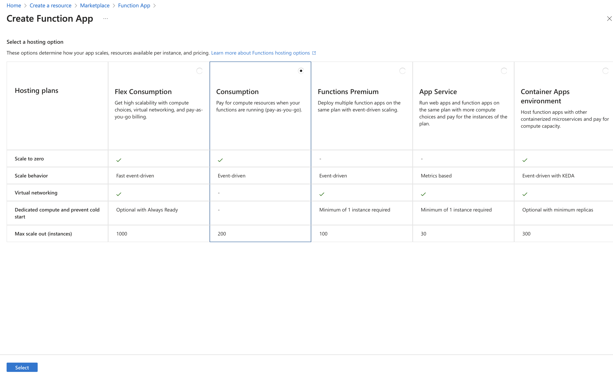

---
# User change
title: "Set Up Data Monitoring and Alerts with Azure Functions"

weight: 7

layout: "learningpathall"
---

## Objective
In the previous section, you successfully configured Azure Stream Analytics to store incoming IoT telemetry data securely in Azure Cosmos DB. The stored sensor data is now readily accessible for further analysis, monitoring, and action. In this section, you’ll enhance your IoT solution by implementing real-time data monitoring and alerting capabilities using Azure Functions.

Azure Functions is a powerful, event-driven, serverless compute service provided by Azure, enabling you to execute custom code in response to specific events or triggers without the need to manage infrastructure. You’ll create an Azure Function that regularly queries temperature data from Cosmos DB, evaluates sensor readings against predefined thresholds, and sends notifications when critical values are exceeded—such as detecting overheating or environmental anomalies. By adding this functionality, you’ll build proactive monitoring into your IoT pipeline, ensuring timely responses to sensor data events and improving overall operational reliability.

## Azure Functions
Azure Functions is a serverless computing platform provided by Microsoft Azure, designed to enable developers to run event-driven code without having to provision or manage infrastructure. With Azure Functions, you can easily create small, focused applications or services that automatically respond to events, such as database updates, HTTP requests, IoT sensor data events, or scheduled tasks. Because Azure Functions is serverless, it automatically scales based on workload, providing elasticity, rapid deployment, and simplified maintenance—developers only pay for resources actually consumed during execution.

In IoT scenarios, Azure Functions are particularly valuable for responding to real-time data events, such as sensor readings exceeding specific thresholds. You can integrate Azure Functions seamlessly with services like Azure Cosmos DB, Azure IoT Hub, or Azure Notification Hubs, enabling functions to trigger automatically when new data is received or when certain conditions are met. This flexibility allows you to build responsive, cost-effective, and efficient IoT applications that require minimal setup yet offer highly scalable, real-time processing capabilities.

### Event-driven Architecture
Azure Functions are inherently event-driven, meaning your code is automatically executed in direct response to specific events or triggers, without manual intervention. Each Azure Function remains dormant and consumes no resources until activated by a defined event, at which point the function is instantly executed. Common triggers include events like new data being written to Azure Cosmos DB, telemetry messages arriving in Azure IoT Hub, incoming HTTP requests, scheduled timers, or even queue-based messages.

This event-driven design ensures real-time responsiveness, making Azure Functions especially well-suited for IoT scenarios, where timely reactions to incoming sensor data or critical events are crucial. For instance, an Azure Function can immediately activate upon detecting new sensor data in Cosmos DB, evaluate the data (such as checking whether temperature thresholds are exceeded), and promptly send alerts or trigger follow-up actions. 

### Serverless and Scalability
Azure Functions is built on a serverless computing model, meaning you can execute custom code in response to specific events without having to provision or maintain any underlying server infrastructure. This approach enables developers to focus purely on application logic rather than spending time on managing servers, operating systems, or runtime environments. When an event—such as an HTTP request, database update, or new IoT sensor reading—occurs, Azure Functions automatically triggers your custom code, scales the necessary resources dynamically, and executes the function.

In the context of IoT solutions, the serverless model offered by Azure Functions is especially valuable because it can efficiently handle unpredictable workloads, scaling instantly as data volume fluctuates. Functions can scale out horizontally to accommodate spikes in IoT data without manual intervention, providing real-time responsiveness and reliability. This automatic scaling, coupled with a consumption-based billing model (paying only for resources actually consumed), makes Azure Functions an optimal choice for cost-effective, efficient, and responsive IoT monitoring, alerting, and analytics applications.

### Triggers and Events
In Azure Functions, the concepts of triggers and events are central to how functions are executed. A trigger defines how and when an Azure Function is executed. Triggers respond to specific events, such as data arrival, HTTP requests, scheduled timers, or changes to database content. When the defined event occurs, the trigger initiates the execution of your custom code automatically, without manual intervention.

Examples of triggers include:
* HTTP Trigger - executes functions via HTTP requests.
* Timer Trigger - executes code at scheduled intervals.
* Cosmos DB Trigger - runs whenever new data is added or updated in Cosmos DB.
* IoT Hub/Event Hub Triggers - respond immediately to events like incoming IoT device messages.

In IoT scenarios, triggers tied to Cosmos DB are particularly powerful. For example, an Azure Function can automatically activate when new sensor readings are stored in Cosmos DB, allowing you to implement real-time monitoring, send immediate notifications, or perform analytics. Each function’s event-driven execution ensures your application remains highly responsive, efficient, and scalable—crucial for maintaining performance and cost-effectiveness in IoT solutions

### Azure Functions Bindings
In addition to triggers, Azure Functions provide another powerful feature called bindings. Bindings allow you to effortlessly connect your functions to other Azure services or external resources, simplifying both input and output integration. Using bindings, you can directly access data from services like Azure Cosmos DB, Azure Blob Storage, Azure Queue Storage without the need to write custom integration code or manage connection logic manually.

Bindings greatly accelerate development, as you can easily read from or write to external services declaratively—just by defining simple configurations. For instance, when working with IoT solutions, you can configure a Cosmos DB input binding to automatically retrieve sensor data as documents, or set up an output binding to seamlessly persist aggregated data or alerts back to Cosmos DB or Azure Storage. This eliminates repetitive integration code, reduces complexity, and significantly enhances productivity.

Overall, Azure Function bindings simplify and speed up your development workflow, allowing you to focus entirely on your application logic rather than managing integration details

### Deployment Options
When working with Azure Functions, there are two primary deployment approaches: using the Azure Portal directly or developing and deploying locally from your development environment. 

Azure Portal provides a user-friendly interface to quickly create, configure, and manage Azure Functions directly from your web browser. It’s particularly suitable for simple scenarios or quick prototypes, as it requires minimal setup and no installation of additional tools. You can easily define triggers, bindings, environment variables, and monitor function execution directly through the portal interface.

However, there’s an important limitation for Python-based Azure Functions. If you choose Python with a Linux-based hosting plan (required for Python functions), the Azure Portal does not support in-portal code editing. In other words, while you can manage and monitor your Python functions in the portal, you can’t directly edit or modify the function’s Python source code there.

To overcome this limitation, local development is highly recommended for Python-based Azure Functions. Local development involves developing and testing your Azure Functions on your own computer using the Azure Functions Core Tools and a IDE like Visual Studio Code. After development and local testing, you deploy your function to Azure using command-line tools (func CLI), IDE integrations, or continuous integration solutions such as GitHub Actions. 

For Python functions on Linux-based plans, local development and deployment represent the best-practice approach, enabling you to efficiently create, debug, test, and manage more sophisticated IoT solutions. Therefore, in this section we will use local development.

## Create an Azure Function App
We will start by creating an Azure Function App, in which we will create an Azure Function that regularly queries temperature data from Cosmos DB. In the next step, we will add the capability to send notifications, whenever the temperature reading exceeds a predefined threshold. Proceed as follows:
1. Sign in to the Azure Portal.
2. Click “Create a resource”, type “Function App”, and select it:

3. Click Create, then select Consumption as a hosting option:

4. Provide the required details:
* Subscription: Your Azure subscription.
* Resource Group: Select your existing IoT resource group.
* Function App Name: Provide a unique name (e.g., IoTTemperatureAlertFunc).
* Runtime Stack: Select Python.
* Version: Select 3.11
* Region: Select the same region as your Cosmos DB and IoT Hub.
* Operating System: Linux as Windows is unavailable for Python.
5. Click Review + Create, and then Create.


## Install Prerequisites
Before writing the code make sure you have the following tools installed:
1. Python (≥3.8 recommended) ([download](https://www.python.org/downloads/))
2. Azure Functions Core Tools ([installation guide](https://learn.microsoft.com/en-gb/azure/azure-functions/functions-run-local?tabs=macos%2Cisolated-process%2Cnode-v4%2Cpython-v2%2Chttp-trigger%2Ccontainer-apps&pivots=programming-language-python))
3. Azure CLI ([installation guide](https://learn.microsoft.com/en-gb/cli/azure/install-azure-cli))
4. A code editor, such as Visual Studio Code.

Ensure Azure Functions Core Tools are properly installed by running:
```console
func --version
```

The output would be like:
```output
func --version
4.0.6821
```

## Create Azure Function to Read Cosmos DB Data 

1. Open a terminal and run these commands:
```console
func init Arm64.IoTFunctionProject --python
```

The output should look as follows:
```output
Found Python version 3.10.11 (python3).
The new Python programming model is generally available. Learn more at https://aka.ms/pythonprogrammingmodel
Writing requirements.txt
Writing function_app.py
Writing .gitignore
Writing host.json
Writing local.settings.json
Writing /Users/db/Repos/Arm64.IoTFunctionProject/.vscode/extensions.json
```

2. Navigate to the newly created folder
```console
cd Arm64.IoTFunctionProject
```

3. Add a Cosmos DB triggered function that will automatically run whenever new data arrives:
```
func new --name CheckTemperature --template "Azure Cosmos DB trigger"
```

Select python, when prompted:

```output
Select a number for worker runtime:
1. dotnet (isolated worker model)
2. dotnet (in-process model)
3. node
4. python
5. powershell
6. custom
Choose option: 4
python
Found Python version 3.10.11 (python3).
The new Python programming model is generally available. Learn more at https://aka.ms/pythonprogrammingmodel
Writing requirements.txt
Writing function_app.py
Writing .gitignore
Writing host.json
Writing local.settings.json
Writing /Users/db/Repos/.vscode/extensions.json
```
## Summary and Next Steps
