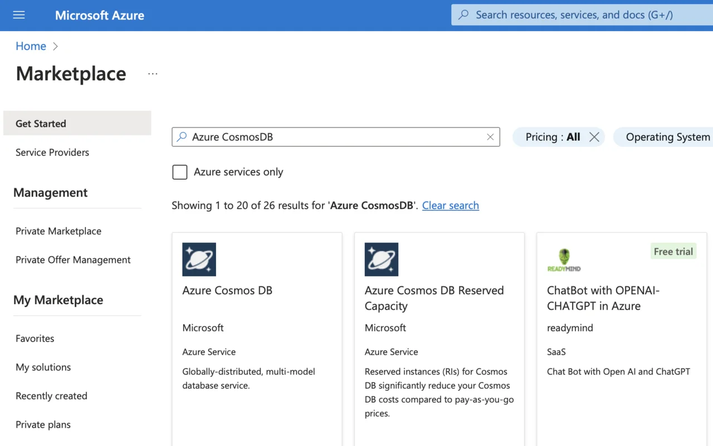
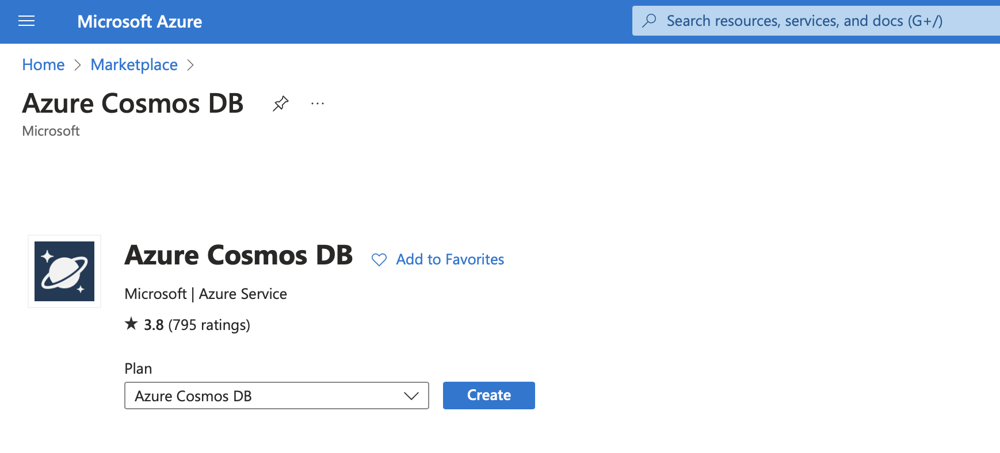
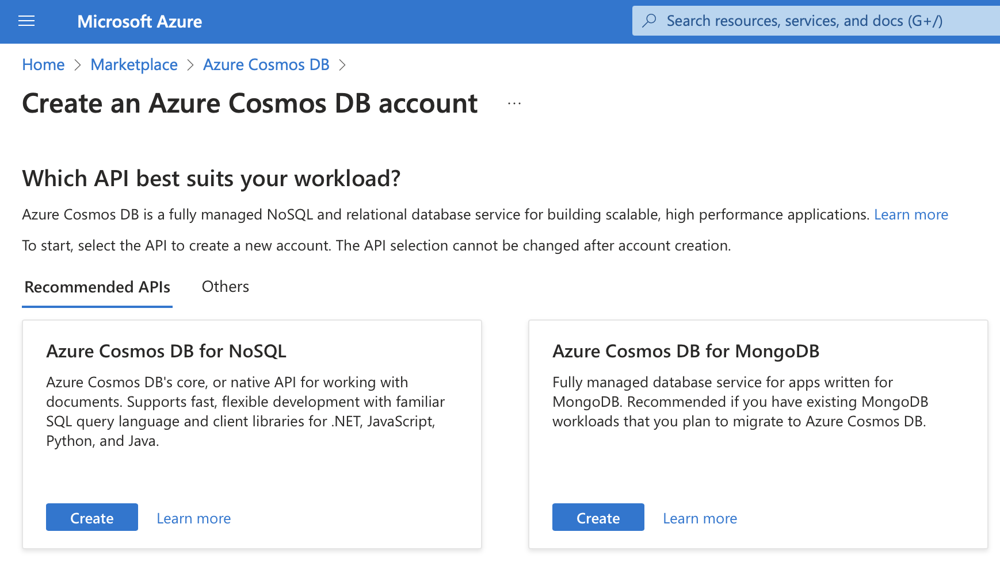
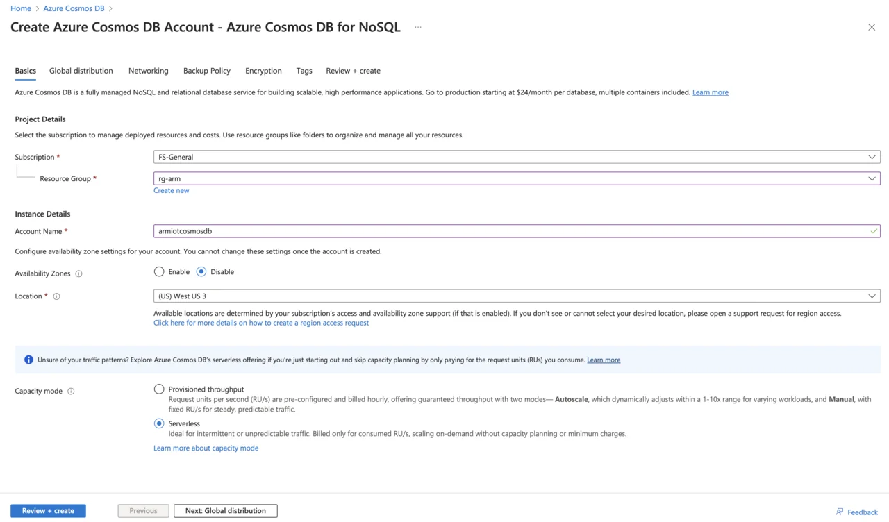
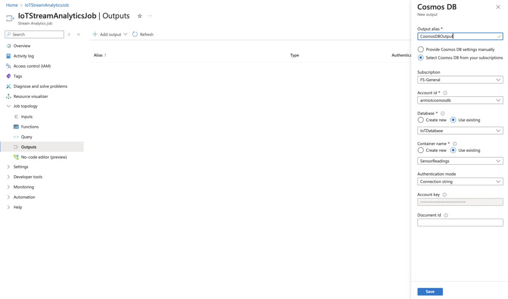
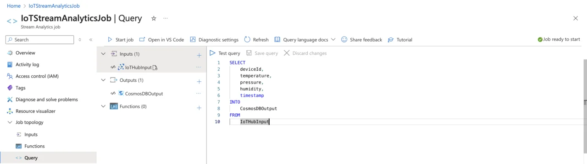
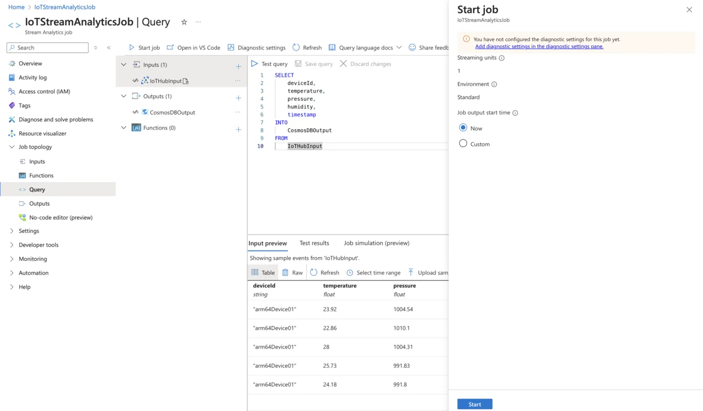

---
# User change
title: "Store data in Azure Cosmos DB with Azure Stream Analytics"

weight: 6

layout: "learningpathall"
---

In the previous section, you successfully set up an Azure Stream Analytics job and configured Azure IoT Hub as an input source. You implemented a simple query to stream real-time sensor data directly from IoT Hub, establishing a seamless flow of telemetry data into Azure. Now, you will take the next step to persist this streaming data in Azure Cosmos DB.

## Azure Cosmos DB
Azure Cosmos DB is a fully managed, globally distributed NoSQL database service designed for scalability, reliability, and high availability. Its flexible data schema allows for easy storage of diverse data types from multiple IoT devices without requiring rigid schema definitions. This schema flexibility is especially valuable in IoT scenarios, where sensors and devices may send varied or evolving data structures.

Consider a scenario where your existing IoT devices stream telemetry data (temperature, pressure, humidity) to Azure Cosmos DB via Azure Stream Analytics. Now imagine that you need to integrate a new sensor type, such as an air-quality sensor that provides an additional measurement (example: AirQualityIndex).

With Azure Cosmos DB's NoSQL architecture, you do not have to explicitly modify or migrate database schemas when introducing new data fields. The new sensor data can simply be included in your Stream Analytics query, and Cosmos DB will automatically store the additional field alongside existing data entries without any extra setup.

### Partitioning
Azure Cosmos DB uses partitioning for efficiently managing large-scale data and high-throughput operations. Partitioning distributes data across multiple servers (physical partitions), allowing Cosmos DB to scale seamlessly as data volume and query demands grow.

Cosmos DB uses a partition key, a field chosen by the user, to determine how data is distributed across partitions. The partition key should ideally have a high cardinality (many distinct values) and should evenly distribute read and write workloads. Each unique value of the partition key corresponds to a logical grouping called a logical partition. Documents with the same partition key value reside within the same logical partition.

When you select a suitable partition key, Cosmos DB ensures that operations (reads and writes) targeting a specific logical partition perform efficiently because queries can quickly locate and retrieve data without scanning the entire dataset. If your data and workload scale significantly, Cosmos DB transparently manages splitting and distributing data across additional physical partitions automatically. Therefore, selecting an effective partition key (such as deviceId for IoT scenarios) can greatly optimize performance, scalability, and cost efficiency.

For IoT data specifically, choosing a device ID or similar attribute as your partition key ensures efficient data retrieval, balanced storage, and evenly distributed workload across the infrastructure, resulting in faster queries and reliable performance at any scale.

### Scaling
In Azure Cosmos DB, scaling relies on partitions, allowing the database to handle increasing amounts of data and throughput demands smoothly. Cosmos DB partitions your data automatically into smaller manageable segments known as logical partitions based on the partition key you specify. Each logical partition can store up to 20 GB of data and has a throughput limit (typically around 10,000 RU/s per partition).

When data volume or throughput requirements grow beyond the capacity of a single logical partition, Cosmos DB transparently distributes these logical partitions across multiple physical partitions (servers). As data volume and workload increase, Cosmos DB dynamically creates additional physical partitions, automatically redistributing your logical partitions across them. This horizontal scaling ensures that read and write operations remain fast and efficient, even as the database size and traffic significantly grow.

Efficient scaling is directly linked to choosing a suitable partition key. Selecting a good partition key ensures that your data and workload are evenly balanced across physical partitions. Good partitioning prevents hotspot scenarios where a single partition disproportionately handles more workload than others, which can lead to performance bottlenecks. Thus, careful selection of partition keys (such as device ID in IoT scenarios) allows Cosmos DB to scale smoothly and maintain high performance and reliability, regardless of how much your data or traffic grows.

### Data Operations
In Azure Cosmos DB, all data operations, such as retrieval, update, insert, and delete, consume units of measure called Request Units (RUs). Request Units represent the resources required to perform operations such as reads, writes, queries, and updates. Each operation consumes a certain number of RUs, and Cosmos DB uses this concept to provide predictable and consistent performance.

When you perform a data operation in Cosmos DB, the request is routed to the appropriate partition based on the partition key provided. If you are retrieving or updating a single document by specifying its unique id and partition key value, Cosmos DB efficiently locates the data within a single logical partition, resulting in minimal RU consumption. However, cross-partition queries, which are queries spanning multiple logical partitions, consume more RUs because Cosmos DB must query multiple partitions simultaneously.

As your application workload increases, Cosmos DB manages scalability through partitions. Increasing throughput (i.e., RU/s) allocates more resources to your container, automatically distributing the load across existing or newly created physical partitions. Conversely, if your workload decreases, you can scale down to reduce costs. Since Cosmos DB automatically handles partition management behind the scenes, data remains available and responsive with minimal intervention.

In IoT scenarios, choosing an optimal partition key (e.g., device ID) helps evenly distribute load across partitions, ensuring consistent and reliable performance as your IoT application scales up and down.

### Importance in IoT Solutions
Azure Cosmos DB plays an important role in IoT solutions due to its ability to handle vast volumes of diverse, rapidly streaming sensor data. Its NoSQL architecture allows IoT applications to adapt to schema changes, accommodating new sensor fields or evolving data structures without complex migrations. Moreover, Cosmos DB's automatic partitioning and elastic scaling enable efficient handling of data at global scale, ensuring low latency, high availability, and predictable performance. With built-in partitioning, Cosmos DB seamlessly manages massive data growth, enabling IoT solutions to scale smoothly and maintain consistent performance. These capabilities make Azure Cosmos DB an essential component for building production-grade IoT solutions.

## Configure Stream Analytics to write data into Azure Cosmos DB
You will now configure the stream analytics job such that the telemetry data will be automatically written to the table in Azure Cosmos DB. 

### Cosmos DB account and database
Start by creating the Create Cosmos DB account and database:
1. Log in to the Azure Portal.
2. Select **Create a resource**, search for “Azure Cosmos DB”, and click **Create**:



3. Select Azure Cosmos DB for NoSQL, then click **Create**.


4. Fill in the required details:
* Subscription: select your subscription.
* Resource Group: use your existing IoT resource group or create a new one.
* Account Name: provide a unique name (for example, armiotcosmosdb).
* Availability Zones: disable.
* Region: choose the same region as your IoT Hub and Stream Analytics job.
* Select serverless as capacity mode.
* Apply Free Tier Discount: apply
* Check Limit total account throughput.

5. Click **Review + create**, then click **Create**.

Once the deployment completes:
* Navigate to your Cosmos DB account and select **Data Explorer**.
* Click **New Container**, then create a database with a name such as "IoTDatabase", and create a container named "SensorReadings".
* Select an appropriate partition key (recommended: /deviceId).
* Enable analytical store capability to perform near real-time analytics on your operational data, without impacting the performance of transactional workloads: Off.
* Click **OK**.


### Modify Stream Analytics Job
Now update your query in Stream Analytics to write data from IoT Hub directly into Cosmos DB:
1. Go to `IoTStreamAnalyticsJob`.
2. Under Job topology, select **Outputs**.
3. Click **Add output**, and select **Cosmos DB**:

4. In the Cosmos DB pane, type "CosmosDBOutput" for the alias name, leave other fields at their default values, and click the **Save** button:


### Update Your Stream Analytics Query
Now that you have the output configured, lets modify the query. To do so, select Query under Job topology. Then, modify your existing query to explicitly specify your Cosmos DB output alias:

```SQL
SELECT
    deviceId,
    temperature,
    pressure,
    humidity,
    timestamp
INTO
    CosmosDBOutput
FROM
    IoTHubInput
```



Afterwards, click **Start job**, and then **Start**:



## Verify data flow in Cosmos DB
To verify that your data pipeline is working correctly, first start your Python IoT simulator application `iot_simulator.py`. Ensure it's actively sending telemetry data. Next, open the Azure Portal and navigate to your Azure Cosmos DB resource. Under Data Explorer, select your database and then your container (e.g., SensorReadings). Once selected, click **Items** to view your stored data. Sensor readings streamed from your IoT device will appear on the right-hand side of the Data Explorer interface, similar to the screenshot below:


Azure Cosmos DB stores data as JSON documents within a NoSQL (document-based) structure, making it ideal for flexible and dynamic data, such as IoT telemetry. Each record (also called a document) is stored in a container (or collection) that doesn’t enforce a rigid schema. As a result, each document can contain different fields without requiring schema changes or migrations, which is particularly valuable when collecting data from diverse IoT devices with evolving attributes.

Consider the sample item with the sensor reading:

```JSON
{
    "deviceId": "arm64Device01",
    "temperature": 25.63,
    "pressure": 1017.45,
    "humidity": 79.64,
    "timestamp": "2025-03-18T09:30:15.040263+00:00",
    "id": "71cb92d4-63f3-44c2-880d-7d9bf0746661",
    "_rid": "vAxGAPBgq2sBAAAAAAAAAA==",
    "_self": "dbs/vAxGAA==/colls/vAxGAPBgq2s=/docs/vAxGAPBgq2sBAAAAAAAAAA==/",
    "_etag": "\"4000555d-0000-4d00-0000-67d93d470000\"",
    "_attachments": "attachments/",
    "_ts": 1742290247
}
```

Our defined fields (deviceId, temperature, pressure, humidity, and timestamp) contain the actual telemetry data from your IoT device. Then, Azure Cosmos DB automatically adds metadata fields to each stored document:
* _rid - this is a resource identifier used internally by Cosmos DB.
* _self - a unique URI representing the document within Cosmos DB.
* _etag - a version tag used for optimistic concurrency control.
* _self - a self-link, providing the path to access the document via Cosmos DB API.
* _ts - timestamp automatically indicating when the document was last modified (if present).
* each document has a unique id field, represented by your own ID or autogenerated by Cosmos DB, to identify documents uniquely within the container.

When storing data, Cosmos DB uses the provided partition key (such as deviceId) to evenly distribute documents across logical partitions. This optimizes retrieval speed and scalability, especially in IoT scenarios where queries often target specific devices. This approach helps ensure efficient data management and high performance, even as your data volume and throughput requirements increase.


Now that you have successfully configured Azure Stream Analytics to store telemetry data in Azure Cosmos DB, the next step is to implement data monitoring and alerting. You will use Azure Functions, serverless compute service, to automatically monitor stored sensor data. Specifically, you will create an Azure Function that periodically reads temperature values from Cosmos DB, evaluates them against defined thresholds, and sends notifications whenever these thresholds are exceeded.
