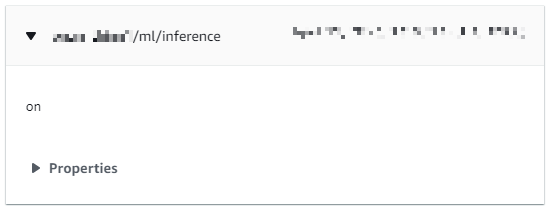
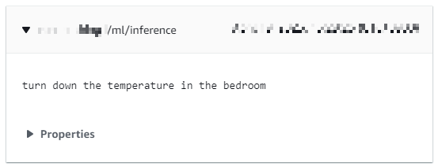

---
# User change
title: Enable AWS connectivity

weight: 3 # 1 is first, 2 is second, etc.

# Do not modify these elements
layout: "learningpathall"
---
A key requirement for IoT devices is connectivity. The `keyword` and `speech` examples implement AWS cloud connectivity.

You can create an [AWS thing](https://docs.aws.amazon.com/iot/latest/developerguide/iot-thing-management.html) (a representation of a device) to send data from a simulated Corstone-300 device to AWS IoT cloud services.

## Default build

Build and run the `keyword` example:

```console
./ats.sh build-n-run keyword
```
The build will take a few minutes to complete.

The results are output (alongside other data) in the terminal:

```output
*** ML interface initialised
INFO - For timestamp: 0.000000 (inference #: 0); label: on, score: 0.996127; threshold: 0.700000
ML_HEARD_ON
INFO - For timestamp: 0.500000 (inference #: 1); label: on, score: 0.962542; threshold: 0.700000
INFO - For timestamp: 1.000000 (inference #: 2); label: <none>; threshold: 0.000000
ML UNKNOWN
INFO - For timestamp: 1.500000 (inference #: 3); label: off, score: 0.999030; threshold: 0.700000
ML_HEARD_OFF
...
```

Use `Ctrl+C` to stop the simulation.

This confirms your environment is setup correctly to build and run the `keyword` (and `speech`) example applications.

## Set up an AWS thing

You can send the output data to an `AWS thing` using [MQTT](https://mqtt.org/).

Open the AWS console in your browser.

In the same AWS region where you launched your Arm Virtual Hardware instance, navigate to `IoT Core`.

### Create IoT policy {#policy}

An AWS IoT policy defines how your `thing` can be accessed.

1. Select `Manage` > `Security` > `Policies`.

2. Click `Create policy` and give it a meaningful name.

3. In the `Policy document` section, create 4 statements (use `Add new statement` button to add more) where:

* `Policy effect` = `Allow`

`Policy action` = one each of:
* `iot:Connect`
* `iot:Publish`
* `iot:Receive`
* `iot:Subscribe`

`Policy resource` will be unique to you, of the form:
* `arn:aws:iot:<region>:<account-id>:*`

For example, if you are in region `us-east-1`, and your account number is `1111-2222-3333`, use:

* `arn:aws:iot:us-east-1:111122223333:*`

4. Click `Create` to define the policy.

### Create an AWS thing {#thing}

1. Select `Manage` > `All devices` > `Things`, and click on `Create things`.

2. Select `Create a single thing` and give it a meaningful name. Click `Next` leaving all other options as default.

3. Select `Auto-generate a new certificate` and click `Next`.

4. Select the `Policy` created [above](#policy) and click `Create thing`.

5. When prompted, download the `device certificate` (`.crt`) and public and private `keys` (`.pem.key`) for your `thing`. Click `Done`.

### Observe MQTT data {#mqtt}

In your AWS console, click on your `thing`.

1. Select the `Activity` tab and open `MQTT test client`.

2. Subscribe to `thingname/ml/inference` where `thingname` is the name from the previous section. You can subscribe to `#` as a catch-all wildcard if you prefer.

3. Click `Edit` and enable `MQTT payload display` > `Display payloads as strings (more accurate)`. Click `Confirm`.

## Modify code with above credentials

The example applications need to be modified to add the credentials.

Return to your Virtual Hardware terminal.

Modify the 2 `.h` files to add your information.

### bsp/default_credentials/aws_clientcredential.h

Use a text editor to modify these macros with the unique values for your AWS thing.


```C
#define clientcredentialMQTT_BROKER_ENDPOINT         "endpointid.amazonaws.com"
```

where `endpointid.amazonaws.com` is unique to you, and is given in `IoT Core` > `Settings` > `Endpoint` on your AWS console.

```C
#define clientcredentialIOT_THING_NAME               "thingname"
```

where `thingname` is the `thing` created [above](#thing).

Save the file when done.

### bsp/default_credentials/aws_clientcredential_keys.h

Use a text editor to modify these macros with the unique values for your AWS thing.

```C
#define keyCLIENT_CERTIFICATE_PEM \
...
```

with the contents of the `.crt` certificate file downloaded [above](#thing). You will need to start and end each line of the certificate with quotations and escape commands:

```output
"-----BEGIN CERTIFICATE-----\n"\
"1234123412341234123412341234123412341234123412341234123412341234\n"\
"5678567856785678567856785678567856785678567856785678567856785678\n"\
...
"-----END CERTIFICATE-----"
```

Similarly add the public and private keys (`.pem.key`), modified as above.

```C
#define keyCLIENT_PRIVATE_KEY_PEM \
...
#define keyCLIENT_PUBLIC_KEY_PEM \
...
```

Save the file when done.

## Run with MQTT connectivity

Rebuild and run the `keyword` application.

```console
./ats.sh build-n-run keyword
```

The messages are shown in the terminal as well as in [MQTT test client](#mqtt).

```output
ML_HEARD_ON
109 27329 [ML_MQTT] [INFO] Publish to the MQTT topic <thingname>/ml/inference.
...
```



## Repeat with the speech example

Build and run the `speech` example.

```console
./ats.sh build-n-run speech
```

Observe the output on the terminal and your MQTT console.

```output
INFO - Complete recognition: turn down the temperature in the bedroom
134 14506 [ML_MQTT] [INFO] Publish to the MQTT topic <thingname>/ml/inference.
```



See the [README.md](https://github.com/ARM-software/open-iot-sdk/blob/main/v8m/README.md#setting-up-aws-connectivity) for full details.