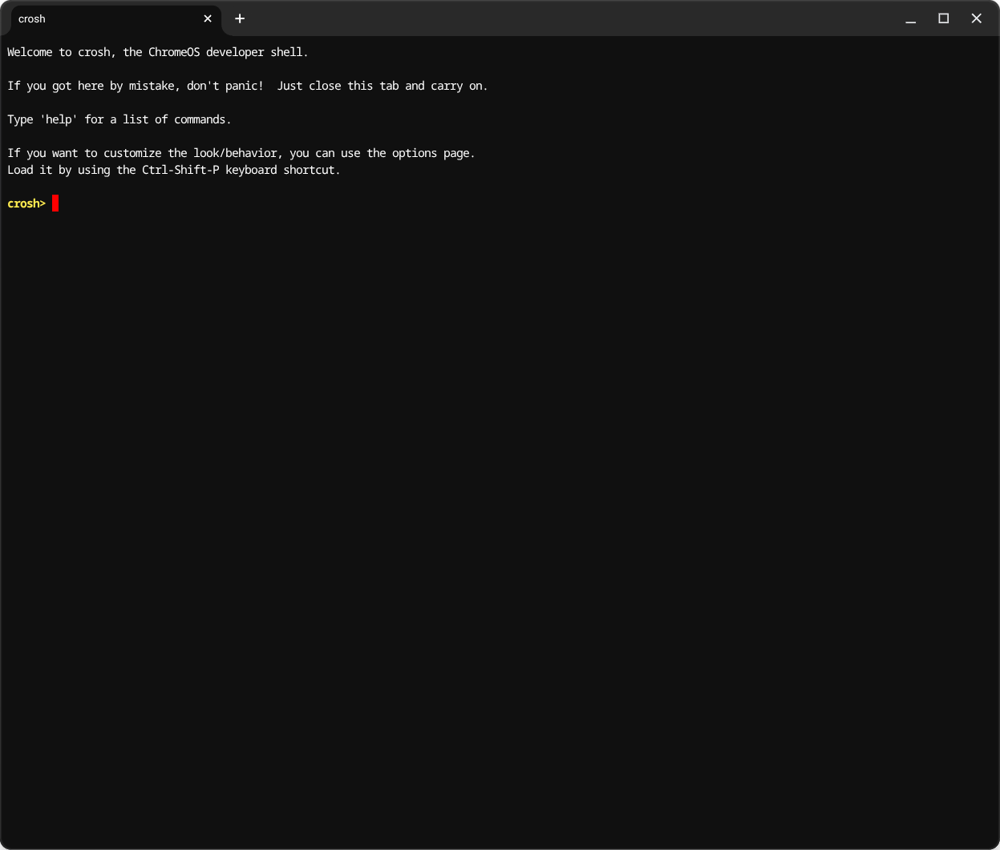

The [Lenovo Chromebook Plus 14](https://www.bestbuy.com/site/lenovo-chromebook-plus-14-oled-2k-touchscreen-laptop-mediatek-kompanio-ultra-16gb-memory-256gb-ufs-seashell/6630493.p?skuId=6630493&intl=nosplash) is is powered by the MediaTek Kompanio Ultra processor, featuring an Arm-based MediaTek Kompanio Ultra processor, offers software developers a powerful and energy-efficient platform for Linux development. Its compatibility with containerized environments and support for ChromeOS Linux (Crostini) make it an excellent choice for coding, testing, and running modern development workflows on the go.

This Learning Path will walk you through setting up an Ubuntu 24.04 container on your Arm-based Chromebook using ChromeOS's built-in Linux development environment. You'll learn how to create and manage containers, install essential development tools, and integrate your Ubuntu environment with ChromeOS features like file sharing and GUI application support. By the end, you'll have a flexible and powerful Arm Linux development environment.

## Access the ChromeOS terminal

The first step to creating an Ubuntu container on ChromeOS is to open the ChromeOS shell.

Open the Chrome browser and press **Ctrl + Alt + T** to open crosh, the ChromeOS shell, crosh.



Run the command below to start the Termina shell.

```console
vsh termina
```

You are now in the Termina environment where you can manage containers.

The `lxc` command is used to manage containers on ChromeOS. 

You can list the running containers.

```console
lxc list
```

If you have the default Debian container running you see output similar to:

```output
+---------+---------+-----------------------+------+-----------+-----------+
|  NAME   |  STATE  |         IPV4          | IPV6 |   TYPE    | SNAPSHOTS |
+---------+---------+-----------------------+------+-----------+-----------+
| penguin | RUNNING | 100.115.92.204 (eth0) |      | CONTAINER | 0         |
+---------+---------+-----------------------+------+-----------+-----------+
```

The name of the Debian container is penguin. When you enable the Linux subsystem on ChromeOS the Debian container named penguin is created, but you can create additional containers with different Linux distributions and different names.

## Create a Ubuntu 24.04 container

This command creates and starts a new Ubuntu 24.04 container named `u1`.

```bash
lxc launch ubuntu:24.04 u1
```

The output is:

```output
Creating u1
Starting u1 
```

Check the status of the new container and confirm the status is RUNNING.

```bash
lxc list
```

Now there are 2 containers running.

```output
+---------+---------+-----------------------+------+-----------+-----------+
|  NAME   |  STATE  |         IPV4          | IPV6 |   TYPE    | SNAPSHOTS |
+---------+---------+-----------------------+------+-----------+-----------+
| penguin | RUNNING | 100.115.92.204 (eth0) |      | CONTAINER | 0         |
+---------+---------+-----------------------+------+-----------+-----------+
| u1      | RUNNING | 100.115.92.206 (eth0) |      | CONTAINER | 0         |
+---------+---------+-----------------------+------+-----------+-----------+
```

Create a new shell in the Ubuntu container. 

```bash
lxc exec u1 -- bash
```

## Complete the Ubuntu setup

Once inside the Ubuntu container, you need to perform some initial setup tasks. 

Update the package lists and upgrade installed packages to the latest versions.

```bash
apt update && apt upgrade -y
```

Install essential packages for development and system management. You can select your favorite software packages, these are examples.

```bash
apt install -y net-tools gcc
```

Creating a non-root user is a crucial security best practice and ensures that applications don't have unnecessary administrative privileges. The username `ubuntu` is already available in the container. You are free to use `ubuntu` as your non-root user or create a new user. 

{}
The following commands use `user1` as a new username. You can replace it with your actual desired username in all subsequent steps.
{}

Create a new user account. Skip if you want to use the `ubuntu` user.

```bash
adduser user1
```

Add the new user to the sudo group to grant administrative privileges. Skip if you want to use the `ubuntu` user.

```bash
usermod -aG sudo user1
```

Switch to your new user account to continue the setup.

```bash
su - user1
```

If you didn't creat a new user switch to `ubuntu` as the non-root user.

```bash
su - ubuntu
```

Continue to learn how to integrate the new Ubuntu container with ChromeOS features like file sharing.