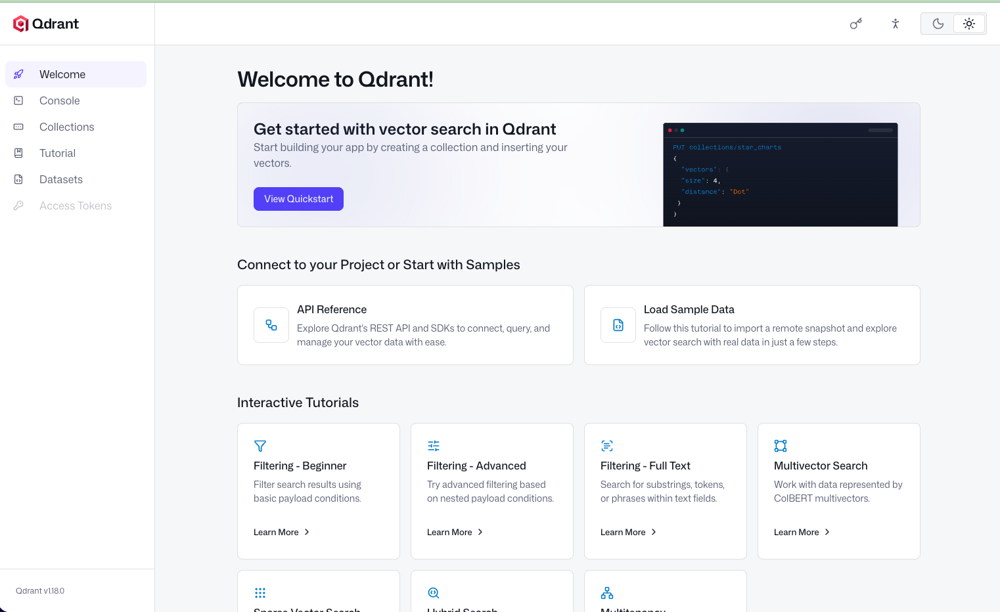

## Build the DGX Spark AI Runtime Foundation

In this section, you will prepare the ***base runtime*** used by the rest of the Learning Path.

You will install ***Docker***, configure ***GPU-enabled containers***, create a ***persistent workspace***, and start the initial runtime service stack:

- Ollama for local inference
- Qdrant for vector memory
- Open WebUI for browser-based model access

***Hermes Agent*** is added in the next section. This section builds the local infrastructure it depends on.

## Verify the DGX Spark Environment

Start by verifying that your DGX Spark system exposes the expected Arm CPU and NVIDIA GPU environment.

Check the CPU architecture:

```bash
uname -m
```

The expected output is:

```text
aarch64
```

This confirms that you are running on an Arm64 environment.

Check the Linux distribution:

```bash
lsb_release -a
```

Check that the NVIDIA GPU and CUDA driver stack are visible:

```bash
nvidia-smi
```

Confirm that the command shows the GPU, driver version, and CUDA version. Later, you will run the same command from inside a container to verify GPU passthrough.

Example output:

```text
nvidia-smi
Wed May 20 18:12:05 2026       
+-----------------------------------------------------------------------------------------+
| NVIDIA-SMI 580.95.05              Driver Version: 580.95.05      CUDA Version: 13.0     |
+-----------------------------------------+------------------------+----------------------+
| GPU  Name                 Persistence-M | Bus-Id          Disp.A | Volatile Uncorr. ECC |
| Fan  Temp   Perf          Pwr:Usage/Cap |           Memory-Usage | GPU-Util  Compute M. |
|                                         |                        |               MIG M. |
|=========================================+========================+======================|
|   0  NVIDIA GB10                    On  |   0000000F:01:00.0 Off |                  N/A |
| N/A   36C    P8              4W /  N/A  | Not Supported          |      0%      Default |
|                                         |                        |                  N/A |
+-----------------------------------------+------------------------+----------------------+

+-----------------------------------------------------------------------------------------+
| Processes:                                                                              |
|  GPU   GI   CI              PID   Type   Process name                        GPU Memory |
|        ID   ID                                                               Usage      |
|=========================================================================================|
|    0   N/A  N/A            3565      G   /usr/lib/xorg/Xorg                      137MiB |
|    0   N/A  N/A            3776      G   /usr/bin/gnome-shell                    164MiB |
|    0   N/A  N/A            5115      G   .../8305/usr/lib/firefox/firefox        239MiB |
|    0   N/A  N/A           85940      G   ...m Performix/arm-performix-gui         54MiB |
+-----------------------------------------------------------------------------------------+
```

## Install Docker

Install the packages needed to add the Docker repository:

```bash
sudo apt update
sudo apt install -y \
    ca-certificates \
    curl \
    gnupg \
    lsb-release
```

Add the Docker GPG key:

```bash
curl -fsSL https://download.docker.com/linux/ubuntu/gpg | \
sudo gpg --dearmor -o /usr/share/keyrings/docker-archive-keyring.gpg
```

Add the Docker repository:

```bash
echo \
"deb [arch=$(dpkg --print-architecture) \
signed-by=/usr/share/keyrings/docker-archive-keyring.gpg] \
https://download.docker.com/linux/ubuntu \
$(lsb_release -cs) stable" | \
sudo tee /etc/apt/sources.list.d/docker.list > /dev/null
```

Install Docker Engine and Docker Compose:

```bash
sudo apt update

sudo apt install -y \
    docker-ce \
    docker-ce-cli \
    containerd.io \
    docker-buildx-plugin \
    docker-compose-plugin
```

Allow your user to run Docker commands:

```bash
sudo usermod -aG docker $USER
```

Apply the new group membership in the current shell:

```bash
newgrp docker
```

Verify Docker:

```bash
docker run hello-world
```

You should see a message confirming that Docker is installed and working.

## Install NVIDIA Container Toolkit

Install NVIDIA Container Toolkit so Docker containers can access the GPU.

Add the NVIDIA Container Toolkit GPG key:

```bash
curl -fsSL https://nvidia.github.io/libnvidia-container/gpgkey | \
sudo gpg --dearmor -o /usr/share/keyrings/nvidia-container-toolkit-keyring.gpg
```

Add the NVIDIA Container Toolkit repository:

```bash
curl -s -L https://nvidia.github.io/libnvidia-container/stable/deb/nvidia-container-toolkit.list | \
sed 's#deb https://#deb [signed-by=/usr/share/keyrings/nvidia-container-toolkit-keyring.gpg] https://#g' | \
sudo tee /etc/apt/sources.list.d/nvidia-container-toolkit.list
```

Install the toolkit:

```bash
sudo apt update
sudo apt install -y nvidia-container-toolkit
```

Configure the Docker runtime:

```bash
sudo nvidia-ctk runtime configure --runtime=docker
```

Restart Docker:

```bash
sudo systemctl restart docker
```

## Verify GPU-enabled Containers

Run a CUDA validation container:

```bash
docker run --rm --gpus all \
nvcr.io/nvidia/cuda:12.4.1-base-ubuntu22.04 \
nvidia-smi
```

If you have not pulled this image before, Docker downloads it before running `nvidia-smi`. This can take a few minutes depending on your network connection.

```text
Unable to find image 'nvcr.io/nvidia/cuda:12.4.1-base-ubuntu22.04' locally
12.4.1-base-ubuntu22.04: Pulling from nvidia/cuda
70104cd59e2a: Pull complete 
35e6dd55b641: Pull complete 
56c8cdb42d24: Pull complete 
22748568967f: Pull complete 
56dc85502937: Pull complete 
Digest: sha256:0f6bfcbf267e65123bcc2287e2153dedfc0f24772fb5ce84afe16ac4b2fada95
Status: Downloaded newer image for nvcr.io/nvidia/cuda:12.4.1-base-ubuntu22.04
Wed May 20 18:15:08 2026       
+-----------------------------------------------------------------------------------------+
| NVIDIA-SMI 580.95.05              Driver Version: 580.95.05      CUDA Version: 13.0     |
+-----------------------------------------+------------------------+----------------------+
| GPU  Name                 Persistence-M | Bus-Id          Disp.A | Volatile Uncorr. ECC |
| Fan  Temp   Perf          Pwr:Usage/Cap |           Memory-Usage | GPU-Util  Compute M. |
|                                         |                        |               MIG M. |
|=========================================+========================+======================|
|   0  NVIDIA GB10                    On  |   0000000F:01:00.0  On |                  N/A |
| N/A   37C    P0              5W /  N/A  | Not Supported          |      0%      Default |
|                                         |                        |                  N/A |
+-----------------------------------------+------------------------+----------------------+

+-----------------------------------------------------------------------------------------+
| Processes:                                                                              |
|  GPU   GI   CI              PID   Type   Process name                        GPU Memory |
|        ID   ID                                                               Usage      |
|=========================================================================================|
|  No running processes found                                                             |
+-----------------------------------------------------------------------------------------+
```

If the command prints GPU information from inside the container, Docker GPU passthrough is working.

At this point, your DGX Spark system can run GPU-enabled AI containers.

## Create the Persistent Workspace

Create the project directory:

```bash
mkdir -p ~/dgx-hermes-agent
cd ~/dgx-hermes-agent
```

Create the directory structure used by the runtime:

```bash
mkdir -p \
workspace/inbox \
workspace/memory \
workspace/logs \
workspace/processed \
workspace/config \
models \
compose \
qdrant
```

The workspace should now look like this:

```text
dgx-hermes-agent/
|-- compose/
|-- models/
|-- qdrant/
|-- workspace/
|   |-- config/
|   |-- inbox/
|   |-- logs/
|   |-- memory/
|   `-- processed/
```

The `workspace/` directory is shared across runtime services. Hermes will later monitor `workspace/inbox/`, write generated artifacts to `workspace/memory/`, and read runtime policies from `workspace/config/`.

## Build the Runtime Service Stack

Create and edit the file `~/dgx-hermes-agent/compose/docker-compose.yml`.

Add the following content:

```yaml
services:

  ollama:
    image: ollama/ollama:latest
    container_name: ollama

    ports:
      - "11434:11434"

    dns:
      - 8.8.8.8
      - 1.1.1.1

    volumes:
      - ../models:/root/.ollama
      - ../workspace:/workspace

    deploy:
      resources:
        reservations:
          devices:
            - driver: nvidia
              count: all
              capabilities: [gpu]

    environment:
      - NVIDIA_VISIBLE_DEVICES=all

    restart: unless-stopped

  qdrant:
    image: qdrant/qdrant:latest
    container_name: qdrant

    ports:
      - "6333:6333"
      - "6334:6334"

    volumes:
      - ../qdrant:/qdrant/storage

    restart: unless-stopped

  open-webui:
    image: ghcr.io/open-webui/open-webui:main
    container_name: open-webui

    ports:
      - "3000:8080"

    environment:
      - OLLAMA_BASE_URL=http://ollama:11434

    volumes:
      - open-webui:/app/backend/data

    depends_on:
      - ollama

    restart: unless-stopped

volumes:
  open-webui:
```

This Compose stack creates the first three runtime services. Hermes will be added as a fourth service later.

## Runtime Service Roles

The initial stack separates model execution, memory storage, and user interaction.

| Service | Role |
|---|---|
| Ollama | Runs local language and embedding models |
| Qdrant | Stores persistent vector memory |
| Open WebUI | Provides a local browser interface to Ollama |

The `models/` directory persists Ollama models on the host. The `qdrant/` directory persists vector database storage. The `workspace/` directory is mounted into Ollama now and will also be mounted into Hermes later.

Ollama does not orchestrate workspace files by itself. The mount verification below confirms shared storage access; Hermes will become the service that reads workspace files and decides when to call Ollama.

## Start the Runtime Stack

If Ollama is already installed as a host service, stop it to avoid port conflicts:

```bash
sudo systemctl stop ollama
sudo systemctl disable ollama
```

Start the container stack:

```bash
cd ~/dgx-hermes-agent/compose
docker compose up -d
```

{}
The first `docker compose up -d` run can take several minutes because Docker needs to pull the service images. The time depends on your network speed.
{}

Verify that the containers are running:

```bash
docker ps
```

You should see containers similar to:

```text
NAME         IMAGE                                COMMAND               SERVICE      CREATED         STATUS                            PORTS
ollama       ollama/ollama:latest                 "/bin/ollama serve"   ollama       5 seconds ago   Up 4 seconds                      0.0.0.0:11434->11434/tcp, [::]:11434->11434/tcp
open-webui   ghcr.io/open-webui/open-webui:main   "bash start.sh"       open-webui   4 seconds ago   Up 4 seconds (health: starting)   0.0.0.0:3000->8080/tcp, [::]:3000->8080/tcp
qdrant       qdrant/qdrant:latest                 "./entrypoint.sh"     qdrant       5 seconds ago   Up 4 seconds                      0.0.0.0:6333-6334->6333-6334/tcp, [::]:6333-6334->6333-6334/tcp
```

## Verify Container Networking

Open a shell in the Ollama container:

```bash
docker exec -it ollama bash
```

Verify DNS resolution:

```bash
getent hosts registry.ollama.ai
```

Example output:

```text
root@367b013fd34c:/# getent hosts registry.ollama.ai
2606:4700:3036::6815:4be3 registry.ollama.ai
2606:4700:3034::ac43:b6e5 registry.ollama.ai
```

Exit the container shell:

```bash
exit
```

The DNS settings in the Compose file help the container reach the Ollama model registry reliably.

## Pull Local Models

Open a shell in the Ollama container:

```bash
docker exec -it ollama bash
```

Pull the language model used in this Learning Path:

```bash
ollama pull qwen2.5:7b
```

Pull the embedding model:

```bash
ollama pull nomic-embed-text
```

Exit the container:

```bash
exit
```

The Learning Path uses fixed models so that the later code and validation steps remain consistent. The architecture can use other suitable models, but keep these names while following the examples in this Learning Path.

| Model | Purpose |
|---|---|
| `qwen2.5:7b` | Local chat, summarization, reasoning |
| `nomic-embed-text` | Embedding generation for semantic memory |

## Verify Local Inference

Open a shell in the Ollama container:

```bash
docker exec -it ollama bash
```

Run the local model:

```bash
ollama run qwen2.5:7b
```

Enter a short prompt, such as:

```text
Summarize the role of CPU orchestration for AI agent in one sentence.
```

After the model responds, exit the interactive model session and the container shell.

You can also monitor GPU activity from another terminal while the model is running:

```bash
nvtop
```

This validates that local inference is available before Hermes begins calling Ollama programmatically.

## Verify Open WebUI

Open a browser and navigate to:

```text
http://localhost:3000
```

Open WebUI should connect to the Ollama service at:

```text
http://ollama:11434
```

Use Open WebUI to confirm that the local model is available.

## Verify Qdrant

Open the Qdrant dashboard:

```text
http://localhost:6333/dashboard
```



Qdrant is running, but it does not contain the `workspace_memory` collection yet. Hermes creates that collection later when you add persistent memory.

## Verify the Shared Workspace Mount

Open another terminal on your DGX Spark system and create a test file on the host. Do not run this command inside a container.

```bash
echo "Arm CPUs orchestrate persistent AI workflows." \
> ~/dgx-hermes-agent/workspace/inbox/test.txt
```

Verify that the shared mount is visible by opening a shell in the Ollama container:

```bash
docker exec -it ollama bash
```

Inside the container, run:

```bash
ls /workspace
cat /workspace/inbox/test.txt
```

You should see:

```text
drwxrwxr-x 2 1001 1001 4096 May 20 18:16 config
drwxrwxr-x 2 1001 1001 4096 May 20 18:37 inbox
drwxrwxr-x 2 1001 1001 4096 May 20 18:16 logs
drwxrwxr-x 2 1001 1001 4096 May 20 18:16 memory
drwxrwxr-x 2 1001 1001 4096 May 20 18:16 processed
```

And the file content:

```text
Arm CPUs orchestrate persistent AI workflows.
```

Exit the container:

```bash
exit
```

## Summary

You have built the ***runtime foundation*** for the persistent local AI system. The DGX Spark environment now has Docker, Docker Compose, NVIDIA Container Toolkit, GPU-enabled containers, persistent workspace storage, and the initial Ollama, Qdrant, and Open WebUI services.

You also verified shared workspace access, local inference, and the fixed model setup used by the later sections.

Next, you will add Hermes Agent as the persistent orchestration runtime.
