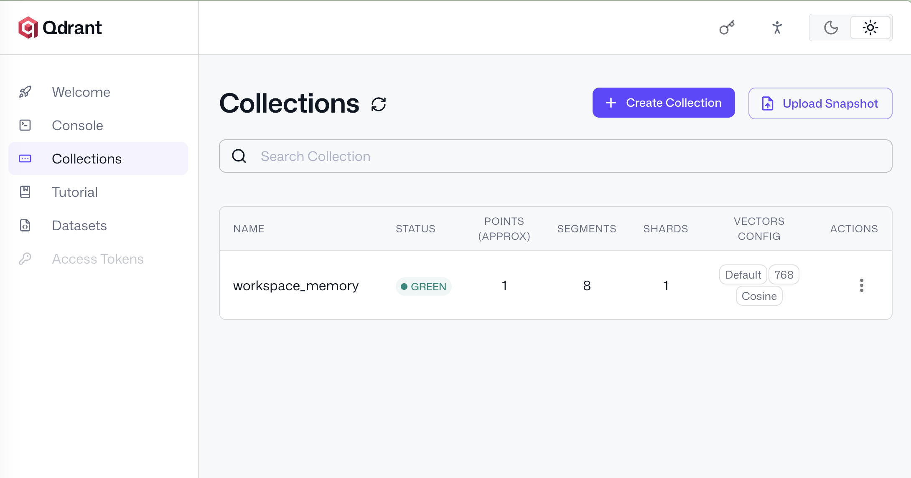
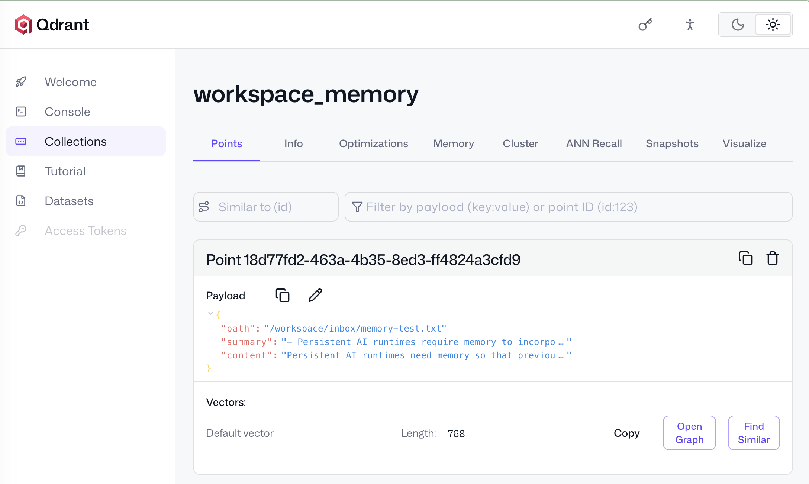
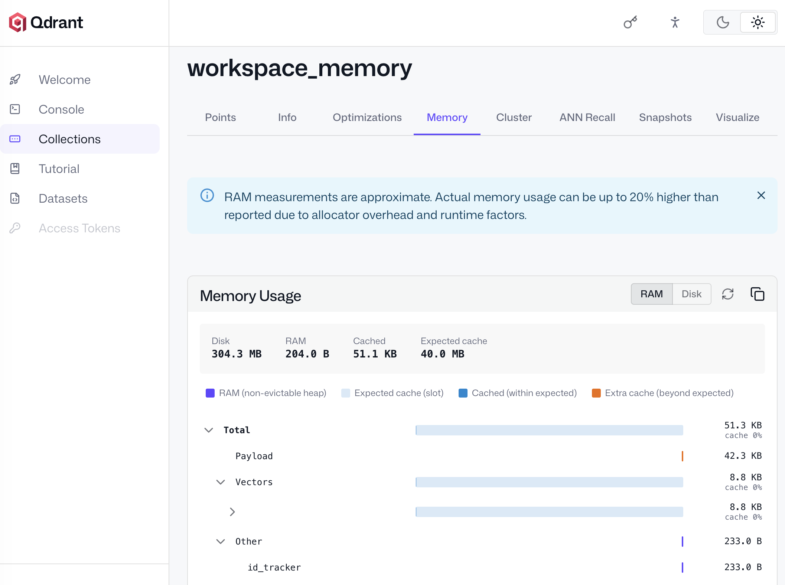

## Build Persistent Semantic Memory

In this section, you will add ***persistent semantic memory*** to Hermes Agent.

In the previous section, Hermes became an ***inference orchestrator***: it watched the workspace, sent document content to Ollama, and printed an AI summary. This section extends that workflow so the summary and source content are no longer just log output. Hermes will encode the document as an embedding and store it in Qdrant as reusable memory.

The runtime can already monitor files and generate summaries with a local language model. You will now generate ***embeddings*** for workspace content and store them in ***Qdrant***.

The workflow becomes:

```text
workspace/inbox document
    -> Hermes summarizes with Ollama
    -> Hermes generates embedding
    -> Hermes stores vector + payload in Qdrant
    -> persistent semantic memory
```

This turns Hermes from an event-driven summarizer into a local AI runtime with long-term memory.

## Persistent Memory Architecture

Semantic memory uses vector embeddings to represent document meaning.

In this Learning Path, the memory pipeline has three services:

| Component | Responsibility |
|---|---|
| Hermes Agent | Orchestrates ingestion, summaries, embeddings, and storage |
| Ollama | Generates summaries and embeddings |
| Qdrant | Stores vectors and metadata as persistent memory |

The fixed embedding configuration is:

| Component | Value |
|---|---|
| Embedding model | `nomic-embed-text` |
| Vector dimension | `768` |
| Qdrant collection | `workspace_memory` |
| Distance metric | Cosine |

The vector dimension must match the output size of the embedding model. For `nomic-embed-text`, the collection is created with a vector size of `768`.

For example, a document about CPU orchestration is first summarized by `qwen2.5:7b`. Hermes then sends the same document text to `nomic-embed-text`, receives a 768-dimensional embedding, and stores that vector in Qdrant with metadata such as the file path, generated summary, and source content excerpt. Later, a query about "runtime scheduling" can retrieve this memory even if the document does not contain the exact same words.

## Pull the Embedding Model

Open a shell in the Ollama container:

```bash
docker exec -it ollama bash
```

Pull the embedding model:

```bash
ollama pull nomic-embed-text
```

Exit the container:

```bash
exit
```

The embedding model converts text into vectors. Qdrant stores those vectors and uses them later for semantic retrieval.

## Add Persistent Memory to Hermes

Open and edit the file `~/dgx-hermes-agent/hermes/agent.py`.

Replace the file with the following version:

```python
import os
import uuid
import time
import ollama

from qdrant_client import QdrantClient
from qdrant_client.models import Distance, VectorParams, PointStruct

from watchdog.observers import Observer
from watchdog.events import FileSystemEventHandler

WATCH_DIR = "/workspace/inbox"

SUPPORTED_EXTENSIONS = [
    ".txt",
    ".md",
    ".log"
]

OLLAMA_HOST = os.getenv(
    "OLLAMA_HOST",
    "http://ollama:11434"
)

QDRANT_HOST = os.getenv(
    "QDRANT_HOST",
    "qdrant"
)

COLLECTION_NAME = "workspace_memory"

client = ollama.Client(host=OLLAMA_HOST)

qdrant = QdrantClient(
    host=QDRANT_HOST,
    port=6333
)

def ensure_collection():
    collections = qdrant.get_collections().collections
    names = [c.name for c in collections]
    if COLLECTION_NAME not in names:

        qdrant.create_collection(
            collection_name=COLLECTION_NAME,
            vectors_config=VectorParams(
                size=768,
                distance=Distance.COSINE
            )
        )
        print(f"[Memory] Created collection: {COLLECTION_NAME}")

class WorkspaceHandler(FileSystemEventHandler):
    def on_created(self, event):
        if event.is_directory:
            return

        filename = os.path.basename(event.src_path)
        if filename.startswith("."):
            return

        ext = os.path.splitext(filename)[1]
        if ext not in SUPPORTED_EXTENSIONS:
            return

        print(f"\n[Agent] New file detected:")
        print(event.src_path)
        process_file(event.src_path)

def generate_summary(content):

    response = client.chat(
        model="qwen2.5:7b",
        messages=[
            {
                "role": "system",
                "content": (
                    "You are a local AI workspace assistant. "
                    "Summarize the document in 3 concise bullet points."
                )
            },
            {
                "role": "user",
                "content": content[:4000]
            }
        ]
    )
    return response["message"]["content"]

def generate_embedding(content):

    response = client.embed(
        model="nomic-embed-text",
        input=content[:4000]
    )
    return response["embeddings"][0]

def store_memory(path, content, summary, embedding):

    point_id = str(uuid.uuid4())
    qdrant.upsert(
        collection_name=COLLECTION_NAME,
        points=[
            PointStruct(
                id=point_id,
                vector=embedding,
                payload={
                    "path": path,
                    "summary": summary,
                    "content": content[:4000]
                }
            )
        ]
    )
    print(f"[Memory] Stored document: {path}")

def process_file(path):

    try:
        with open(path, "r", encoding="utf-8") as f:
            content = f.read()
        print("\n[Agent] Running summarization inference...")
        summary = generate_summary(content)
        print("\n[Agent] AI Summary:")
        print(summary)
        print("\n[Agent] Generating embeddings...")

        embedding = generate_embedding(content)
        store_memory(
            path,
            content,
            summary,
            embedding
        )
    except Exception as e:
        print(f"[Agent] Error: {e}")

if __name__ == "__main__":

    print("\n[Hermes Agent] Starting workspace watcher...")
    print(f"[Hermes Agent] Monitoring: {WATCH_DIR}")

    ensure_collection()
    observer = Observer()
    observer.schedule(
        WorkspaceHandler(),
        WATCH_DIR,
        recursive=False
    )
    observer.start()
    try:
        while True:
            time.sleep(1)
    except KeyboardInterrupt:
        observer.stop()
    observer.join()
```

## Code Trace

This version adds the Qdrant client:

```python
from qdrant_client import QdrantClient
from qdrant_client.models import Distance, VectorParams, PointStruct
```

The runtime connects to Qdrant using the Docker service name:

```python
QDRANT_HOST = os.getenv(
    "QDRANT_HOST",
    "qdrant"
)
```

Hermes creates a persistent memory collection if it does not exist:

```python
qdrant.create_collection(
    collection_name=COLLECTION_NAME,
    vectors_config=VectorParams(
        size=768,
        distance=Distance.COSINE
    )
)
```

The embedding API uses `client.embed(...)`:

```python
response = client.embed(
    model="nomic-embed-text",
    input=content[:4000]
)

return response["embeddings"][0]
```

This is the current Ollama Python SDK embedding interface. The returned embedding is stored as the first item in `response["embeddings"]`.

Hermes stores each document as a Qdrant point:

```python
PointStruct(
    id=point_id,
    vector=embedding,
    payload={
        "path": path,
        "summary": summary,
        "content": content[:4000]
    }
)
```

The payload stores metadata alongside the vector so future retrieval results can include document context.

## Runtime Filtering

This version also adds basic runtime hygiene.

Supported file extensions are defined in:

```python
SUPPORTED_EXTENSIONS = [
    ".txt",
    ".md",
    ".log"
]
```

Hidden files are ignored:

```python
if filename.startswith("."):
    return
```

Unsupported extensions are ignored:

```python
if ext not in SUPPORTED_EXTENSIONS:
    return
```

This avoids ingesting temporary files, hidden files, and unsupported file formats.

## Rebuild Hermes

Rebuild the Hermes container:

```bash
cd ~/dgx-hermes-agent/compose
docker compose build hermes
```

Restart the runtime:

```bash
docker compose up -d
```

Follow the Hermes logs:

```bash
docker logs -f hermes
```

On first startup, if the collection does not already exist, you should see:

```text
[Memory] Created collection: workspace_memory
```

You should also see:

```text
[Hermes Agent] Starting workspace watcher...
[Hermes Agent] Monitoring: /workspace/inbox
```

## Validate Memory Ingestion

Create a new document. Write it outside the inbox first, then move the completed file into `workspace/inbox/` so Hermes processes a fully written document.

```bash
cat > /tmp/memory-test.txt <<'EOF'
Persistent AI runtimes need memory so that previous workspace activity
can influence future reasoning. Semantic memory stores embeddings and
metadata so the runtime can retrieve relevant context later.
EOF

mv /tmp/memory-test.txt \
~/dgx-hermes-agent/workspace/inbox/memory-test.txt
```

Watch the Hermes logs. Expected output includes:

```text
[Agent] New file detected:
/workspace/inbox/memory-test.txt

[Agent] Running summarization inference...

[Agent] AI Summary:
- Persistent AI runtimes require memory to incorporate past workspace activities into future reasoning.
- Semantic memory in AI systems retains embeddings and metadata to store relevant context.
- This stored information allows for retrieval of pertinent context, enhancing the runtime's ability to reason effectively.
```

Then:

```text
[Agent] Generating embeddings...
[Memory] Stored document: /workspace/inbox/memory-test.txt
```

The summary text will vary because it is generated by the local model.

## Verify Qdrant Memory

Open the Qdrant dashboard:

```text
http://localhost:6333/dashboard
```

Confirm that the `workspace_memory` collection exists:



The dashboard should show the `workspace_memory` collection after Hermes starts and runs `ensure_collection()`. If the collection does not appear, check the Hermes logs for Qdrant connection errors and confirm that the `qdrant` container is running.

Open the collection and verify that points are being stored. Each point represents one ingested workspace document and should contain:

- A 768-dimensional vector
- A `path` payload field
- A `summary` payload field
- A `content` payload field



Use this view to confirm that Qdrant has stored both the vector and payload metadata. The payload fields are important because later retrieval steps need the path and summary to assemble useful context for the LLM.

You can also inspect collection storage and memory usage:



The memory usage view confirms that Qdrant is maintaining persistent collection state on disk. This matters because the vector memory should survive container restarts as long as the `../qdrant:/qdrant/storage` volume remains mounted.

You can also inspect collections from the host:

```bash
curl http://localhost:6333/collections
```

The response should include:

```text
workspace_memory
```

## CPU and GPU Responsibilities

The Arm Grace CPU coordinates the memory pipeline:

- Detects new files
- Filters supported file types
- Reads file content
- Calls Ollama for summaries and embeddings
- Creates Qdrant collections
- Upserts vector points and metadata
- Keeps the long-running runtime active

The Blackwell GPU accelerates the model workloads:

- Summary generation with `qwen2.5:7b`
- Embedding generation with `nomic-embed-text`

Qdrant stores the results as persistent memory.

## Runtime Compatibility Notes

The following compatibility notes apply to the code you added in `~/dgx-hermes-agent/hermes/agent.py`.

Use the current Ollama embedding API inside the `generate_embedding()` function:

```python
client.embed(...)
```

Read the embedding from the `embeddings` list returned by Ollama:

```python
response["embeddings"][0]
```

Do not use older examples that call:

```python
client.embeddings(...)
```

The Qdrant vector dimension must match the embedding model output size. For this Learning Path, use ***768*** with: ***nomic-embed-text***

This dimension is configured in `ensure_collection()`:

```python
vectors_config=VectorParams(
    size=768,
    distance=Distance.COSINE
)
```

If you change the embedding model later, update the Qdrant collection dimension to match the new model output. If the dimensions do not match, Qdrant will reject the inserted vectors.

## Summary

You added ***persistent semantic memory*** to Hermes Agent by connecting it to Qdrant, creating the `workspace_memory` collection, generating local embeddings with Ollama, and storing vectors with document metadata.

The runtime can now ingest documents, summarize them, generate embeddings, and preserve that context as ***persistent vector memory***.

Next, you will add semantic retrieval and contextual question answering.
