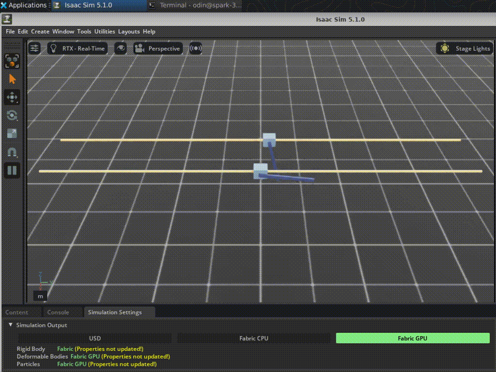
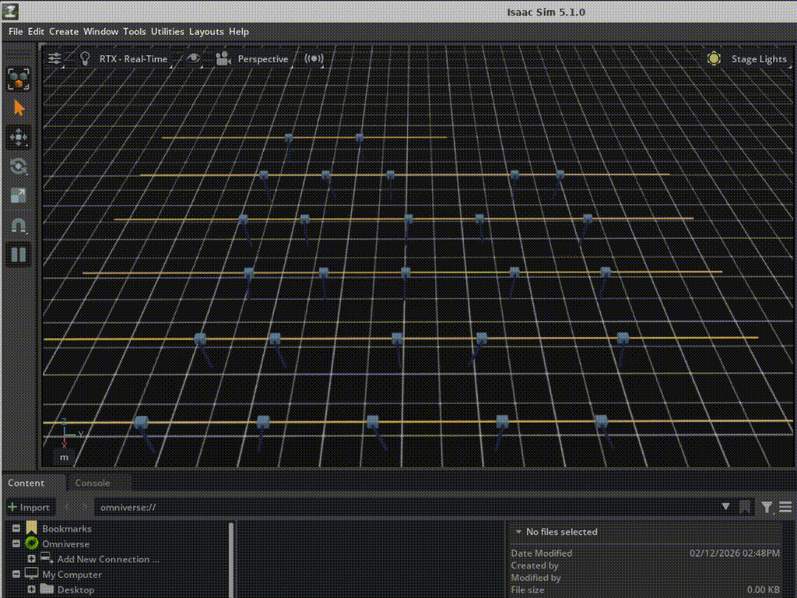

## Deploy a basic robot simulation

With Isaac Sim and Isaac Lab installed, you can now run your first robot simulation. In this section you will launch a pre-built simulation scene, interact with it programmatically, and explore the key concepts behind Isaac Sim's simulation loop.

The example environment used here is Cartpole, a classic control benchmark in which a cart must balance an upright pole by applying horizontal forces. Although simple, this environment demonstrates the core mechanics of simulation environments used in robotics and reinforcement learning.

## Step 1: Launch a sample scene from Isaac Lab

Isaac Lab provides tutorial scripts that demonstrate how to create and interact with simulation scenes. Start with a minimal scene to verify Isaac Sim’s rendering and simulation setup:

```bash
cd ~/IsaacLab
export LD_PRELOAD="$LD_PRELOAD:/lib/aarch64-linux-gnu/libgomp.so.1"
./isaaclab.sh -p scripts/tutorials/00_sim/create_empty.py
```

This script creates an empty simulation world with a ground plane and default lighting. It validates that the Isaac Sim rendering and physics engines are working on your DGX Spark system.

If a display is available, a viewer window opens showing the simulation scene. On systems without a graphical display, the simulation runs in headless mode, and initialization messages appear in the terminal.

Press `Ctrl+C` to exit the simulation.

## Step 2: Spawn and simulate a robot

Next, run a tutorial that loads an articulated robot into the simulation and advances the physics engine.
This example demonstrates how Isaac Sim handles multi-body dynamics, including loading robot assets, configuring actuators, and stepping the physics simulation.
Run the following command:
```bash
./isaaclab.sh -p scripts/tutorials/01_assets/run_articulation.py
```

This script loads a robot model, advances the physics simulation, and prints joint states to the terminal. It demonstrates:

- Loading a robot from a USD (Universal Scene Description) asset file
- Configuring joint actuators and control modes
- Stepping the physics simulation and reading back joint positions and velocities



## Step 3: Run the Cartpole environment

Next, run a complete Isaac Lab environment that combines a simulation scene with environment management components such as action, observation, and event managers.

The `create_cartpole_base_env.py` tutorial creates a Cartpole environment and applies random actions to the cart. Running multiple environments in parallel allows reinforcement learning algorithms to collect experience more efficiently.
Run the following command:

```bash
./isaaclab.sh -p scripts/tutorials/03_envs/create_cartpole_base_env.py --num_envs 32
```

This command launches 32 parallel Cartpole environments on the Blackwell GPU. Each environment runs its own independent simulation with random joint efforts applied to the cart. You will see the pole joint angle printed to the terminal for each step.



{}
This tutorial script uses a hardcoded `CartpoleEnvCfg` configuration. It does not accept a `--task` argument. The `--num_envs` flag controls how many parallel environments are spawned on the GPU.
{}

## Step 4: Run the Cartpole RL environment

The previous tutorial created a base simulation environment that advances physics and applies actions but does not include reinforcement learning components such as rewards or episode termination.
To run the full reinforcement learning version of the environment, execute the following command:

```bash
./isaaclab.sh -p scripts/tutorials/03_envs/run_cartpole_rl_env.py --num_envs 32
```

This script wraps the Cartpole scene in a `ManagerBasedRLEnv`, which includes reward computation, termination conditions, and the standard Gymnasium `step()` interface that returns `(obs, reward, terminated, truncated, info)`.

Key differences between the base and RL environments:

| **Script** | **Environment type** | **Returns from step()** |
|-----------|---------------------|------------------------|
| `create_cartpole_base_env.py` | `ManagerBasedEnv` | `(obs, info)` — no rewards or terminations |
| `run_cartpole_rl_env.py` | `ManagerBasedRLEnv` | `(obs, reward, terminated, truncated, info)` — full RL interface |

## Step 5: Understand the simulation code

To better understand how Isaac Lab environments operate, examine the Cartpole environment source code. Isaac Lab environments are typically defined through configuration classes that specify the scene layout, action interfaces, observation space, and environment events.

### Environment configuration

Every Isaac Lab environment starts with a configuration class that defines the simulation parameters. In the Cartpole tutorial, the `CartpoleEnvCfg` configuration specifies the scene layout and simulation timing:

```python
@configclass
class CartpoleEnvCfg(ManagerBasedEnvCfg):
    """Configuration for the cartpole environment."""

    # Scene settings
    scene = CartpoleSceneCfg(num_envs=1024, env_spacing=2.5)
    # Basic settings
    observations = ObservationsCfg()
    actions = ActionsCfg()
    events = EventCfg()

    def __post_init__(self):
        """Post initialization."""
        self.decimation = 4         # env step every 4 sim steps: 200Hz / 4 = 50Hz
        self.sim.dt = 0.005         # sim step every 5ms: 200Hz
```

The table below summarizes the key parameters:

| **Parameter** | **Value** | **Description** |
|---------------|-----------|-----------------|
| `scene.num_envs` | 1024 | Default number of parallel environment instances (overridden by `--num_envs` from the command line) |
| `scene.env_spacing` | 2.5 | Distance in meters between each parallel environment in the scene |
| `decimation` | 4 | The policy acts every 4 physics steps. With a 200 Hz physics rate, the policy runs at 50 Hz |
| `sim.dt` | 0.005 | The physics engine advances by 5 ms per step (200 Hz simulation rate) |

### Actions, observations, and events

Isaac Lab environments organize functionality into manager groups that define how the agent interacts with the simulation.

**Actions** — how the agent controls the robot:

```python
@configclass
class ActionsCfg:
    joint_efforts = mdp.JointEffortActionCfg(
        asset_name="robot",
        joint_names=["slider_to_cart"],
        scale=5.0                       # Multiplier on raw action values
    )
```

The agent produces a single continuous value that is scaled by `5.0` and applied as a force on the cart's slider joint.

**Observations** — what the agent sees:

```python
@configclass
class ObservationsCfg:
    @configclass
    class PolicyCfg(ObsGroup):
        joint_pos_rel = ObsTerm(func=mdp.joint_pos_rel)   # Relative joint positions
        joint_vel_rel = ObsTerm(func=mdp.joint_vel_rel)   # Relative joint velocities
```

The agent observes joint positions and velocities for both the cart slider and the pole hinge.

**Events** — randomization applied during simulation:

```python
@configclass
class EventCfg:
    # On startup: randomize the pole mass (adds 0.1 to 0.5 kg)
    add_pole_mass = EventTerm(
        func=mdp.randomize_rigid_body_mass,
        mode="startup",
        params={"mass_distribution_params": (0.1, 0.5), "operation": "add"},
    )
    # On reset: randomize cart and pole starting positions
    reset_cart_position = EventTerm(func=mdp.reset_joints_by_offset, mode="reset", ...)
    reset_pole_position = EventTerm(func=mdp.reset_joints_by_offset, mode="reset", ...)
```
Events introduce controlled randomness into the environment.
For example:
  * The pole mass is randomized during initialization
  * Cart and pole positions are randomized on reset
This variability helps the trained policy generalize to slightly different system dynamics.

### The simulation loop

The core simulation loop in Isaac Lab follows a standard Gymnasium-style interface. The example below is taken from `run_cartpole_rl_env.py`:

```python
# Create the RL environment
env = ManagerBasedRLEnv(cfg=env_cfg)

count = 0
while simulation_app.is_running():
    with torch.inference_mode():
        # Reset every 300 steps
        if count % 300 == 0:
            count = 0
            env.reset()

        # Sample random actions
        joint_efforts = torch.randn_like(env.action_manager.action)

        # Step the environment: apply action, advance physics, compute reward
        obs, rew, terminated, truncated, info = env.step(joint_efforts)

        # Print the pole joint angle for environment 0
        print("[Env 0]: Pole joint: ", obs["policy"][0][1].item())
        count += 1
```

Each call to `env.step(action)` performs these operations on the GPU:

1. **Apply actions**: The action tensor is scaled and applied as joint efforts to the cart
2. **Step physics**: The simulation advances by `decimation` physics steps (4 steps at 200 Hz = 20 ms of simulated time)
3. **Compute observations**: Joint positions and velocities are read from the simulation
4. **Compute rewards**: A reward function evaluates how well the agent balanced the pole
5. **Check terminations**: The environment checks if the episode should end (for example, the pole angle exceeded a threshold)

All computations happen in parallel across all environments using PyTorch tensors on the GPU. This is what makes Isaac Lab efficient: thousands of environments run in parallel without Python loop overhead.

## Step 6: Run with headless mode

For reinforcement learning workflows, it is common to run Isaac Sim without rendering. Disabling the viewer allows more GPU resources to be used for physics simulation and neural network computation.

You can test headless execution using the Cartpole RL environment:
```bash
./isaaclab.sh -p scripts/tutorials/03_envs/run_cartpole_rl_env.py --num_envs 64 --headless
```

In headless mode, all GPU resources are dedicated to physics simulation and tensor computation. This is the recommended mode for training reinforcement learning policies, which you will do in the next section.

{}
When running headless on DGX Spark, the Blackwell GPU handles both the physics simulation and neural network computation. The unified memory architecture means there is no performance penalty for sharing GPU memory between these workloads.
{}

## What you have accomplished

In this section you have:

- Launched your first Isaac Sim scene on DGX Spark and verified the rendering and physics engines work correctly
- Spawned articulated robots and observed multi-body physics simulation
- Run the Cartpole base environment and RL environment with 32 parallel instances on the Blackwell GPU
- Understood the key components of an Isaac Lab environment: configuration, actions, observations, events, simulation loop, and reward computation
- Tested headless mode for maximum training performance

You now understand the core components of an Isaac Lab simulation environment, including scene creation, robot articulation, observation and action structures, and simulation loop execution.
In the next section, you will use these concepts to train a reinforcement learning policy for a humanoid robot.
